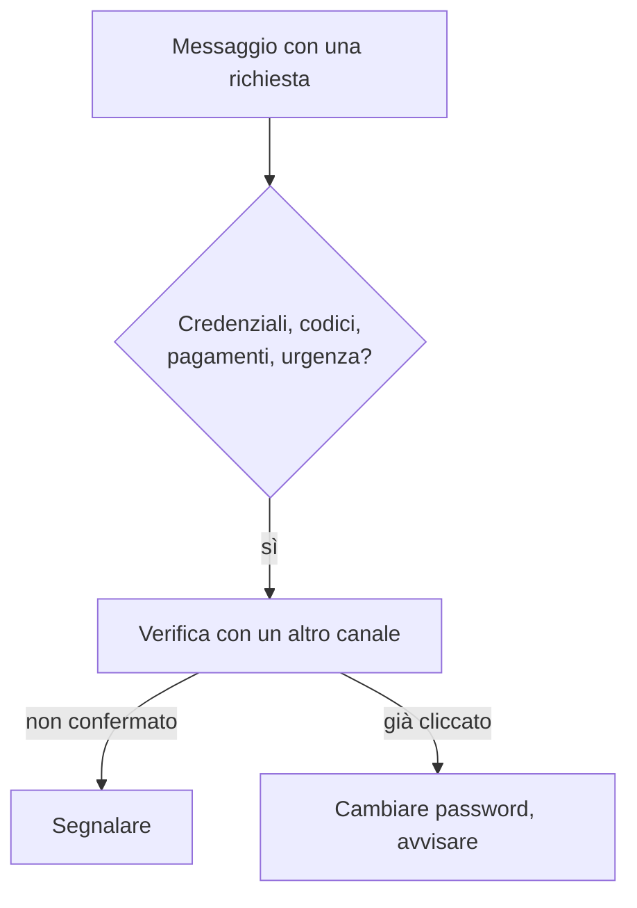

## Contenuti

- Ingegneria sociale
- Segnali
- Intestazioni dell'email
- Che cosa fare
- Laboratorio
- Aspetti orientativi

## Ingegneria sociale

- Indurre una persona ad agire contro i propri interessi
- Leve: autorità, urgenza, paura, curiosità, fiducia, segretezza
- Forme: phishing, spear phishing, frode del finto dirigente, smishing, vishing, codici QR, richiesta del codice MFA

## Segnali

- Richiesta di credenziali, codici, pagamenti, carte regalo
- Testo del collegamento diverso dalla destinazione
- Domini simili: `scuo1a.example`, `scuola.example.verifica-account.example`
- Il dominio si legge da destra
- Il lucchetto non garantisce l'affidabilità

## Intestazioni dell'email

- **Received**: dal basso verso l'alto
- **Return-Path**, **Reply-To**
- **Authentication-Results**: SPF, DKIM, DMARC
- `pass`: il dominio è autentico, non necessariamente affidabile

## Che cosa fare

## Laboratorio

1. Sei messaggi di esempio: legittimo o sospetto, segnali, leve, azione
2. `python analizza_email.py email_sospetta.eml`
3. SPF, DKIM, DMARC, Reply-To, collegamenti ingannevoli; 10 test

## Aspetti orientativi

- Security awareness: tecnica, comunicazione, didattica
- Simulazioni di phishing formative, non punitive
- SPF, DKIM, DMARC: compito degli amministratori della posta
- Perché il messaggio senza collegamenti può essere il più pericoloso?
