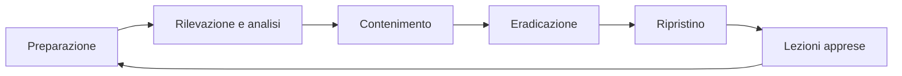

## Contenuti

- Eventi e incidenti
- Le fasi
- Ransomware
- Notifiche
- Esercitazione a tavolino
- Aspetti orientativi

## Eventi e incidenti

- **Evento** di sicurezza
- **Incidente**: riservatezza, integrità o disponibilità compromesse
- **Violazione dei dati personali** (data breach)
- La risposta funziona solo se preparata prima

## Le fasi

NIST SP 800-61r3 (2025): risposta dentro le funzioni del CSF 2.0

## Ransomware

- Cifratura dei dati, spesso doppia estorsione
- Isolare dalla rete, preservare le evidenze
- Non pagare; No More Ransom (Europol)
- Ripristino da backup scollegati, dopo l'eradicazione
- Denuncia alla Polizia Postale

## Notifiche

| Norma | A chi | Termini |
|---|---|---|
| GDPR art. 33 | Garante | entro 72 ore, ove possibile |
| GDPR art. 34 | interessati | senza ingiustificato ritardo, se rischio elevato |
| NIS2 (D.Lgs. 138/2024) | CSIRT Italia | 24 ore, 72 ore, un mese |

## Esercitazione a tavolino

- Scenario: ransomware nella segreteria della Scuola di Esempio
- Ruoli: dirigente, referente tecnico, DSGA, DPO, comunicazione, segretario
- Quattro sviluppi, decisioni annotate
- Chiusura: lezioni apprese, tre azioni di preparazione

## Aspetti orientativi

- CSIRT, CERT, analisi forense digitale
- Decisione e comunicazione sotto pressione
- Esercitazioni richieste da norme e standard
- Quali decisioni dipendevano da scelte fatte prima?
