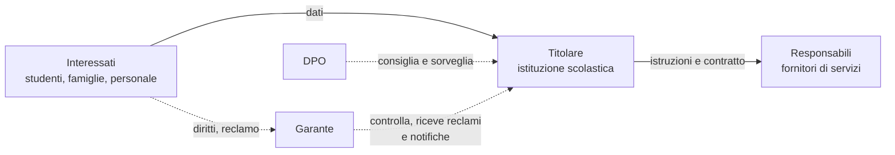

# Lezione 7.1: GDPR e dati personali

> Contenuto originale. Riferimenti: Regolamento (UE) 2016/679 (GDPR), testo in italiano su EUR-Lex, https://eur-lex.europa.eu/legal-content/IT/TXT/HTML/?uri=CELEX:32016R0679 ; D.Lgs. 196/2003 (Codice in materia di protezione dei dati personali) come modificato dal D.Lgs. 101/2018. La scheda dell'attività è nella cartella `attivita`. La lezione presenta i concetti essenziali e non sostituisce la consulenza del responsabile della protezione dei dati.

Obiettivo: conoscere definizioni, principi, basi giuridiche e diritti previsti dal GDPR, e leggere con spirito critico l'informativa privacy di un servizio usato ogni giorno.

## 7.1.1 Definizioni

- **Dato personale** (art. 4)
  qualsiasi informazione riguardante una persona fisica identificata o identificabile, direttamente (nome, numero di matricola, fotografia) o indirettamente (combinazione di informazioni, identificativi online, dati di localizzazione).
- **Categorie particolari di dati** (art. 9)
  dati che rivelano origine razziale o etnica, opinioni politiche, convinzioni religiose o filosofiche, appartenenza sindacale, dati genetici, biometrici, relativi alla salute, alla vita o all'orientamento sessuale; il loro trattamento è in generale vietato, salvo casi specifici previsti dal regolamento.
- **Trattamento**
  qualsiasi operazione sui dati: raccolta, registrazione, conservazione, consultazione, comunicazione, cancellazione.
- **Interessato**
  la persona a cui i dati si riferiscono.
- **Titolare del trattamento**
  chi decide finalità e mezzi del trattamento; per una scuola statale, l'istituzione scolastica, rappresentata dal dirigente.
- **Responsabile del trattamento**
  chi tratta i dati per conto del titolare, per esempio il fornitore del registro elettronico.
- **Responsabile della protezione dei dati** (RPD o DPO)
  figura che consiglia il titolare e sorveglia il rispetto del regolamento; obbligatoria per gli enti pubblici, comprese le scuole.

## 7.1.2 Principi (art. 5)

I dati personali devono essere:

- trattati in modo **lecito, corretto e trasparente**
- raccolti per **finalità** determinate, esplicite e legittime, e non trattati per finalità incompatibili (**limitazione della finalità**)
- adeguati, pertinenti e limitati a quanto necessario (**minimizzazione**)
- **esatti** e aggiornati
- conservati per il tempo necessario alle finalità (**limitazione della conservazione**)
- trattati in modo da garantirne la **sicurezza** (**integrità e riservatezza**), con misure tecniche e organizzative adeguate

Il titolare deve inoltre essere in grado di dimostrare il rispetto dei principi (**responsabilizzazione**, accountability). Il regolamento chiede di considerare la protezione dei dati fin dalla progettazione e per impostazione predefinita (art. 25): lo stesso principio della sicurezza fin dalla progettazione (lezione 5.1).

## 7.1.3 Basi giuridiche (art. 6)

Un trattamento è lecito solo se si basa su almeno una di queste condizioni:

1. **consenso** dell'interessato, libero, specifico, informato, inequivocabile e revocabile
2. esecuzione di un **contratto** con l'interessato
3. adempimento di un **obbligo legale**
4. salvaguardia di **interessi vitali**
5. esecuzione di un compito di **interesse pubblico** o connesso all'esercizio di pubblici poteri
6. **legittimo interesse** del titolare, se non prevalgono i diritti dell'interessato (non utilizzabile dalle autorità pubbliche nell'esecuzione dei loro compiti)

Una scuola statale tratta la maggior parte dei dati degli studenti per obbligo legale e per compiti di interesse pubblico (istruzione), non sul consenso; il consenso serve per attività facoltative. Per i servizi online offerti direttamente ai minori, in Italia il consenso può essere dato autonomamente a partire dai 14 anni; sotto questa età serve quello di chi esercita la responsabilità genitoriale.

## 7.1.4 Diritti degli interessati (artt. 12-22)

- **informazione**: sapere chi tratta i dati, perché, come, per quanto tempo (informativa, artt. 13-14)
- **accesso**: ottenere conferma del trattamento e una copia dei propri dati
- **rettifica** dei dati inesatti
- **cancellazione** ("diritto all'oblio"), nei casi previsti
- **limitazione** del trattamento
- **portabilità**: ricevere i propri dati in un formato strutturato e leggibile da un computer, per trasferirli ad altro titolare
- **opposizione** al trattamento, per esempio al marketing diretto
- non essere sottoposto a **decisioni basate unicamente su trattamenti automatizzati** che producano effetti significativi

Le richieste si rivolgono al titolare, che risponde di norma entro un mese; si può presentare reclamo al **Garante per la protezione dei dati personali**, l'autorità di controllo italiana.

Diagramma: i soggetti di un trattamento scolastico.

## 7.1.5 Violazioni dei dati e sanzioni

Una **violazione dei dati personali** (data breach) è un incidente di sicurezza che comporta distruzione, perdita, modifica, divulgazione o accesso non autorizzati ai dati (lezione 6.4). Il titolare:

- documenta ogni violazione, anche quelle non notificate
- la **notifica al Garante** entro 72 ore da quando ne è venuto a conoscenza, salvo che sia improbabile un rischio per le persone (art. 33)
- la **comunica agli interessati** senza ingiustificato ritardo quando il rischio è elevato (art. 34)

Le sanzioni amministrative arrivano fino a 20 milioni di euro o, per le imprese, al 4% del fatturato mondiale annuo, se superiore (art. 83); si aggiungono il risarcimento dei danni agli interessati e i danni alla reputazione.

## 7.1.6 Attività: analisi di un'informativa privacy

Tempo indicativo: 35 minuti, a coppie.

1. Scegliere un servizio usato davvero dagli studenti: un social network, un'applicazione di messaggistica, un gioco online, una piattaforma per lo studio.
2. Trovare l'informativa privacy ufficiale (di solito "Privacy", "Informativa sulla privacy" o "Privacy policy" in fondo alla pagina o nelle impostazioni dell'app).
3. Compilare la scheda `attivita/scheda_informativa.md`: titolare e contatti, dati raccolti, finalità, basi giuridiche, destinatari e trasferimenti fuori dall'Unione europea, tempi di conservazione, modalità per esercitare i diritti, età minima.
4. Nelle impostazioni del proprio account individuare dove si scaricano i propri dati (portabilità) e dove si limitano pubblicità personalizzata e condivisione dei dati; non è richiesto modificare nulla.
5. Presentare alla classe in due minuti: una cosa inattesa e una domanda rimasta senza risposta chiara.

## 7.1.7 Aspetti orientativi (discussione)

- La protezione dei dati è un campo in cui informatica e diritto si incontrano: DPO, consulenti privacy, esperti di conformità, avvocati specializzati in diritto delle tecnologie.
- Chi sviluppa software deve tradurre i principi in scelte tecniche: raccogliere meno dati, cifrarli, cancellarli quando non servono più (lezione 7.2).
- Domanda: se un servizio è gratuito, in che modo il trattamento dei dati degli utenti può far parte del suo modello economico? Che cosa lo rende lecito o illecito?
