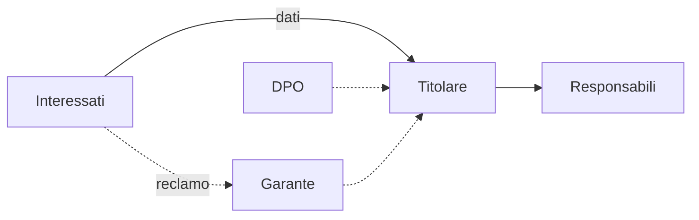

## Contenuti

- Definizioni
- Principi (art. 5)
- Basi giuridiche (art. 6)
- Diritti e soggetti
- Violazioni e sanzioni
- Attività
- Aspetti orientativi

## Definizioni

- **Dato personale**: persona identificata o identificabile
- **Categorie particolari**: salute, biometria, opinioni, religione, ...
- **Titolare**, **responsabile**, **interessato**
- **DPO**: obbligatorio per gli enti pubblici, comprese le scuole

## Principi (art. 5)

- Liceità, correttezza, trasparenza
- Limitazione della finalità
- Minimizzazione
- Esattezza
- Limitazione della conservazione
- Integrità e riservatezza
- Responsabilizzazione; protezione fin dalla progettazione

## Basi giuridiche (art. 6)

- Consenso, contratto, obbligo legale, interessi vitali, interesse pubblico, legittimo interesse
- Scuola statale: soprattutto obbligo legale e interesse pubblico
- Servizi online ai minori: consenso autonomo dai 14 anni in Italia

## Diritti e soggetti

Accesso, rettifica, cancellazione, limitazione, portabilità, opposizione

## Violazioni e sanzioni

- Notifica al Garante entro 72 ore (art. 33)
- Comunicazione agli interessati se rischio elevato (art. 34)
- Sanzioni fino a 20 milioni di euro o al 4% del fatturato mondiale

## Attività

- Informativa privacy di un servizio usato dagli studenti
- Scheda: titolare, dati, finalità, basi giuridiche, trasferimenti, conservazione, diritti, età minima
- Impostazioni: scaricare i propri dati, limitare la pubblicità personalizzata

## Aspetti orientativi

- DPO, consulenti privacy, diritto delle tecnologie
- Principi tradotti in scelte tecniche
- Servizi gratuiti e dati degli utenti
