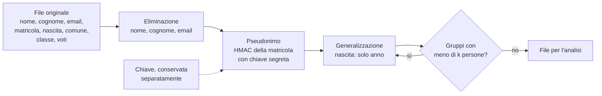

# Lezione 7.2: Classificazione e protezione dei dati

> Fonte della sezione 7.2.1: adattamento da Microsoft, "Security-101", lezione "Data security key concepts", licenza CC0 1.0, https://github.com/microsoft/Security-101/blob/main/7.1%20Data%20security%20key%20concepts.md . Il resto della lezione è contenuto originale. Gli script e il file di dati fittizi sono nella cartella `laboratorio`.

Obiettivo: classificare i dati secondo la loro sensibilità, conoscere le misure di protezione dei dati a riposo, e applicare minimizzazione e pseudonimizzazione a un file di dati.

## 7.2.1 Classificazione

La **classificazione** assegna ai dati un livello di sensibilità, da cui derivano le regole di trattamento: chi può accedervi, dove si possono conservare, come si trasmettono, quando si cancellano. Senza classificazione tutti i dati vengono trattati allo stesso modo: troppo poco protetti quelli sensibili, o troppo vincolati quelli pubblici. Un modello tipico a quattro livelli:

| Livello | Esempi in una scuola | Regole indicative |
|---|---|---|
| **Pubblico** | orari, calendario, circolari pubblicate | nessun vincolo di riservatezza; integrità da garantire |
| **Interno** | verbali delle riunioni, procedure, rubrica interna | solo personale; non pubblicare |
| **Riservato** | voti, assenze, dati anagrafici, dati del personale | accesso per ruolo; cifratura sui dispositivi portatili; trasmissione protetta |
| **Strettamente riservato** | dati sanitari, certificazioni, piani didattici personalizzati, procedimenti disciplinari | accesso nominativo e minimo; cifratura sempre; registrazione degli accessi |

La classificazione fa parte della **gestione del ciclo di vita dei dati**: creazione, uso, conservazione, archiviazione e cancellazione sicura, con tempi di conservazione definiti. Gli strumenti di **prevenzione della perdita di dati** (DLP) controllano che i dati classificati non escano dai canali consentiti, per esempio via email verso l'esterno.

## 7.2.2 Cifratura dei dati a riposo

La cifratura protegge i dati memorizzati quando il supporto finisce nelle mani sbagliate: un portatile smarrito, un disco rubato, una chiavetta dimenticata (lezione 3.1).

- **cifratura dell'intero disco**: in Windows la **crittografia del dispositivo**, disponibile anche nelle edizioni Home sui dispositivi compatibili, e **BitLocker**, nelle edizioni Pro, Enterprise ed Education (https://support.microsoft.com/it-it/windows/crittografia-del-dispositivo-in-windows-cf7e2b6f-3e70-4882-9532-18633605b7df); in macOS FileVault; sugli smartphone moderni è attiva di serie con il blocco dello schermo
- **supporti rimovibili e contenitori cifrati**: BitLocker To Go, oppure **VeraCrypt**, software libero per Windows, macOS e Linux (https://veracrypt.io/en/Home.html)
- **file e archivi**: archivi cifrati con AES-256, per esempio con **7-Zip** (https://www.7-zip.org/), utili per inviare un singolo file riservato; la password va comunicata con un canale diverso
- **database e servizi cloud**: cifratura gestita dal servizio, con attenzione a chi controlla le chiavi

Il punto critico è sempre la **chiave**: la chiave di ripristino di BitLocker va conservata in un luogo sicuro e separato dal dispositivo; senza, i dati cifrati sono persi anche per il proprietario. La cifratura a riposo non protegge i dati mentre il sistema è acceso e l'utente ha effettuato l'accesso: servono anche controllo degli accessi e blocco dello schermo.

## 7.2.3 Minimizzazione, pseudonimizzazione e anonimizzazione

- **Minimizzazione**
  raccogliere e conservare solo i dati necessari; il dato più protetto è quello che non si possiede.
- **Pseudonimizzazione** (GDPR, art. 4)
  i dati non possono più essere attribuiti a una persona senza informazioni aggiuntive, conservate separatamente e protette. I dati pseudonimizzati restano **dati personali**, ma il rischio in caso di violazione è minore.
- **Anonimizzazione**
  nessuno, con mezzi ragionevoli, può più risalire alle persone; i dati anonimi non sono più dati personali. È difficile da ottenere davvero.

Tecniche:

- **eliminazione** degli identificativi diretti: nome, cognome, email, codice fiscale
- **sostituzione** con uno pseudonimo, per esempio calcolato con **HMAC** e una chiave segreta: lo stesso identificativo produce sempre lo stesso pseudonimo, così si possono collegare dati raccolti in momenti diversi, ma senza la chiave non lo si può ricalcolare
- **generalizzazione**: data di nascita ridotta all'anno, comune ridotto alla provincia, età in fasce
- **aggregazione**: pubblicare solo totali e medie, mai righe singole

Perché non basta un hash semplice: se l'insieme dei valori possibili è piccolo o noto (le matricole di una scuola, i nomi di una classe), chiunque può calcolare l'hash di ogni valore e confrontarlo con quelli del file. Con HMAC serve anche la chiave.

Perché eliminare i nomi non basta: i **quasi-identificativi**, cioè informazioni non identificative da sole (anno di nascita, comune, classe), combinate possono individuare una persona. Uno studente nato nel 2010 che abita a Pianoro, unico nella sua classe, è riconoscibile da chi conosce la classe. Il criterio della **k-anonimità** richiede che ogni combinazione di quasi-identificativi riguardi almeno k persone.

Diagramma: dal file originale al file per l'analisi.



## 7.2.4 Laboratorio: pseudonimizzazione in Python

Tempo indicativo: 40 minuti. Cartella di lavoro `C:\corso-cyber\lab72`, con i file della cartella `laboratorio`. Il file `studenti_fittizi.csv` contiene 40 studenti inventati, con nomi generati casualmente.

```powershell
python pseudonimizza.py studenti_fittizi.csv studenti_pseudonimizzati.csv chiave.txt
```

```text
Righe pseudonimizzate: 40; file creato: studenti_pseudonimizzati.csv
Chiave in chiave.txt: va conservata separatamente dal file dei dati.

Attenzione: 16 combinazioni di anno_nascita, comune, classe riguardano meno di 3 persone:
  ('2008', 'Bologna', '4B'): 2
  ...
  ('2010', 'Pianoro', '4A'): 1
  ...
```

Prime righe del file prodotto (gli pseudonimi dipendono dalla chiave, creata casualmente):

```text
pseudonimo,anno_nascita,comune,classe,media_informatica,assenze
834acb1941ca,2008,Bologna,4B,8.0,18
7b88bb16465c,2009,Zola Predosa,4A,6.0,7
```

Funzione principale:

```python
def pseudonimo(valore, chiave, lunghezza=12):
    return hmac.new(chiave, valore.encode("utf-8"), hashlib.sha256).hexdigest()[:lunghezza]
```

`hmac.new` combina chiave e valore secondo lo standard HMAC; la chiave è creata con `secrets.token_bytes(32)`. Test: `python test_pseudonimizza.py` (12 test).

### Attività

1. Eseguire due volte lo script con la stessa chiave e verificare che gli pseudonimi coincidano; poi cancellare `chiave.txt` e rieseguire: che cosa cambia, e quando è utile l'uno o l'altro comportamento?
2. Classificare ciascuna colonna del file originale: identificativo diretto, quasi-identificativo, dato di interesse per l'analisi.
3. Modificare la funzione `trasforma` per generalizzare ulteriormente: comune sostituito da "Bologna" o "provincia", oppure eliminato. Rieseguire fino a non avere più gruppi con meno di 3 persone. Quali analisi non sono più possibili?
4. Calcolare dal file pseudonimizzato la media dei voti per classe e per anno di nascita, con Python o con un foglio di calcolo.
5. Discussione: il file pseudonimizzato può essere consegnato a un fornitore esterno per un'analisi statistica? E la chiave?

## 7.2.5 Aspetti orientativi (discussione)

- La protezione dei dati sfrutta competenze di statistica e di informatica: i data engineer e i data scientist devono sapere come ridurre i rischi dei dati che usano.
- Le tecniche per proteggere la privacy nei dati (privacy enhancing technologies), come la privacy differenziale, sono un campo di ricerca attivo.
- Domanda: perché è così difficile anonimizzare davvero un insieme di dati che contiene molte informazioni sulla stessa persona?
