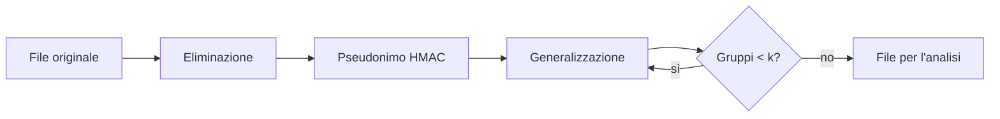

## Lezione 7.2: Classificazione e protezione dei dati

Modulo 7: Dati, privacy e continuità. Cybersecurity ed Ethical Hacking

Fonte sezione 7.2.1: Microsoft, "Security-101", licenza CC0 1.0
https://github.com/microsoft/Security-101

---

## Classificazione

| Livello | Esempi |
|---|---|
| Pubblico | orari, circolari |
| Interno | verbali, procedure |
| Riservato | voti, assenze, anagrafica |
| Strettamente riservato | dati sanitari, piani personalizzati |

Ciclo di vita dei dati; DLP

---

## Cifratura a riposo

- Crittografia del dispositivo e BitLocker (Windows), FileVault (macOS)
- VeraCrypt, BitLocker To Go
- Archivi AES-256 con 7-Zip
- La chiave di ripristino va conservata separatamente

---

## Minimizzazione e pseudonimizzazione

- Pseudonimizzati: ancora dati personali; anonimi: non più
- Eliminazione, pseudonimo HMAC, generalizzazione, aggregazione
- Hash semplice: ricalcolabile su valori noti
- Quasi-identificativi e k-anonimità

---

## Dal file originale al file per l'analisi



---

## Laboratorio

```powershell
python pseudonimizza.py studenti_fittizi.csv studenti_pseudonimizzati.csv chiave.txt
```

- 40 studenti fittizi
- 16 combinazioni con meno di 3 persone: generalizzare ancora
- 12 test

---

## Aspetti orientativi

- Data engineer e data scientist attenti alla privacy
- Privacy enhancing technologies
- Perché anonimizzare davvero è difficile?
