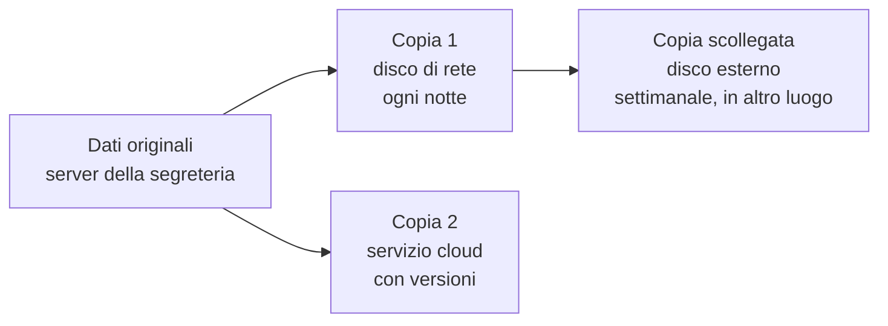

# Lezione 7.3: Backup e continuità

> Contenuto originale. Riferimenti: lezioni 3.2 (impronte), 6.4 (ransomware) e 7.2. Lo script e il modello di piano sono nella cartella `laboratorio`.

Obiettivo: progettare una strategia di backup secondo la regola 3-2-1, verificarla con una prova di ripristino e collegarla alla continuità operativa di un'organizzazione.

## 7.3.1 Perché i backup

Un **backup** è una copia dei dati conservata per poterli ripristinare dopo una perdita. Le cause di perdita sono molte e in gran parte non malevole: guasti dei dischi, cancellazioni per errore, file sovrascritti, furto o smarrimento dei dispositivi, incendi e allagamenti, ransomware (lezione 6.4).

La sincronizzazione con un servizio cloud **non è un backup** se replica subito anche le cancellazioni e le cifrature: un file cancellato o cifrato sul PC viene cancellato o cifrato anche nella copia, salvo che il servizio conservi le versioni precedenti.

## 7.3.2 La regola 3-2-1

- **3** copie dei dati: l'originale e due backup
- su **2** supporti o sistemi diversi, per esempio un disco di rete e un servizio cloud
- di cui **1** in un luogo diverso, lontano dall'originale

Molte guide aggiungono oggi due requisiti (regola 3-2-1-1-0):

- **1** copia **scollegata** (offline) o **non modificabile** (immutabile) per un periodo stabilito: il ransomware che cifra i dati raggiungibili dalla rete non può cifrarla
- **0** errori nelle **prove di ripristino**: un backup mai provato non è un backup

Diagramma: la regola 3-2-1 con una copia scollegata.



## 7.3.3 Scelte di progetto

- **Che cosa**: dati prima di tutto; sistemi e configurazioni se il ripristino da zero richiederebbe troppo tempo
- **Tipo**: **completo** (tutti i dati), **incrementale** (solo le modifiche dall'ultimo backup di qualsiasi tipo), **differenziale** (le modifiche dall'ultimo backup completo)
- **Frequenza**: stabilita dal **RPO** (Recovery Point Objective), la quantità massima di dati che si accetta di perdere, espressa come tempo: con RPO di 24 ore basta un backup al giorno
- **Tempo di ripristino**: stabilito dal **RTO** (Recovery Time Objective), il tempo massimo entro cui il servizio deve tornare disponibile
- **Conservazione**: quante versioni e per quanto tempo; per esempio 7 giornaliere, 4 settimanali, 12 mensili. Un attacco scoperto dopo tre settimane (scenario della lezione 6.4) richiede versioni più vecchie
- **Protezione**: backup cifrati, con chiavi conservate separatamente; accesso limitato; i backup contengono gli stessi dati personali dell'originale (lezione 7.1)
- **Verifica**: controllo automatico dell'integrità e prove periodiche di ripristino, documentate

## 7.3.4 Continuità operativa

La **continuità operativa** (business continuity) è la capacità di un'organizzazione di continuare a svolgere le attività essenziali durante e dopo un evento grave. Il **ripristino in caso di disastro** (disaster recovery) ne è la parte tecnica: riportare in funzione sistemi e dati.

Elementi di un piano di continuità:

- elenco dei **processi essenziali** e dei loro tempi massimi di interruzione (per una scuola: registro, comunicazioni alle famiglie, esami, stipendi, iscrizioni)
- **dipendenze**: sistemi, dati, fornitori, persone necessari a ogni processo
- **modalità alternative** temporanee: procedure cartacee, dispositivi di riserva, sedi diverse
- **ruoli e contatti**, anche fuori orario
- **prove ed esercitazioni** periodiche (lezione 6.4)

## 7.3.5 Laboratorio: piano di backup e prova di ripristino

Tempo indicativo: 50 minuti, a gruppi di tre. Cartella di lavoro `C:\corso-cyber\lab73`, con i file della cartella `laboratorio`.

### Parte 1: il piano

Scenario: un piccolo ufficio di segreteria con 4 PC, un server di file con 200 GB di documenti che crescono di circa 1 GB al mese, una connessione a Internet, e una persona che può dedicare 15 minuti alla settimana ai backup. Compilare il file `piano_backup.md`: dati da salvare, RPO e RTO, tipo e frequenza dei backup, supporti e luoghi (regola 3-2-1), copia scollegata, conservazione, cifratura, responsabile, calendario delle prove di ripristino.

### Parte 2: backup e prova di ripristino con Python

Lo script `backup.py` crea archivi ZIP datati con l'elenco delle impronte SHA-256 di tutti i file (lezione 3.2), li verifica, esegue la prova di ripristino in una cartella nuova e conserva solo gli ultimi N archivi.

```powershell
python backup.py crea C:\corso-cyber\lab73\documenti D:\backup_prova --conserva 7
python backup.py verifica D:\backup_prova\backup_20261007_180000.zip
python backup.py ripristina D:\backup_prova\backup_20261007_180000.zip C:\corso-cyber\lab73\prova_ripristino
```

Output di esempio (dimensione e numero dei file dipendono dai dati):

```text
Creato: D:\backup_prova\backup_20261007_180000.zip (48213 byte)
Archivio integro.
File ripristinati: 12; problemi: 0
```

La cartella `documenti` si prepara con alcuni file e sottocartelle di prova creati dagli studenti; `D:` indica un secondo disco o una chiavetta. Il nome dell'archivio contiene data e ora della creazione.

Scelte dello script:

- lo script rifiuta una destinazione che si trovi dentro la cartella da salvare, che altrimenti finirebbe per copiare anche i backup precedenti
- `verifica` usa sia il controllo interno del formato ZIP (`testzip`) sia le impronte registrate al momento del backup
- `ripristina` accetta solo una cartella nuova o vuota: una prova di ripristino non deve sovrascrivere i dati originali

Test: `python test_backup.py` (10 test, su cartelle temporanee).

### Attività

1. Creare tre backup a distanza di qualche minuto, modificando un file e cancellandone un altro tra l'uno e l'altro; ripristinare il secondo e verificare quale versione dei file si ottiene.
2. Aprire un archivio con un programma di compressione, modificare un file al suo interno e rieseguire `verifica`: che cosa segnala?
3. Lo script soddisfa da solo la regola 3-2-1? Che cosa manca, e come si otterrebbe nello scenario della parte 1?
4. Aggiungere al piano la procedura di prova di ripristino scritta passo per passo, in modo che possa eseguirla anche una persona che non l'ha mai fatta.

## 7.3.6 Aspetti orientativi (discussione)

- La gestione dei backup è un compito dei sistemisti; nelle organizzazioni più grandi esistono ruoli dedicati alla continuità operativa e al ripristino in caso di disastro.
- Dopo i grandi attacchi ransomware, la capacità di ripristino è diventata una delle prime domande di assicurazioni, revisori e autorità di controllo.
- Domanda: nella propria vita digitale (foto, documenti, compiti), quale regola di backup si applica oggi, e che cosa si perderebbe con la rottura o il furto dello smartphone?
