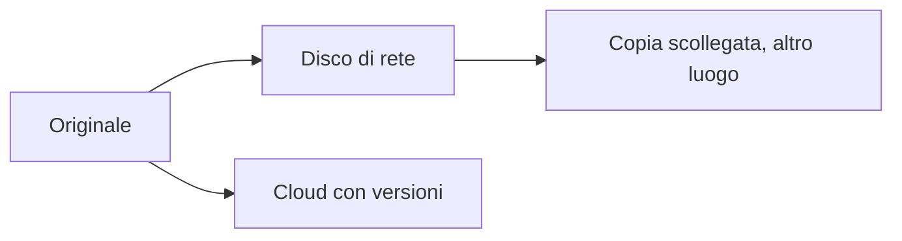

## Contenuti

- Perché i backup
- Regola 3-2-1 (1-0)
- Scelte di progetto
- Continuità operativa
- Laboratorio
- Aspetti orientativi

## Perché i backup

- Guasti, errori, furti, disastri, ransomware
- La sincronizzazione non è un backup, senza versioni

## Regola 3-2-1 (1-0)

- 3 copie, 2 supporti, 1 fuori sede
- 1 scollegata o non modificabile, 0 errori nelle prove di ripristino

## Scelte di progetto

- Completo, incrementale, differenziale
- **RPO**: dati che si accetta di perdere
- **RTO**: tempo massimo di ripristino
- Conservazione delle versioni, cifratura, verifica

## Continuità operativa

- Processi essenziali e tempi massimi di interruzione
- Dipendenze, modalità alternative, ruoli
- Disaster recovery; prove ed esercitazioni

## Laboratorio

1. Piano di backup per un piccolo ufficio (`piano_backup.md`)
2. `python backup.py crea | verifica | ripristina`
3. Archivi datati con impronte SHA-256; conservazione degli ultimi N; 10 test

## Aspetti orientativi

- Sistemisti, continuità operativa, disaster recovery
- Capacità di ripristino: domanda di assicurazioni e revisori
- Il backup della propria vita digitale
