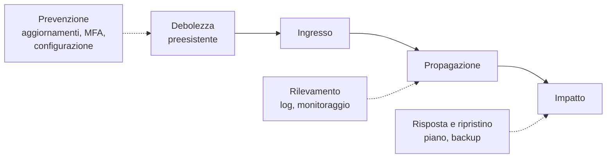

# Lezione 8.1: Casi reali, parte 1

> Contenuto originale. I dati dei casi sono tratti dalle voci di Wikipedia indicate in ciascuna scheda, consultate a settembre 2026; per l'approfondimento i gruppi usano le stesse voci e le fonti che esse citano.

Obiettivo: analizzare incidenti reali di grande rilievo con uno schema comune, collegando cause, impatto e contromisure ai concetti del corso.

## 8.1.1 Perché studiare i casi reali

Gli incidenti reali mostrano che la maggior parte dei danni non deriva da tecniche sconosciute, ma da **errori noti**: aggiornamenti non installati, credenziali senza autenticazione a più fattori, monitoraggio assente, dipendenze non controllate, backup non adeguati. Ogni caso è anche una lezione su **organizzazione e decisioni**, non solo sulla tecnica.

## 8.1.2 Schema comune di analisi

| Voce | Domande |
|---|---|
| Contesto | Chi è l'organizzazione colpita? Che cosa fa? Quando è successo? |
| Ingresso | Da dove è entrato l'attaccante, o qual è stata la causa iniziale? |
| Debolezza | Quale errore o mancanza ha reso possibile l'incidente? Categoria OWASP o tecnica MITRE ATT&CK più vicina |
| Propagazione | Come si è esteso l'incidente dopo l'ingresso? |
| Impatto | Quali proprietà sono state compromesse (riservatezza, integrità, disponibilità)? Chi ha subito danni, e quali? |
| Rilevamento e risposta | Quando e come è stato scoperto? Che cosa è stato fatto? |
| Conseguenze | Costi, sanzioni, cause legali, conseguenze per le persone |
| Contromisure | Che cosa lo avrebbe evitato o limitato? In quale modulo del corso se ne è parlato? |

Diagramma: la catena di un incidente e i punti di intervento.

## 8.1.3 Cinque casi

### WannaCry (2017)

Voce: https://it.wikipedia.org/wiki/WannaCry

- **Che cosa**: ransomware che nel maggio 2017 colpì in pochi giorni oltre 230.000 computer in 150 paesi, tra cui ospedali del servizio sanitario britannico (NHS), aziende di trasporti e di telecomunicazioni.
- **Debolezza**: si propagava da solo attraverso una vulnerabilità del protocollo di condivisione dei file di Windows (SMB), per la quale Microsoft aveva pubblicato l'aggiornamento MS17-010 due mesi prima; molti sistemi non erano aggiornati, alcuni usavano versioni di Windows non più supportate.
- **Svolta**: un ricercatore britannico scoprì che il programma controllava l'esistenza di un dominio non registrato; registrandolo, ne fermò gran parte della diffusione.
- **Collegamenti al corso**: aggiornamenti (A03 e A02), servizi esposti e segmentazione (modulo 4), backup (modulo 7).

### Equifax (2017)

Voce: https://en.wikipedia.org/wiki/2017_Equifax_data_breach

- **Che cosa**: violazione dei dati di un'agenzia statunitense di informazioni creditizie: dati personali di circa 148 milioni di persone negli Stati Uniti, oltre a cittadini britannici e canadesi.
- **Debolezza**: un sito web usava una versione della libreria Apache Struts con una vulnerabilità nota, corretta da un aggiornamento pubblicato due mesi prima dell'attacco.
- **Rilevamento**: l'intrusione è rimasta inosservata per 76 giorni; un dispositivo di monitoraggio del traffico non funzionava perché il suo certificato era scaduto da mesi (lezione 3.3), e appena rinnovato ha segnalato l'attività sospetta.
- **Conseguenze**: accordo da circa 575 milioni di dollari con le autorità statunitensi.
- **Collegamenti al corso**: dipendenze (lezione 5.3), monitoraggio (modulo 6), inventario dei sistemi.

### SolarWinds (2020)

Voce: https://en.wikipedia.org/wiki/2020_United_States_federal_government_data_breach

- **Che cosa**: campagna di spionaggio attribuita dal governo statunitense ai servizi di intelligence esteri russi; colpì agenzie governative e grandi aziende.
- **Debolezza**: gli aggiornamenti del software di gestione delle reti Orion furono modificati nel sistema di produzione del fornitore; circa 18.000 clienti installarono una versione compromessa, firmata regolarmente.
- **Rilevamento**: scoperto nel dicembre 2020 da un'azienda di sicurezza che indagava su un'intrusione nei propri sistemi, dopo circa nove mesi.
- **Collegamenti al corso**: catena di fornitura del software (A03, A08), firme digitali che garantiscono la provenienza ma non l'assenza di manomissioni a monte (lezione 3.2), monitoraggio del comportamento.

### Log4Shell (2021)

Voce: https://en.wikipedia.org/wiki/Log4Shell

- **Che cosa**: vulnerabilità di gravità massima (CVE-2021-44228, punteggio CVSS 10) nella libreria Log4j, usata per scrivere i log in un numero enorme di applicazioni Java, da servizi cloud a giochi.
- **Debolezza**: la libreria interpretava come istruzioni alcuni testi presenti nei dati registrati: un caso di dati trattati come codice (iniezione, lezione 5.2), presente dal 2013.
- **Risposta**: tre aggiornamenti in undici giorni nel dicembre 2021; la difficoltà principale per le organizzazioni fu scoprire **dove** la libreria fosse usata, spesso come dipendenza indiretta.
- **Collegamenti al corso**: iniezione (A05), inventario delle dipendenze e SBOM (lezione 5.3), rapidità della risposta.

### Colonial Pipeline (2021)

Voce: https://en.wikipedia.org/wiki/Colonial_Pipeline_ransomware_attack

- **Che cosa**: ransomware contro il principale oleodotto della costa orientale degli Stati Uniti; l'azienda fermò l'oleodotto per precauzione, con carenze di carburante per alcuni giorni.
- **Ingresso**: la password di un account VPN non più usato, senza autenticazione a più fattori.
- **Risposta**: l'azienda pagò un riscatto di circa 4,4 milioni di dollari, ma lo strumento di decifratura era lento e il ripristino avvenne soprattutto dai backup; il Dipartimento di Giustizia recuperò in seguito gran parte della somma.
- **Collegamenti al corso**: MFA e ciclo di vita degli account (modulo 2), risposta agli incidenti e decisione sul riscatto (lezione 6.4), backup (lezione 7.3).

## 8.1.4 Attività

Tempo indicativo: 45 minuti. La classe si divide in cinque gruppi, uno per caso.

1. Ogni gruppo legge la voce indicata e almeno una delle fonti che essa cita (15 minuti).
2. Compila lo schema della sezione 8.1.2 (15 minuti).
3. Prepara per la lezione 8.2 una presentazione di 3 minuti: una diapositiva con la catena dell'incidente, una con le tre contromisure più importanti.

Domande per il confronto finale:

- quali debolezze ricorrono in più casi?
- in quali casi il problema principale era tecnico, in quali organizzativo?
- quale contromisura, se applicata, avrebbe avuto l'effetto maggiore sull'insieme dei casi?

## 8.1.5 Aspetti orientativi (discussione)

- L'analisi degli incidenti e la ricerca sulle minacce (threat intelligence) sono attività professionali: i rapporti pubblicati dopo un incidente sono studiati da tutto il settore.
- Molti incidenti hanno avuto conseguenze legali e politiche: la sicurezza informatica coinvolge anche giuristi, giornalisti, decisori pubblici.
- Domanda: perché le organizzazioni colpite spesso esitano a rendere pubblici i dettagli di un incidente, e perché farlo è utile a tutti?
