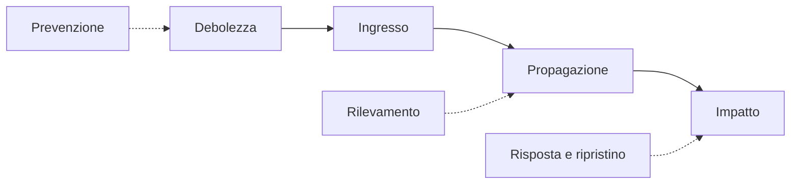

## Lezione 8.1: Casi reali, parte 1

Modulo 8: Casi reali e professioni. Cybersecurity ed Ethical Hacking

---

## Perché i casi reali

- Danni da errori noti: aggiornamenti, MFA, monitoraggio, dipendenze, backup
- Lezioni tecniche e organizzative

---

## Schema comune di analisi

| Voce | Domanda |
|---|---|
| Contesto | chi, che cosa, quando |
| Ingresso e debolezza | quale errore lo ha reso possibile |
| Propagazione e impatto | riservatezza, integrità, disponibilità |
| Rilevamento e risposta | quando, come |
| Conseguenze e contromisure | costi, sanzioni, che cosa lo avrebbe evitato |

---

## La catena di un incidente

---

## Cinque casi

| Caso | Anno | Debolezza principale |
|---|---|---|
| WannaCry | 2017 | aggiornamento MS17-010 non installato |
| Equifax | 2017 | libreria non aggiornata; monitoraggio fermo per un certificato scaduto |
| SolarWinds | 2020 | aggiornamenti del fornitore compromessi |
| Log4Shell | 2021 | dati trattati come codice in una libreria diffusissima |
| Colonial Pipeline | 2021 | account VPN inutilizzato senza MFA |

---

## Attività

- Cinque gruppi, un caso ciascuno
- Voce di Wikipedia e almeno una fonte citata
- Schema compilato; presentazione di 3 minuti nella lezione 8.2

---

## Aspetti orientativi

- Analisi degli incidenti e threat intelligence
- Conseguenze legali e politiche
- Perché pubblicare i dettagli di un incidente è utile a tutti?
