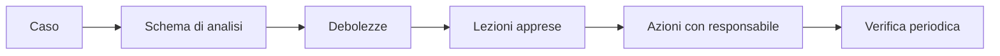

# Lezione 8.2: Casi reali, parte 2

> Contenuto originale. I dati dei casi sono tratti dagli articoli indicati in ciascuna scheda, consultati a settembre 2026.

Obiettivo: analizzare incidenti avvenuti in Italia nel settore pubblico e nella scuola, confrontarli con i casi internazionali della lezione 8.1 e ricavarne lezioni apprese.

## 8.2.1 Presentazione dei casi della lezione 8.1

Tempo indicativo: 20 minuti. Ogni gruppo presenta il proprio caso in 3 minuti; dopo ogni presentazione, un minuto di domande. Al termine, la classe compila alla lavagna una tabella con le debolezze ricorrenti.

## 8.2.2 Tre casi italiani

### Registro elettronico Axios (aprile 2021)

Fonti: Punto Informatico, https://www.punto-informatico.it/axios-registro-attacco-ransomware-ripristino/ ; Agenda Digitale, https://www.agendadigitale.eu/sicurezza/blocco-registri-elettronici-per-ransomware-quali-lezioni-dal-caso-axios/

- **Che cosa**: un attacco ransomware ai sistemi di un fornitore di registri elettronici, nel fine settimana di Pasqua, rese inutilizzabile per circa una settimana il registro di una larga parte delle scuole italiane: voti, assenze, comunicazioni, compiti, prenotazione dei colloqui.
- **Aspetti notevoli**: le scuole, clienti del servizio, non avevano alcun controllo sui sistemi colpiti ma dovevano comunque garantire le attività; il fornitore dichiarò che i dati personali non erano stati persi. L'attacco avvenne in un periodo festivo, quando i controlli sono ridotti.
- **Collegamenti al corso**: fornitori come responsabili del trattamento (lezione 7.1), continuità operativa e procedure alternative (lezione 7.3), notifiche (lezione 6.4).

### Regione Lazio (agosto 2021)

Fonte: Diritto.it, https://www.diritto.it/garante-privacy-sanzioni-lazio-attacco-ransomware/

- **Che cosa**: nella notte tra il 31 luglio e il 1° agosto 2021 un ransomware colpì i sistemi informatici della Regione, bloccando tra l'altro il sistema di prenotazione delle vaccinazioni in piena campagna vaccinale.
- **Ingresso**: secondo le ricostruzioni, il computer di un dipendente, usato per l'accesso remoto ai sistemi della Regione.
- **Conseguenze**: il Garante per la protezione dei dati personali ha sanzionato la società regionale che gestiva i sistemi (271.000 euro) per aggiornamenti e misure di sicurezza inadeguati, la Regione (120.000 euro) per il controllo insufficiente sul proprio responsabile del trattamento, e un'azienda sanitaria (10.000 euro) per la notifica tardiva della violazione.
- **Collegamenti al corso**: accesso remoto e dispositivi dei dipendenti (moduli 2 e 4), responsabilità di titolare e responsabile (lezione 7.1), notifica entro 72 ore (lezione 6.4).

### Westpole e PA Digitale (dicembre 2023)

Fonte: Il Post, https://www.ilpost.it/2023/12/19/attacco-informatico-westpole-pa/

- **Che cosa**: l'8 dicembre 2023 un ransomware del gruppo criminale LockBit colpì Westpole, fornitore di servizi informatici, e di conseguenza i servizi di PA Digitale, società che fornisce software a enti pubblici: circa 540 comuni e oltre 700 enti persero l'accesso a sistemi come la gestione degli stipendi, il protocollo e l'anagrafe.
- **Risposta**: l'Agenzia per la cybersicurezza nazionale coordinò il ripristino; i dati furono recuperati da copie di alcuni giorni precedenti.
- **Collegamenti al corso**: rischio concentrato nei fornitori (catena di fornitura, A03), ransomware come servizio (modulo 1), backup e RPO (lezione 7.3).

## 8.2.3 Attività: lezioni apprese

Tempo indicativo: 25 minuti, negli stessi gruppi.

1. Ogni gruppo sceglie uno dei tre casi italiani e compila lo schema della lezione 8.1.
2. Confronta il caso con quello internazionale già analizzato: quali somiglianze e quali differenze?
3. Scrive tre **lezioni apprese** rivolte alla propria scuola, in forma di azioni concrete ("la scuola dovrebbe..."), indicando per ciascuna chi dovrebbe occuparsene: dirigente, personale di segreteria, docenti, studenti, fornitori.

Diagramma: dal caso alle azioni.

Discussione finale comune (10 minuti):

- una scuola dipende da molti fornitori (registro elettronico, posta, piattaforme didattiche): che cosa può fare per ridurre il rischio che non controlla direttamente?
- quali lezioni apprese riguardano gli studenti stessi, nel loro uso quotidiano dei servizi digitali?

## 8.2.4 Aspetti orientativi (discussione)

- Il settore pubblico italiano ha un forte bisogno di competenze di sicurezza: l'Agenzia per la cybersicurezza nazionale, le regioni, le aziende sanitarie e i fornitori della pubblica amministrazione assumono specialisti.
- Giornalismo investigativo, diritto e pubblica amministrazione sono ambiti in cui la conoscenza della sicurezza informatica fa la differenza.
- Domanda: in quale dei casi analizzati una persona senza competenze tecniche avrebbe potuto fare di più per evitare o limitare il danno?
