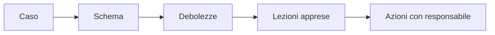

## Contenuti

- Presentazione dei casi
- Registro elettronico Axios (aprile 2021)
- Regione Lazio (agosto 2021)
- Westpole e PA Digitale (dicembre 2023)
- Lezioni apprese
- Aspetti orientativi

## Presentazione dei casi

- Cinque presentazioni da 3 minuti
- Tabella comune delle debolezze ricorrenti

## Registro elettronico Axios (aprile 2021)

- Ransomware al fornitore, nel fine settimana di Pasqua
- Registro fuori servizio per circa una settimana in molte scuole
- Scuole senza controllo sui sistemi, ma responsabili delle attività
- Fornitori, continuità operativa, notifiche

## Regione Lazio (agosto 2021)

- Prenotazioni delle vaccinazioni bloccate
- Ingresso dal computer di un dipendente usato per l'accesso remoto
- Sanzioni del Garante: società regionale 271.000 euro, Regione 120.000, azienda sanitaria 10.000

## Westpole e PA Digitale (dicembre 2023)

- Ransomware LockBit a un fornitore di servizi informatici
- Circa 540 comuni e oltre 700 enti senza stipendi, protocollo, anagrafe
- Ripristino coordinato dall'ACN da copie di alcuni giorni prima

## Lezioni apprese

- Tre azioni per la propria scuola, con chi se ne occupa

## Aspetti orientativi

- Settore pubblico: ACN, regioni, sanità, fornitori
- Giornalismo, diritto, amministrazione
- Che cosa avrebbe potuto fare una persona senza competenze tecniche?
