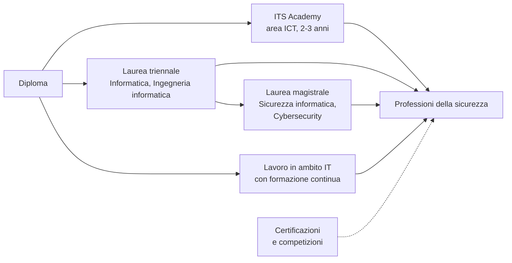

# Lezione 8.3: Professioni della sicurezza

> Contenuto originale. Riferimenti: ENISA, European Cybersecurity Skills Framework (ECSF); siti di CyberChallenge.IT e OliCyber.IT, consultati a settembre 2026. La scheda di orientamento è nella cartella `attivita`.

Obiettivo: conoscere i principali ruoli professionali della sicurezza informatica, le competenze richieste e i percorsi di studio e di formazione, e riflettere sulle proprie attitudini.

## 8.3.1 Un settore con molti ruoli

La sicurezza informatica non è un unico mestiere: comprende ruoli tecnici, di gestione, giuridici e formativi. L'Agenzia dell'Unione europea per la cibersicurezza (ENISA) ha definito nel 2022 lo **European Cybersecurity Skills Framework** (ECSF), che descrive 12 profili professionali con compiti, competenze e conoscenze: https://www.enisa.europa.eu/topics/skills-and-competences/skills-development/european-cybersecurity-skills-framework-ecsf

| Profilo ECSF | In sintesi | Collegamento con il corso |
|---|---|---|
| Chief Information Security Officer (CISO) | guida la strategia di sicurezza dell'organizzazione | tutti i moduli |
| Cyber Incident Responder | rileva, analizza e gestisce gli incidenti | modulo 6 |
| Cyber Legal, Policy and Compliance Officer | cura il rispetto delle norme su sicurezza e dati | moduli 1 e 7 |
| Cyber Threat Intelligence Specialist | raccoglie e analizza informazioni sulle minacce | lezioni 1.3 e 4.4 |
| Cybersecurity Architect | progetta architetture sicure | lezioni 4.2 e 4.5 |
| Cybersecurity Auditor | verifica la conformità a norme e politiche | lezione 5.4 |
| Cybersecurity Educator | forma e sensibilizza | lezione 6.3 |
| Cybersecurity Implementer | configura e gestisce le soluzioni di sicurezza | moduli 2, 3 e 4 |
| Cybersecurity Researcher | studia nuove minacce e nuove difese | modulo 3 |
| Cybersecurity Risk Manager | valuta e gestisce i rischi | lezione 1.1 |
| Digital Forensics Investigator | raccoglie e analizza le prove digitali | lezioni 6.1 e 6.4 |
| Penetration Tester | verifica la sicurezza simulando attacchi, con autorizzazione | moduli 4 e 5 |

## 8.3.2 Alcuni ruoli in dettaglio

- **Analista SOC**
  controlla gli allarmi del sistema di monitoraggio, distingue i falsi positivi dagli incidenti, avvia la risposta. Ruolo di ingresso frequente, spesso su turni; richiede conoscenza di sistemi operativi, reti e log, e attenzione costante.
- **Penetration tester**
  esegue verifiche di sicurezza su sistemi e applicazioni, solo con un incarico scritto che ne definisce perimetro e regole, e scrive un rapporto con i problemi trovati e le correzioni proposte. Richiede solide basi di reti, sistemi, programmazione e sviluppo web, e un forte senso etico (lezione 1.2).
- **Responsabile della sicurezza** (CISO)
  definisce strategia, politiche e budget, riferisce alla direzione, coordina persone e fornitori. Si arriva al ruolo dopo anni di esperienza; contano la capacità di comunicare e di decidere quanto le competenze tecniche.
- **Consulente privacy e DPO**
  aiuta le organizzazioni a rispettare il GDPR: registri dei trattamenti, valutazioni d'impatto, gestione delle violazioni, formazione. Unisce competenze giuridiche e tecniche.
- **Sviluppatore con competenze di sicurezza**
  non è un ruolo specialistico, ma è sempre più richiesto: chi scrive software sicuro evita molti problemi alla radice (modulo 5).

Competenze trasversali richieste a tutti: capacità di analisi, curiosità, aggiornamento continuo, lavoro in gruppo, scrittura chiara di rapporti, comunicazione con persone non tecniche, riservatezza e integrità.

## 8.3.3 Percorsi di studio e di formazione

Diagramma: alcuni percorsi dopo il diploma.

- **ITS Academy**: percorsi post-diploma di due o tre anni, con molte ore in azienda; diverse regioni offrono corsi dedicati alla cybersecurity nell'area delle tecnologie dell'informazione. L'offerta si consulta sui siti delle regioni e delle singole fondazioni ITS.
- **Università**: lauree triennali in Informatica, Ingegneria informatica e affini; lauree magistrali specifiche in sicurezza informatica o cybersecurity, offerte da diversi atenei.
- **Certificazioni professionali**: attestano competenze specifiche e sono richieste in molti annunci; alcune sono pensate per chi inizia, altre richiedono anni di esperienza documentata.
- **Autoformazione**: laboratori online, competizioni Capture The Flag, contributi a progetti open source; sempre in ambienti predisposti per l'esercizio e nel rispetto delle regole delle piattaforme.

## 8.3.4 Competizioni e programmi per studenti

- **OliCyber.IT**, Olimpiadi Italiane di Cybersicurezza: programma di formazione e competizione dedicato agli studenti delle scuole secondarie di secondo grado, gratuito, organizzato dal Cybersecurity National Lab del CINI con il sostegno dell'Agenzia per la cybersicurezza nazionale; si partecipa tramite le scuole aderenti al programma CyberHighSchools.IT: https://olicyber.it/
- **CyberChallenge.IT**: programma di formazione introduttiva per studenti delle superiori e universitari tra i 16 e i 24 anni, con test di ammissione, corso di alcuni mesi presso le sedi aderenti e gare locali e nazionale: https://cyberchallenge.it/

Le date delle iscrizioni cambiano ogni anno; per l'edizione 2025-2026 si sono chiuse tra dicembre e gennaio. Conviene controllare i siti all'inizio dell'anno scolastico.

## 8.3.5 Attività: scheda di orientamento personale

Tempo indicativo: 35 minuti, individuale, poi confronto a coppie.

Compilare la scheda `attivita/scheda_orientamento.md`:

1. quali attività del corso sono piaciute di più, e perché
2. con quali profili ECSF ci si sente più in sintonia
3. competenze già possedute e competenze da sviluppare
4. un possibile percorso dopo il diploma, con i passi del prossimo anno
5. un'iniziativa concreta da fare entro tre mesi (per esempio informarsi su OliCyber.IT con il docente referente, provare un laboratorio online, leggere un rapporto su un incidente)

La scheda è personale e non viene valutata; può essere condivisa con il docente tutor come base per il colloquio di orientamento.

## 8.3.6 Conclusione del corso

Discussione finale (10 minuti):

- quale idea sulla sicurezza informatica è cambiata di più durante il corso?
- quale abitudine digitale personale si è già cambiata, o si intende cambiare?
- quali argomenti meriterebbero un approfondimento?
