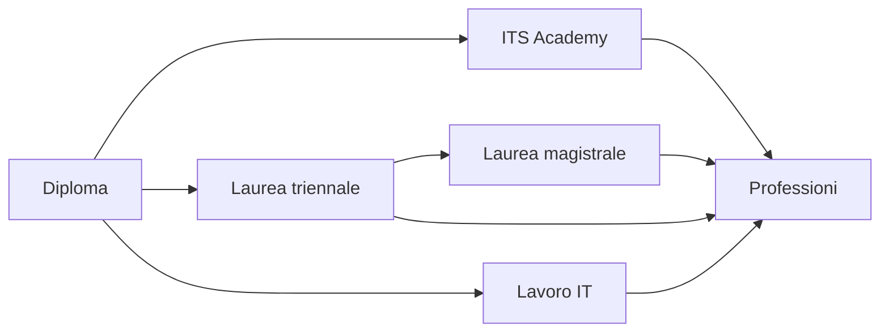

## Lezione 8.3: Professioni della sicurezza

Modulo 8: Casi reali e professioni. Cybersecurity ed Ethical Hacking

---

## I 12 profili ECSF (ENISA)

- CISO, Incident Responder, Legal Policy and Compliance Officer
- Threat Intelligence Specialist, Architect, Auditor
- Educator, Implementer, Researcher
- Risk Manager, Digital Forensics Investigator, Penetration Tester

---

## Alcuni ruoli

- **Analista SOC**: allarmi, falsi positivi, avvio della risposta
- **Penetration tester**: verifiche con incarico scritto, rapporto
- **CISO**: strategia, politiche, direzione
- **Consulente privacy e DPO**
- **Sviluppatore** con competenze di sicurezza

Competenze trasversali: analisi, curiosità, aggiornamento, comunicazione, integrità

---

## Percorsi

Certificazioni, autoformazione, Capture The Flag

---

## Competizioni per studenti

- **OliCyber.IT**: scuole superiori, tramite CyberHighSchools.IT
- **CyberChallenge.IT**: 16-24 anni, formazione e gare
- Organizzate dal CINI con il sostegno dell'ACN
- Iscrizioni tra dicembre e gennaio: controllare a inizio anno

---

## Scheda di orientamento personale

- Attività preferite
- Profili ECSF più vicini
- Competenze possedute e da sviluppare
- Percorso possibile e iniziativa entro tre mesi

---

## Conclusione del corso

- Che cosa è cambiato nell'idea di sicurezza informatica?
- Quale abitudine digitale cambiare?
- Che cosa approfondire?
