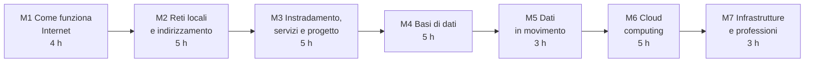

# Reti, Cloud e Gestione dei Dati

Versione del 30/09/2026, ore 21:15. Modifiche rispetto alla versione delle 15:45: nella lezione 7.1 l'attività pratica misura la disponibilità con il monitoraggio (il calcolo con componenti in serie e in parallelo è già svolto nella lezione 6.5); il progetto finale (lezione 7.2) si costruisce durante il corso con i prodotti dei laboratori 2.4, 3.4, 4.4, 5.3, 6.4 e 6.5, senza ore aggiuntive; gli scenari alternativi del progetto finale sono facoltativi.

## Dati generali

- Tipo di percorso: percorso di orientamento per le classi terze, quarte e quinte della scuola secondaria di secondo grado, con il coordinamento del docente tutor.
- Durata: 30 ore, suddivise in unità didattiche di circa un'ora, componibili in sessioni da 2 o 3 ore.
- Destinatari: studenti del triennio di istituto tecnico a indirizzo informatico e di liceo scientifico (16-18 anni).
- Prerequisiti: comprensione di programmi brevi (10-20 righe) in un qualsiasi linguaggio; uso di base del PC (file, cartelle, browser).
- Approccio: laboratoriale e orientato alla progettazione. Gli studenti progettano e simulano reti, progettano e interrogano database, seguono il percorso dei dati dal browser al server e al database, e sperimentano i servizi cloud con emulatori locali. Gli aspetti orientativi sono trattati soprattutto a voce, a partire da brevi elenchi di punti inseriti nei materiali.
- Rapporto con il Corso 2 (Cybersecurity ed Ethical Hacking): alcuni concetti di rete sono comuni; questo corso è autosufficiente e li tratta dal punto di vista della progettazione e del funzionamento, non della sicurezza.

## Obiettivi di apprendimento

Al termine del percorso lo studente:

- descrive che cosa succede tra la digitazione di un indirizzo nel browser e la visualizzazione della pagina: livelli, DNS, TCP/IP, HTTP
- usa gli strumenti di diagnostica di rete di Windows e applica un metodo di diagnosi per livelli
- spiega il funzionamento di Ethernet, switch e ARP, e osserva i pacchetti in un simulatore
- calcola indirizzi, maschere e sottoreti IPv4, anche di dimensione variabile, e conosce la struttura degli indirizzi IPv6
- configura router, instradamento statico e servizi DHCP, DNS e web in un simulatore, e spiega NAT e instradamento dinamico
- progetta la rete di una piccola organizzazione, dai requisiti alla documentazione, e la verifica in un simulatore
- progetta un database relazionale partendo da un problema reale e lo interroga con SQL
- usa un database da un programma Python e scambia dati in formato JSON tramite una semplice API
- spiega i modelli del cloud, la virtualizzazione e i container, e usa un servizio di archiviazione a oggetti emulato localmente
- stima i costi di un'architettura cloud e distingue le responsabilità di fornitore e cliente
- descrive i principi di un'infrastruttura ICT affidabile e i ruoli professionali di reti, dati e cloud

## Strumenti software

Tutti gli strumenti sono gratuiti, con licenza open source o gratuita senza limiti di tempo, funzionano su un laptop Windows con 8 GB di RAM senza macchine virtuali, e non richiedono account né carte di credito. Dove un'estensione di Visual Studio Code è equivalente a un programma separato, si usa l'estensione.

| Tipologia | Strumento consigliato | Alternative | Note |
|---|---|---|---|
| Editor e ambiente di lavoro | Visual Studio Code, versione ZIP in modalità portatile (come nel Corso 1): https://code.visualstudio.com/docs/setup/portable | VSCodium | Tutte le estensioni sotto elencate sono gratuite |
| Programmazione | Python, installazione per utente senza diritti di amministratore, con l'estensione Python di Microsoft per VS Code | WinPython (portatile) | Calcoli di rete, database, JSON, piccole API |
| Simulatore di reti | Filius 2.14 (GPL), progettato per la scuola: https://www.lernsoftware-filius.de/Herunterladen | Cisco Packet Tracer, gratuito ma con account Cisco Networking Academy: solo tramite il docente | Nessuna estensione di VS Code equivalente. Installatore con Java incluso, oppure archivio ZIP portatile con Java 17 o successivo (Eclipse Temurin JRE, archivio ZIP: https://github.com/adoptium/temurin21-binaries/releases); interfaccia in inglese, scelta al primo avvio |
| Diagnostica di rete | comandi di Windows: `ipconfig`, `ping`, `tracert`, `nslookup`, `arp`, `curl`, `netstat` | PowerShell: `Test-NetConnection`, `Resolve-DnsName` | Già presenti in Windows |
| Richieste HTTP e API | estensione REST Client (licenza MIT): https://marketplace.visualstudio.com/items?itemName=humao.rest-client | `curl` da terminale | Richieste scritte in file `.http`, risposte visibili nell'editor |
| Database relazionale | SQLite, con l'estensione SQLite per VS Code (gratuita, include il programma SQLite per Windows): https://marketplace.visualstudio.com/items?itemName=alexcvzz.vscode-sqlite | DB Browser for SQLite, versione ZIP portatile: https://github.com/sqlitebrowser/sqlitebrowser/releases ; modulo `sqlite3` di Python | Un database è un singolo file; l'estensione non è aggiornata dal 2022: in caso di problemi si usa l'alternativa |
| Emulatore di servizi cloud | moto (licenza Apache 2.0), emulatore locale in Python dei servizi AWS, compresa l'archiviazione a oggetti S3: https://github.com/getmoto/moto | nessuna di pari semplicità | Si installa con `pip`; nessun account cloud, nessuna connessione ai servizi reali |
| Diagrammi di rete e di architettura | estensione Draw.io Integration (gratuita, funziona senza connessione): https://marketplace.visualstudio.com/items?itemName=hediet.vscode-drawio | diagrammi Mermaid nei file Markdown | Simboli per reti e cloud |
| Pagine web del modulo 5 | estensione Live Preview di Microsoft (come nel Corso 1) | apertura diretta del file nel browser | |

Non si usano servizi cloud reali, calcolatori dei costi online o piattaforme che richiedano registrazione. Il docente può mostrare facoltativamente, con il proprio account, la console di un fornitore cloud.

## Struttura del corso

Struttura a tre livelli: modulo, lezione (circa un'ora), sezione. Ogni lezione ha tre file: la lezione (`.md`), la presentazione Marp (`_marp.md`) e la presentazione pandoc reveal.js (`_prezpdoc.md`).



Struttura delle directory:

```text
corso03_reti_cloud_dati/
    corso03_00_syllabus_AAAA-MM-GG_hhmm.md (data e ora della versione)
    mod01_come_funziona_internet/
        lez01_dal_browser_al_server/
        lez02_livelli_e_incapsulamento/
        lez03_strumenti_di_diagnostica/
        lez04_http_da_vicino/
    mod02_reti_locali_indirizzamento/
        lez01_ethernet_switch_e_filius/
        lez02_arp_e_indirizzi_mac/
        lez03_indirizzi_ipv4_e_sottoreti/
        lez04_sottoreti_variabili/
        lez05_ipv6/
    mod03_instradamento_servizi_progetto/
        lez01_router_e_instradamento_statico/
        lez02_instradamento_dinamico_e_internet/
        lez03_dhcp_dns_e_nat/
        lez04_vlan_wifi_e_cablaggio/
        lez05_progetto_rete_aziendale/
    mod04_basi_di_dati/
        lez01_dati_e_modello_relazionale/
        lez02_progettazione_er/
        lez03_sql_interrogazioni/
        lez04_sql_join_aggregazioni_modifiche/
        lez05_python_e_database/
    mod05_dati_in_movimento/
        lez01_formati_dei_dati_e_documenti/
        lez02_api_rest/
        lez03_lab_servizio_e_client/
    mod06_cloud_computing/
        lez01_modelli_cloud/
        lez02_virtualizzazione_e_container/
        lez03_lab_storage_a_oggetti/
        lez04_costi_e_responsabilita/
        lez05_architettura_cloud/
    mod07_infrastrutture_professioni/
        lez01_data_center_e_affidabilita/
        lez02_progetto_finale/
        lez03_professioni_e_percorsi/
```

### Modulo 1: Come funziona Internet (4 ore)

Directory: `mod01_come_funziona_internet/`

| Lezione | Contenuti | Attività pratica |
|---|---|---|
| 1.1 Dal browser al server | Client e server; reti, Internet e fornitori di connettività; pacchetti e commutazione di pacchetto | Percorso di una richiesta web ricostruito con la scheda Rete dei DevTools |
| 1.2 Livelli e incapsulamento | Modelli ISO/OSI e TCP/IP; funzione di ogni livello; intestazioni; indirizzi MAC e IP, porte | Lettura guidata di un pacchetto nel visualizzatore di Filius |
| 1.3 Strumenti di diagnostica | Configurazione del PC; raggiungibilità, latenza, percorso; risoluzione dei nomi; metodo di diagnosi dal basso verso l'alto | `ipconfig /all`, `ping`, `tracert`, `nslookup`, `Test-NetConnection`; soluzione di guasti descritti in schede |
| 1.4 HTTP da vicino | Richieste e risposte, metodi, codici di stato, intestazioni, cookie; HTTP e HTTPS | Richieste con REST Client e `curl`; piccolo server web in Python |

### Modulo 2: Reti locali e indirizzamento (5 ore)

Directory: `mod02_reti_locali_indirizzamento/`

| Lezione | Contenuti | Attività pratica |
|---|---|---|
| 2.1 Ethernet, switch e Filius | Topologie; cavi e connettori (rame, fibra); trama Ethernet; funzionamento dello switch e tabella degli indirizzi; collisioni e domini di broadcast | Prima rete in Filius: PC, switch, verifica con `ping` e osservazione della tabella dello switch |
| 2.2 ARP e indirizzi MAC | Struttura dell'indirizzo MAC; ARP e cache ARP; broadcast; rapporto tra livello 2 e livello 3 | Osservazione delle richieste ARP in Filius; `arp -a` sul proprio PC |
| 2.3 Indirizzi IPv4 e sottoreti | Classi storiche e CIDR; maschera; indirizzo di rete e di broadcast; indirizzi privati; calcolo in binario | Esercizi di calcolo, verificati con il modulo `ipaddress` di Python |
| 2.4 Sottoreti di dimensione variabile | Suddivisione di un blocco in sottoreti per requisiti diversi (VLSM); aggregazione; piano di indirizzamento | Piano di indirizzamento per una scuola, calcolato a mano e verificato con uno script |
| 2.5 IPv6 | Motivazioni; notazione e abbreviazioni; prefissi; tipi di indirizzo; autoconfigurazione; coesistenza con IPv4 | Lettura degli indirizzi IPv6 del proprio PC; esercizi di abbreviazione con Python |

### Modulo 3: Instradamento, servizi e progetto (5 ore)

Directory: `mod03_instradamento_servizi_progetto/`

| Lezione | Contenuti | Attività pratica |
|---|---|---|
| 3.1 Router e instradamento statico | Funzione del router; gateway predefinito; tabella di instradamento; rotte statiche; TTL | Tre reti collegate da due router in Filius, con rotte configurate a mano |
| 3.2 Instradamento dinamico e Internet | Protocolli di instradamento (idea di RIP, OSPF, BGP); sistemi autonomi; come è fatta Internet | Instradamento automatico in Filius, dove disponibile; lettura di un `tracert` verso un sito lontano |
| 3.3 DHCP, DNS e NAT | Assegnazione automatica degli indirizzi; server e gerarchia DNS; traduzione degli indirizzi e porte | Server DHCP, DNS e web in Filius; confronto con la configurazione reale del proprio PC |
| 3.4 VLAN, Wi-Fi e cablaggio | VLAN e segmentazione; reti senza fili, standard e sicurezza di base; cablaggio strutturato, armadi, PoE | Progetto dei segmenti e del cablaggio di un piano di un edificio scolastico |
| 3.5 Progetto di una rete aziendale | Dai requisiti al progetto: piano degli indirizzi, schema, servizi, documentazione | Progetto a gruppi, disegnato con Draw.io in VS Code e verificato in Filius |

### Modulo 4: Basi di dati (5 ore)

Directory: `mod04_basi_di_dati/`

| Lezione | Contenuti | Attività pratica |
|---|---|---|
| 4.1 Dati e modello relazionale | Tabelle, righe, colonne, tipi; chiavi primarie ed esterne; DBMS | Esplorazione del database di una biblioteca con l'estensione SQLite di VS Code |
| 4.2 Progettazione concettuale | Entità, attributi, relazioni e cardinalità; dal diagramma E-R alle tabelle | Progetto E-R della biblioteca scolastica |
| 4.3 SQL: interrogazioni | `SELECT`, `WHERE`, `ORDER BY`, funzioni | Esercizi graduati sul database fornito |
| 4.4 SQL: join, aggregazioni e modifiche | `JOIN`, `GROUP BY`, `HAVING`; `CREATE TABLE`, `INSERT`, `UPDATE`, `DELETE`; vincoli | Domande sui dati; creazione del database progettato nella lezione 4.2 |
| 4.5 Python e database | Connessione, query parametriche, lettura dei risultati, transazioni | Programma che importa un file CSV e produce un rapporto |

### Modulo 5: Dati in movimento (3 ore)

Directory: `mod05_dati_in_movimento/`

| Lezione | Contenuti | Attività pratica |
|---|---|---|
| 5.1 Formati dei dati e database a documenti | CSV, JSON, XML; codifica dei caratteri; database non relazionali (documenti, chiave-valore) | Stessi dati in forma relazionale e in documenti JSON, con conversioni in Python |
| 5.2 API REST | Risorse, metodi HTTP, codici di stato, JSON; API pubbliche | Interrogazione di un'API pubblica senza chiave con REST Client e Python |
| 5.3 Laboratorio: servizio e client | Servizio Python che espone il database della biblioteca come API JSON; pagina web che lo usa con `fetch` | Percorso completo browser, API, database, osservato con i DevTools e verificato con test |

### Modulo 6: Cloud computing (5 ore)

Directory: `mod06_cloud_computing/`

| Lezione | Contenuti | Attività pratica |
|---|---|---|
| 6.1 Modelli del cloud | Caratteristiche del cloud; IaaS, PaaS, SaaS; cloud pubblico, privato, ibrido; regioni e zone; cloud per la pubblica amministrazione | Classificazione di servizi usati ogni giorno |
| 6.2 Virtualizzazione e container | Macchine virtuali e hypervisor; container e immagini; orchestrazione (concetti) | Confronto guidato di scenari; lettura commentata di un Dockerfile |
| 6.3 Laboratorio: archiviazione a oggetti | Contenitori (bucket), oggetti, chiavi, metadati; accesso via HTTP; API S3 | Emulatore moto in locale: caricamento, elenco e lettura di file da Python; richieste osservate con REST Client |
| 6.4 Costi e responsabilità | Modelli di prezzo; stima dei costi; modello di responsabilità condivisa; dove si trovano i dati e perché conta | Modello di costo in Python con listini di esempio, confronto di scenari |
| 6.5 Architettura cloud | Architettura a livelli; scalabilità, bilanciamento del carico, alta disponibilità | Schema dell'architettura cloud del servizio del modulo 5, con Draw.io in VS Code |

### Modulo 7: Infrastrutture e professioni (3 ore)

Directory: `mod07_infrastrutture_professioni/`

| Lezione | Contenuti | Attività pratica |
|---|---|---|
| 7.1 Data center e affidabilità | Data center, ridondanza, livelli Tier; disponibilità, MTBF e MTTR; monitoraggio; copie di sicurezza, RPO e RTO; consumi energetici e PUE | Sonda di monitoraggio in Python sul servizio della lezione 5.3, con un guasto simulato; analisi di un registro di controlli; calcoli di disponibilità (serie e parallelo come nella lezione 6.5), PUE, RPO e RTO |
| 7.2 Progetto finale | Presentazione a gruppi di un'infrastruttura completa per la rete delle biblioteche scolastiche: rete, dati, servizio, cloud, responsabilità | Completamento (15 minuti) e presentazioni di 5 minuti più 2 di domande; il progetto riunisce i prodotti dei laboratori 2.4, 3.4, 4.4, 5.3, 6.4 e 6.5; relazione breve e slide preparate a casa |
| 7.3 Professioni e percorsi | Network engineer, amministratore di sistema, amministratore di database, data engineer, cloud engineer, DevOps; percorsi di studio e certificazioni | Scheda di orientamento personale |

## Composizione delle sessioni

Le lezioni sono unità da circa un'ora. Sessioni da 2 ore: 15 sessioni. Sessioni da 3 ore: 10 sessioni, con la terza ora dedicata al laboratorio più lungo o alla lezione successiva. I laboratori dei moduli 2-5 producono file (progetti Filius, database, programmi) che si riprendono nelle lezioni successive: il corso va svolto nell'ordine previsto.

## Verifica degli apprendimenti

- Osservazione delle attività di laboratorio e dei prodotti realizzati: progetti di rete, database, programmi.
- Esercizi di fine lezione, in particolare di indirizzamento IP e di SQL.
- Progetto di rete (lezione 3.5) e progetto finale di gruppo (lezione 7.2).
- Il progetto finale si costruisce durante il corso: ogni gruppo conserva i file prodotti nei laboratori 2.4 (piano di indirizzamento), 3.4 (piano di un edificio), 4.4 (schema del database), 5.3 (servizio), 6.4 (costi) e 6.5 (architettura cloud), che diventano le parti del progetto. Gli scenari alternativi (azienda, museo) sono facoltativi e richiedono lavoro fuori dall'orario del corso.

## Fonti, licenze e attribuzioni

- Microsoft, "Data Science for Beginners", https://github.com/microsoft/Data-Science-For-Beginners . Licenza MIT: le lezioni 05 (dati relazionali) e 06 (dati non relazionali) sono candidate all'adattamento per le lezioni 4.1, 4.3 e 5.1, con attribuzione e URL della lezione di origine.
- Microsoft, "Security-101", https://github.com/microsoft/Security-101 . Licenza CC0 1.0: concetti di rete e di cloud riutilizzabili, indicati nelle lezioni con l'URL della fonte.
- Filius, guida introduttiva in inglese: https://www.lernsoftware-filius.de/downloads/Introduction_Filius.pdf . Usata come riferimento per le attività con il simulatore.
- Le fonti di ciascuna lezione sono indicate nella lezione stessa; per ogni lezione viene verificata l'esistenza di materiali open source riutilizzabili.
