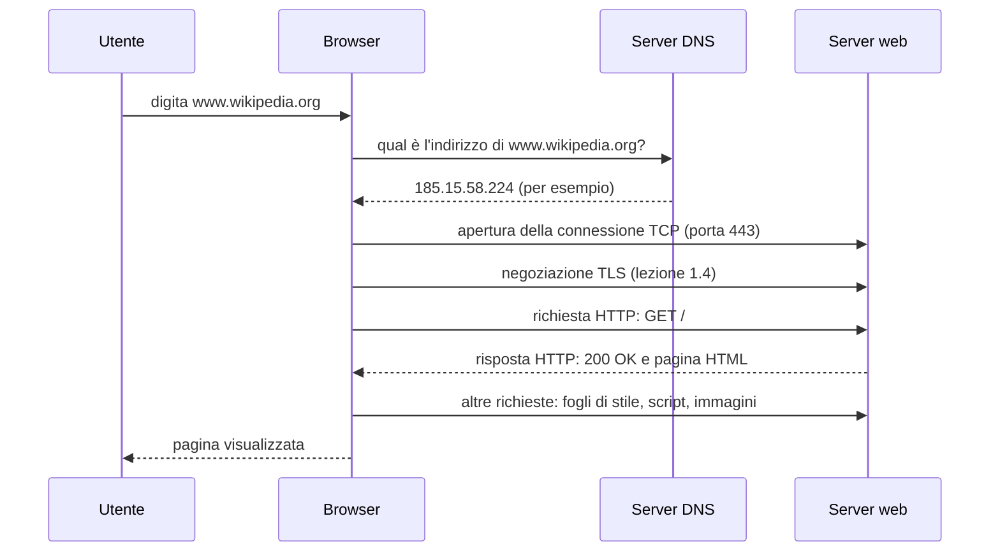

# Lezione 1.1: Dal browser al server

> Contenuto originale. Riferimenti: MDN Web Docs, "An overview of HTTP", https://developer.mozilla.org/en-US/docs/Web/HTTP/Guides/Overview . Gli script sono nella cartella `laboratorio` di questa lezione.

Obiettivo: descrivere che cosa succede tra la digitazione di un indirizzo nel browser e la comparsa della pagina, e misurare le fasi di una richiesta web.

## 1.1.1 Client, server e reti

- **Client**
  programma che chiede un servizio: il browser, un'app, un programma di posta.
- **Server**
  programma, o computer che lo esegue, che offre un servizio e risponde alle richieste: un server web, un server di posta, un database.
- **Rete**
  insieme di dispositivi collegati che si scambiano dati: la rete di casa, quella del laboratorio, quella di un'azienda.
- **Internet**
  rete di reti: decine di migliaia di reti indipendenti, di aziende, università, enti e **fornitori di connettività** (ISP, Internet Service Provider), collegate tra loro e che usano gli stessi protocolli.
- **Protocollo**
  insieme di regole che stabilisce formato e ordine dei messaggi scambiati: HTTP per il web, DNS per i nomi, TCP e IP per il trasporto.

Lo stesso computer può essere client e server: il PC del laboratorio è client quando apre un sito, server quando esegue il server web della lezione 1.4.

## 1.1.2 Pacchetti e commutazione di pacchetto

I dati non viaggiano come un flusso continuo, ma divisi in **pacchetti**: blocchi di al massimo circa 1500 byte su una rete Ethernet, ciascuno con un'intestazione che contiene, tra l'altro, l'indirizzo del destinatario. I dispositivi di rete (router) inoltrano ogni pacchetto verso la destinazione in modo indipendente dagli altri: è la **commutazione di pacchetto**.

Vantaggi rispetto alla vecchia rete telefonica, che riservava un circuito per tutta la durata di una chiamata:

- le linee sono condivise da molte comunicazioni contemporaneamente
- se un collegamento si guasta, i pacchetti successivi possono seguire un'altra strada
- un pacchetto perso si ritrasmette da solo, senza ripetere tutto

Una pagina web di 2 MB richiede quindi più di mille pacchetti, che il computer di destinazione rimette in ordine.

## 1.1.3 Il percorso di una richiesta web

Diagramma: le fasi dall'indirizzo alla pagina.



1. **Risoluzione del nome**: il browser chiede a un server **DNS** l'indirizzo IP corrispondente al nome (lezione 1.2). Il risultato viene conservato per un po' in una memoria temporanea (cache), per non ripetere la richiesta.
2. **Connessione**: il browser apre una connessione **TCP** con il server, all'indirizzo trovato e alla porta del servizio (443 per HTTPS, 80 per HTTP).
3. **Sicurezza**: con HTTPS, client e server negoziano una connessione cifrata **TLS**.
4. **Richiesta e risposta**: il browser invia una richiesta **HTTP**; il server risponde con un codice di stato e il contenuto (lezione 1.4).
5. **Risorse collegate**: la pagina HTML cita altri file (stili, script, immagini, caratteri), che il browser richiede a loro volta; una pagina moderna ne richiede spesso decine.
6. **Visualizzazione**: il browser costruisce la pagina e la mostra.

La **latenza**, il tempo di andata e ritorno di un messaggio, pesa su ogni fase: tra Italia e Stati Uniti è di decine di millisecondi, e ogni fase richiede almeno un andata e ritorno. Per questo i grandi siti usano server vicini agli utenti (reti di distribuzione dei contenuti, CDN).

## 1.1.4 Laboratorio

Tempo indicativo: 40 minuti. Cartella di lavoro `C:\corso-reti\lab11`, con i file della cartella `laboratorio`.

### Parte 1: la scheda Rete dei DevTools

1. Aprire il browser, premere `F12` e scegliere la scheda **Rete** (Network). Attivare **Disattiva cache** (Disable cache).
2. Aprire https://www.wikipedia.org e osservare l'elenco delle richieste: nome del file, codice di stato, tipo, dimensione, tempo.
3. Contare le richieste e i byte trasferiti, indicati in fondo alla scheda.
4. Selezionare la prima richiesta, il documento HTML, e aprire la scheda **Tempi** (Timing): individuare le fasi di ricerca DNS, connessione iniziale, negoziazione SSL/TLS, attesa della risposta del server (tempo al primo byte) e scaricamento del contenuto.
5. Ricaricare la pagina con la cache attiva: quante richieste e quanti byte si risparmiano?

### Parte 2: le stesse fasi con Python

Lo script `misura_richiesta.py` esegue a mano le fasi della richiesta con il modulo `socket` della libreria standard e ne misura la durata:

```powershell
python misura_richiesta.py https://www.wikipedia.org/
```

Output di esempio (i tempi dipendono dalla rete e dal momento):

```text
URL:        https://www.wikipedia.org/
Indirizzo:  185.15.58.224
Risposta:   HTTP/1.1 200 OK  (78231 byte, intestazioni comprese)
  DNS                        12.4 ms  ###
  Connessione TCP            21.0 ms  #####
  TLS                        44.7 ms  ###########
  Attesa della risposta      25.3 ms  ######
  Scaricamento               58.1 ms  ##############
  Totale                    161.5 ms
```

Nucleo dello script:

```python
indirizzi = socket.getaddrinfo(host, porta, type=socket.SOCK_STREAM)   # 1. DNS
sock = socket.socket(famiglia, socket.SOCK_STREAM)
sock.connect(indirizzo)                                                 # 2. connessione TCP
sock = contesto.wrap_socket(sock, server_hostname=host)                # 3. negoziazione TLS
sock.sendall(richiesta.encode("ascii"))                                 # 4. invio della richiesta HTTP
primo_blocco = sock.recv(65536)                                         #    attesa del primo blocco di risposta
```

- `socket.getaddrinfo` chiede al sistema operativo di risolvere il nome, come fa il browser; può restituire più indirizzi, IPv6 e IPv4, che lo script prova in ordine
- `socket.socket` crea un punto di comunicazione; `connect` apre la connessione TCP
- `wrap_socket` avvia la negoziazione TLS; `server_hostname` indica il nome del sito, usato per il certificato
- `sendall` invia il testo della richiesta HTTP; `recv` riceve fino a 65536 byte alla volta
- `time.perf_counter()` misura gli intervalli con precisione, prima e dopo ogni fase

Test: `python test_misura_richiesta.py` (6 test, con server locali, senza Internet).

### Attività

1. Misurare tre siti, uno italiano, uno europeo, uno di un altro continente (per esempio un'università americana o giapponese): quale fase cresce di più con la distanza?
2. Eseguire lo script due volte di seguito sullo stesso sito: la fase DNS cambia? Perché?
3. Confrontare i tempi dello script con quelli della scheda Tempi dei DevTools per lo stesso sito.

## 1.1.5 Aspetti orientativi (discussione)

- Le prestazioni dei siti sono un campo professionale specifico: ingegneri delle prestazioni e delle reti di distribuzione dei contenuti misurano ogni millisecondo, perché incide su vendite e soddisfazione degli utenti.
- I fornitori di connettività e gli operatori di telecomunicazioni sono tra i principali datori di lavoro per chi si occupa di reti.
- Domanda: perché una pagina "leggera" può caricarsi più lentamente di una "pesante"?
