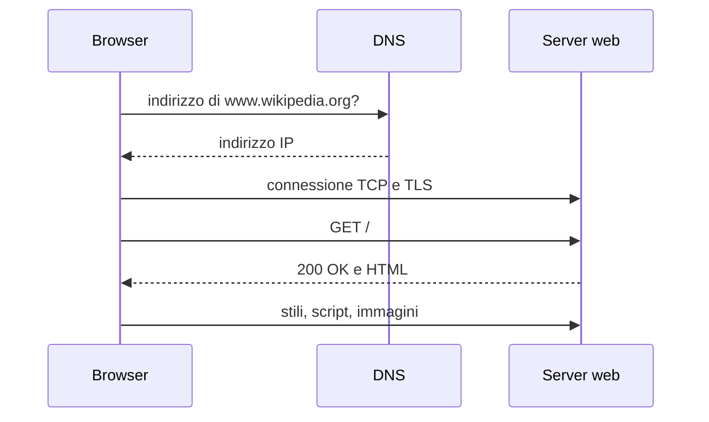

## Contenuti

- Client, server, reti
- Commutazione di pacchetto
- Il percorso di una richiesta
- Laboratorio
- Aspetti orientativi

## Client, server, reti

- **Client**: chiede un servizio; **server**: risponde
- **Internet**: rete di reti, collegate da fornitori di connettività
- **Protocollo**: regole su formato e ordine dei messaggi

## Commutazione di pacchetto

- Dati divisi in pacchetti (circa 1500 byte su Ethernet)
- Ogni pacchetto instradato in modo indipendente
- Linee condivise, percorsi alternativi, ritrasmissioni

## Il percorso di una richiesta

## Laboratorio

1. DevTools, scheda Rete: richieste, byte, scheda Tempi
2. `python misura_richiesta.py https://www.wikipedia.org/`
3. Fasi: DNS, connessione TCP, TLS, attesa, scaricamento
4. Confronto tra siti vicini e lontani; 6 test

## Aspetti orientativi

- Prestazioni e reti di distribuzione dei contenuti
- Operatori e fornitori di connettività
- Perché una pagina leggera può essere lenta?
