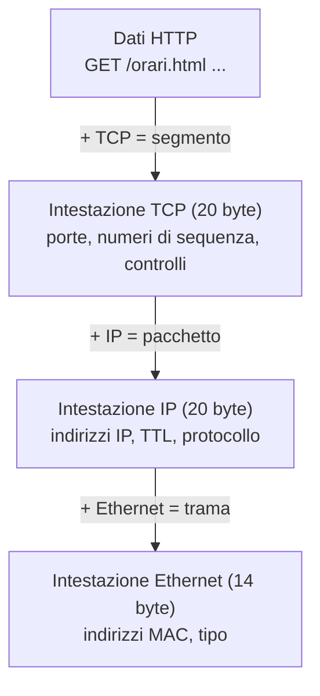

# Lezione 1.2: Livelli e incapsulamento

> Fonte della sezione 1.2.1: adattamento da Microsoft, "Security-101", lezione "Networking key concepts", licenza CC0 1.0, https://github.com/microsoft/Security-101/blob/main/3.1%20Networking%20key%20concepts.md . Riferimento per il simulatore: "Introduction to the world of FILIUS", https://www.lernsoftware-filius.de/downloads/Introduction_Filius.pdf . Il resto della lezione è contenuto originale. Gli script sono nella cartella `laboratorio`.

Obiettivo: comprendere l'organizzazione a livelli delle reti, riconoscere gli indirizzi e le intestazioni di ciascun livello, e osservare l'incapsulamento in un simulatore e in un programma Python.

## 1.2.1 Perché i livelli

Far comunicare due programmi su computer lontani richiede di risolvere molti problemi diversi: trasmettere bit su un cavo o via radio, raggiungere il computer giusto attraverso reti diverse, consegnare i dati al programma giusto e senza perdite, dare un significato ai messaggi. Le reti affrontano ciascun problema in un **livello** separato: ogni livello usa i servizi del livello inferiore e offre servizi a quello superiore. Così si può sostituire la tecnologia di un livello (per esempio Wi-Fi al posto del cavo) senza cambiare gli altri.

Due modelli:

- **ISO/OSI**
  modello di riferimento in sette livelli, usato soprattutto per descrivere e confrontare le tecnologie.
- **TCP/IP**
  modello in quattro livelli su cui è costruita Internet.

| Livello TCP/IP | Livelli OSI | Compito | Unità di dati | Indirizzi | Esempi |
|---|---|---|---|---|---|
| Applicazione | 7 Applicazione, 6 Presentazione, 5 Sessione | servizi per i programmi | messaggio | nomi (www.esempio.it), URL | HTTP, DNS, SMTP, SSH |
| Trasporto | 4 Trasporto | comunicazione tra programmi, affidabilità | segmento (TCP), datagramma (UDP) | porte (0-65535) | TCP, UDP |
| Internet | 3 Rete | instradamento tra reti diverse | pacchetto | indirizzi IP | IPv4, IPv6, ICMP |
| Accesso alla rete | 2 Collegamento dati, 1 Fisico | trasmissione nella rete locale | trama (frame), bit | indirizzi MAC | Ethernet, Wi-Fi |

- **TCP** (Transmission Control Protocol): orientato alla connessione, garantisce che i dati arrivino tutti, in ordine e senza errori, ritrasmettendo quelli persi; usato dal web, dalla posta, dal trasferimento di file.
- **UDP** (User Datagram Protocol): senza connessione e senza garanzie, ma più semplice e veloce; usato da DNS, videochiamate, streaming dal vivo, giochi in rete.
- **Porte**: numeri a 16 bit che identificano i programmi; da 0 a 1023 le porte dei servizi standard (80 HTTP, 443 HTTPS, 53 DNS), da 1024 a 49151 le porte registrate, da 49152 a 65535 le porte dinamiche usate dai client.

## 1.2.2 Incapsulamento

Quando un programma invia dati, ogni livello aggiunge davanti ai dati ricevuti dal livello superiore una propria **intestazione**, con le informazioni necessarie al suo compito: è l'**incapsulamento**. Il destinatario esegue il percorso inverso: ogni livello legge e toglie la propria intestazione e passa il resto al livello superiore.

Diagramma: incapsulamento di una richiesta HTTP.



Due tipi di indirizzi con compiti diversi:

- l'**indirizzo IP** identifica il computer di destinazione finale e resta uguale lungo tutto il percorso (salvo la traduzione NAT, lezione 3.3)
- l'**indirizzo MAC** identifica la scheda di rete del prossimo dispositivo nella rete locale: a ogni passaggio attraverso un router l'intestazione Ethernet viene sostituita con una nuova

Un paragone: l'indirizzo IP è l'indirizzo scritto sulla lettera; l'indirizzo MAC è l'indicazione, cambiata a ogni tappa, di quale ufficio postale o postino deve ricevere il sacco con la lettera.

## 1.2.3 Il simulatore Filius

**Filius** è un simulatore di reti progettato per la scuola, gratuito e con licenza GPL: si costruiscono reti con computer, switch e router, vi si installano programmi (riga di comando, browser, server web, DNS, DHCP) e si osservano i messaggi scambiati, livello per livello.

Installazione:

1. da https://www.lernsoftware-filius.de/Herunterladen scaricare la versione per Windows: l'installatore, che include Java, oppure l'archivio ZIP, che richiede Java 17 o successivo (disponibile anche in versione ZIP, senza installazione, come Eclipse Temurin JRE: https://github.com/adoptium/temurin21-binaries/releases)
2. al primo avvio scegliere la lingua **English**; la scelta viene ricordata

Le tre modalità, selezionabili nella barra in alto:

- **progettazione** (icona del martello): si collocano e si collegano i componenti e si configurano
- **simulazione** (freccia verde): la rete "funziona" e si usano i programmi installati
- **documentazione** (matita): si aggiungono note e riquadri allo schema

Componenti principali: **Computer** e **Notebook** (identici nel funzionamento; per convenzione il primo si usa per i server, il secondo per i client), **Switch**, **Router**, **Cable**.

## 1.2.4 Laboratorio

Tempo indicativo: 40 minuti. Cartella di lavoro `C:\corso-reti\lab12`.

### Parte 1: la prima rete in Filius

1. In modalità progettazione trascinare nello schema due **Notebook** e uno **Switch**; collegare ogni notebook allo switch con un **Cable** (selezionare il cavo, poi fare clic sui due componenti).
2. Configurare i notebook con doppio clic: nome `PC-A`, indirizzo IP `192.168.1.10`, maschera (Netmask) `255.255.255.0`; nome `PC-B`, indirizzo `192.168.1.11`, stessa maschera.
3. Passare in modalità simulazione. Fare clic su `PC-A`, aprire l'installazione del software e installare **Command Line**; avviarla.
4. Eseguire `ipconfig`, poi `ping 192.168.1.11`: `PC-B` risponde.
5. Con il tasto destro su `PC-A` scegliere la voce che mostra lo **scambio di dati** (data exchange): compare una tabella dei messaggi inviati e ricevuti.
6. Selezionare una riga della richiesta di `ping`: individuare, livello per livello, indirizzi MAC, indirizzi IP e protocollo (ICMP). Quali altre righe compaiono prima del primo `ping`, e con quale protocollo? (La risposta è l'argomento della lezione 2.2.)
7. Salvare il progetto come `lab12_prima_rete.fls`.

### Parte 2: l'incapsulamento costruito in Python

Lo script `incapsulamento.py` costruisce byte per byte la trama Ethernet che trasporta una richiesta HTTP, aggiungendo una intestazione alla volta:

```powershell
python incapsulamento.py
```

```text
Messaggio HTTP (i byte sono testo leggibile):
    GET /orari.html HTTP/1.1\r\n
    Host: www.scuola.example\r\n
    ...
+ intestazione Trasporto (TCP): 20 byte
    0000  c8 22 00 50 00 00 00 01 00 00 00 01 50 18 fa f0
    0010  94 83 00 00

+ intestazione Rete (IP): 20 byte
    0000  45 00 00 7d 10 e1 40 00 40 06 2b 8d c0 a8 01 14
    0010  cb 00 71 50

+ intestazione Collegamento (Ethernet): 14 byte
    0000  00 1b 21 3a 5c 01 3c 52 82 4e 10 20 08 00

Frame completo: 139 byte, di cui 85 di dati HTTP e 54 di intestazioni
Frame salvato in richiesta.pcap
```

Come leggere alcuni byte:

- intestazione TCP: `c8 22` è la porta di origine (0xc822 = 51234), `00 50` la porta di destinazione (0x0050 = 80, HTTP)
- intestazione IP: `45` indica la versione 4 e un'intestazione di 5 parole da 4 byte; `40` (64) è il TTL; `06` indica che il contenuto è TCP; gli ultimi 8 byte sono gli indirizzi di origine (`c0 a8 01 14` = 192.168.1.20) e di destinazione (`cb 00 71 50` = 203.0.113.80)
- intestazione Ethernet: i primi 6 byte sono il MAC di destinazione, i successivi 6 quello di origine, `08 00` indica che il contenuto è un pacchetto IPv4

Nel codice:

```python
struct.pack("!HHIIBBHHH", porta_sorgente, porta_destinazione, sequenza, conferma, ...)
```

`struct.pack` converte numeri in byte secondo un formato: `!` indica l'ordine dei byte di rete (il byte più significativo per primo), `H` un intero di 2 byte, `I` di 4 byte, `B` di 1 byte. La funzione `somma_di_controllo` calcola la **checksum** che IP e TCP usano per accorgersi dei dati danneggiati durante la trasmissione.

Il file `richiesta.pcap` si può aprire, facoltativamente, con Wireshark: il programma riconosce tutti i livelli e conferma che le checksum sono corrette. Test: `python test_incapsulamento.py` (13 test).

### Attività

1. Modificare in `costruisci` il percorso richiesto e rieseguire: quali intestazioni cambiano, e perché cambia anche l'intestazione IP?
2. Calcolare la percentuale di byte di intestazione sul totale; ripetere con un messaggio HTTP di 1400 byte. Che cosa si conclude sull'efficienza dei messaggi molto piccoli?
3. Confrontare i campi della trama costruita con quelli visti in Filius nella parte 1: quali livelli ci sono in entrambi, quali solo in uno?

## 1.2.5 Aspetti orientativi (discussione)

- Il modello a livelli è il linguaggio comune di chi lavora con le reti: in un'azienda si dice "è un problema di livello 2" o "di livello 7" per indicare dove cercare.
- La specializzazione per livelli si ritrova nei ruoli: tecnici del cablaggio e degli apparati (livelli 1 e 2), ingegneri di rete (livello 3), sistemisti e sviluppatori (livelli superiori).
- Domanda: che cosa cambierebbe per il browser se il PC passasse dal cavo al Wi-Fi durante il caricamento di una pagina?
