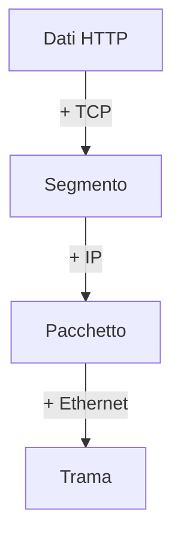

## Lezione 1.2: Livelli e incapsulamento

Modulo 1: Come funziona Internet. Reti, Cloud e Gestione dei Dati

Fonte sezione 1.2.1: Microsoft, "Security-101", licenza CC0 1.0
https://github.com/microsoft/Security-101

---

## Modelli a livelli

| TCP/IP | OSI | Indirizzi | Esempi |
|---|---|---|---|
| Applicazione | 7, 6, 5 | nomi, URL | HTTP, DNS |
| Trasporto | 4 | porte | TCP, UDP |
| Internet | 3 | IP | IPv4, IPv6, ICMP |
| Accesso alla rete | 2, 1 | MAC | Ethernet, Wi-Fi |

---

## Incapsulamento

- IP: destinazione finale, uguale lungo il percorso
- MAC: prossimo dispositivo, cambia a ogni router

---

## Filius

- Simulatore per la scuola, GPL; lingua English al primo avvio
- Modalità: progettazione (martello), simulazione (freccia verde), documentazione (matita)
- Componenti: Computer, Notebook, Switch, Router, Cable
- Programmi: Command Line, web server, DNS, DHCP, ...

---

## Laboratorio

1. Filius: due notebook, uno switch, `ipconfig`, `ping`
2. Scambio di dati: livelli, indirizzi, protocolli
3. `python incapsulamento.py`: trama Ethernet costruita byte per byte
4. `struct.pack`, checksum; 13 test

---

## Aspetti orientativi

- "Problema di livello 2" o "di livello 7": linguaggio comune
- Ruoli per livelli: cablaggio, rete, sistemi, sviluppo
- Che cosa cambia passando dal cavo al Wi-Fi?
