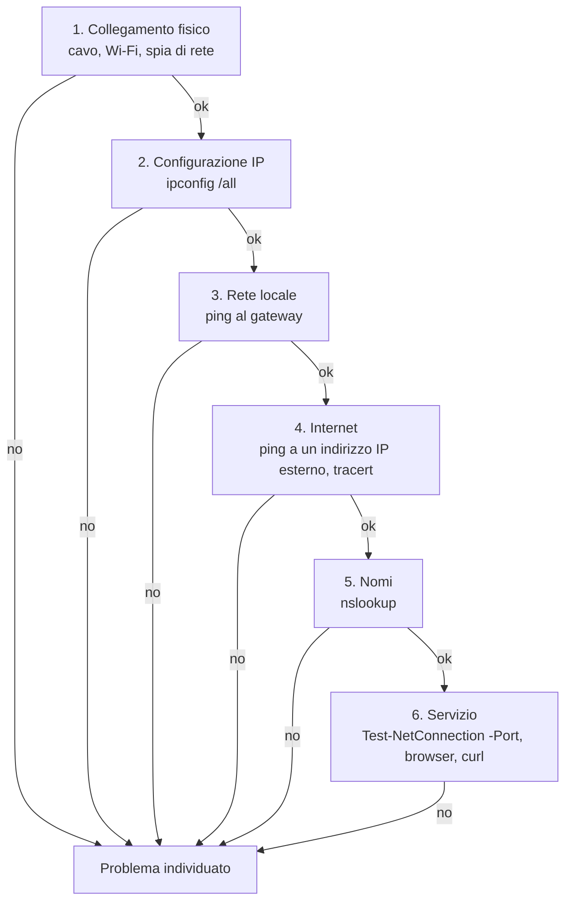

# Lezione 1.3: Strumenti di diagnostica

> Contenuto originale. Riferimenti: documentazione Microsoft dei comandi `ipconfig`, `tracert`, `nslookup` e del comando PowerShell `Test-NetConnection`. Gli script sono nella cartella `laboratorio`; le soluzioni delle schede dei guasti nel file `laboratorio/soluzioni_docente.md`.

Obiettivo: usare i comandi di diagnostica di rete di Windows e applicare un metodo per individuare il livello in cui si trova un problema.

## 1.3.1 Metodo: dal basso verso l'alto

Quando "Internet non funziona", la causa può essere in punti molto diversi: il cavo, la rete Wi-Fi, l'indirizzo IP, il router, il server DNS, il sito stesso. Il metodo più usato è verificare i livelli **dal basso verso l'alto**, fermandosi al primo che non funziona:



Verificare un solo livello alla volta, e annotare ogni verifica, evita di cambiare molte cose insieme senza capire quale ha risolto il problema.

## 1.3.2 I comandi

Si eseguono nel Prompt dei comandi o in PowerShell.

### ipconfig

```powershell
ipconfig            # indirizzo IP, maschera, gateway di ogni scheda di rete
ipconfig /all       # anche indirizzo MAC, server DNS, server DHCP, durata della concessione
```

Voci da cercare nell'output di `ipconfig /all`: **Indirizzo fisico** (MAC), **Indirizzo IPv4**, **Subnet mask**, **Gateway predefinito**, **Server DHCP**, **Server DNS**. Un indirizzo che inizia con `169.254.` indica che il PC non ha ricevuto un indirizzo dal server DHCP e se ne è assegnato uno da solo, valido solo nella rete locale. Altre opzioni: `ipconfig /displaydns` mostra i nomi risolti di recente, conservati in memoria dal sistema. Documentazione: https://learn.microsoft.com/en-us/windows-server/administration/windows-commands/ipconfig

### ping

```powershell
ping 192.168.1.1          # quattro messaggi di prova al gateway
ping -n 10 8.8.8.8        # dieci messaggi a un indirizzo esterno
ping www.wikipedia.org    # risolve il nome e poi invia i messaggi
```

`ping` invia messaggi ICMP di richiesta di eco (echo request) e attende le risposte (echo reply); per ogni risposta mostra il **tempo** di andata e ritorno in millisecondi e il **TTL**. L'opzione `-n` indica quanti messaggi inviare. Alla fine riassume pacchetti inviati, ricevuti e persi. Un ping senza risposta non prova che il computer sia spento: molti sistemi, e il firewall di Windows con le impostazioni predefinite, non rispondono al ping.

### tracert

```powershell
tracert www.wikipedia.org     # percorso fino al sito, un router per riga
tracert -d 8.8.8.8            # senza tradurre gli indirizzi in nomi, più veloce
```

`tracert` invia messaggi con **TTL** crescente: 1, 2, 3 e così via. Ogni router diminuisce il TTL di uno e, quando arriva a zero, scarta il messaggio e avvisa il mittente con un messaggio ICMP "tempo scaduto" (time exceeded): così ogni router del percorso rivela il proprio indirizzo. Le tre colonne di tempi sono tre misure per ogni passo; un asterisco `*` indica un router che non risponde. L'opzione `-d` evita la risoluzione inversa dei nomi. Documentazione: https://learn.microsoft.com/en-us/windows-server/administration/windows-commands/tracert

### nslookup

```powershell
nslookup www.wikipedia.org              # chiede l'indirizzo al server DNS configurato
nslookup www.wikipedia.org 1.1.1.1      # chiede a un server DNS indicato
nslookup -type=AAAA www.wikipedia.org   # chiede l'indirizzo IPv6
nslookup -type=MX gmail.com             # chiede i server di posta del dominio
```

L'output riporta prima il server DNS interrogato, poi la risposta. "Risposta da un server non autorevole" indica che la risposta viene dalla memoria di un server intermedio, non dal server ufficiale del dominio. Documentazione: https://learn.microsoft.com/en-us/windows-server/administration/windows-commands/nslookup

### Test-NetConnection (PowerShell)

```powershell
Test-NetConnection www.wikipedia.org -Port 443
```

Verifica in un solo comando la risoluzione del nome, il ping e l'apertura di una connessione TCP verso una porta; il campo `TcpTestSucceeded` vale `True` se la connessione riesce. È utile quando il ping è bloccato ma il servizio funziona. Documentazione: https://learn.microsoft.com/en-us/powershell/module/nettcpip/test-netconnection

### curl

```powershell
curl.exe -I https://www.wikipedia.org     # solo le intestazioni della risposta HTTP
```

In PowerShell il nome `curl` può richiamare un altro comando (`Invoke-WebRequest`); scrivendo `curl.exe` si usa il vero curl, incluso in Windows 10 e 11 (https://curl.se/windows/microsoft.html). L'opzione `-I` chiede solo le intestazioni. Si approfondisce nella lezione 1.4.

## 1.3.3 Laboratorio

Tempo indicativo: 40 minuti. Cartella di lavoro `C:\corso-reti\lab13`, con i file della cartella `laboratorio`. Si analizzano solo il proprio PC e siti pubblici, con i normali comandi di diagnostica.

### Parte 1: la configurazione del proprio PC

Con `ipconfig /all` compilare la tabella: nome della scheda di rete in uso, indirizzo MAC, indirizzo IPv4, maschera, gateway, server DHCP, server DNS, eventuale indirizzo IPv6. Il PC ha ottenuto l'indirizzo da un server DHCP? Da che cosa si capisce?

### Parte 2: la catena di verifiche

1. `ping` al gateway predefinito trovato nella parte 1.
2. `ping -n 10` a un indirizzo esterno, per esempio `1.1.1.1`: tempi medi e pacchetti persi.
3. `tracert -d` verso lo stesso indirizzo: quanti passi? Dove i tempi aumentano di più?
4. `nslookup` di tre siti; per uno di questi anche il tipo `AAAA`.
5. `Test-NetConnection` verso la porta 443 di un sito e verso una porta non usata, per esempio 81: che differenza c'è nell'output?

Se la rete della scuola blocca `ping` o `tracert` verso l'esterno, annotarlo come osservazione: è un risultato, non un errore dell'esercizio.

### Parte 3: diagnosi automatica con Python

Lo script `diagnosi.py` esegue in ordine le verifiche di configurazione, DNS, trasporto e applicazione, fermandosi alla prima che fallisce:

```powershell
python diagnosi.py www.wikipedia.org
python diagnosi.py sito-inesistente.invalid
```

```text
OK      configurazione  indirizzo locale 192.168.1.20
OK      dns             www.wikipedia.org -> 185.15.58.224, 2a02:ec80:600:ed1a::1
OK      trasporto       connessione TCP alla porta 443 riuscita
OK      applicazione    risposta HTTP 200 OK

Tutti i livelli funzionano.
```

Nel secondo caso lo script si ferma al DNS e suggerisce che cosa controllare. Il dominio `.invalid` è riservato proprio per nomi che non devono esistere.

Per conoscere l'indirizzo locale, lo script "collega" un socket UDP a un indirizzo esterno: con UDP la connessione non invia alcun pacchetto, ma obbliga il sistema operativo a scegliere l'interfaccia e l'indirizzo che userebbe. Test: `python test_diagnosi.py` (7 test, con un server locale).

### Parte 4: schede dei guasti

A coppie, per ogni scheda individuare il livello del problema e la verifica successiva da fare.

| Scheda | Sintomi |
|---|---|
| A | `ipconfig` mostra l'indirizzo `169.254.33.12` e nessun gateway. |
| B | `ping 192.168.1.1` (il gateway) funziona; `ping 1.1.1.1` no; `tracert -d 1.1.1.1` si ferma dopo il primo passo. |
| C | `ping 1.1.1.1` funziona; `ping www.wikipedia.org` risponde "impossibile trovare l'host". |
| D | `nslookup www.esempio.it` restituisce un indirizzo; il browser mostra "impossibile raggiungere il sito"; `Test-NetConnection www.esempio.it -Port 443` riporta `TcpTestSucceeded : False`. |
| E | Tutti i siti funzionano tranne uno, che risponde con "503 Service Unavailable". |
| F | Due PC dello stesso laboratorio hanno lo stesso indirizzo IP, impostato a mano; la connessione va e viene. |

## 1.3.4 Aspetti orientativi (discussione)

- Diagnosticare i problemi con metodo è la competenza più richiesta nell'assistenza tecnica (help desk), il primo impiego di molti tecnici informatici.
- Saper descrivere un problema con dati precisi ("il gateway risponde, il DNS no") fa risparmiare tempo a chi deve risolverlo, anche quando lo si segnala a un fornitore.
- Domanda: perché riavviare il router risolve spesso il problema, e perché non è un buon metodo per capirne la causa?
