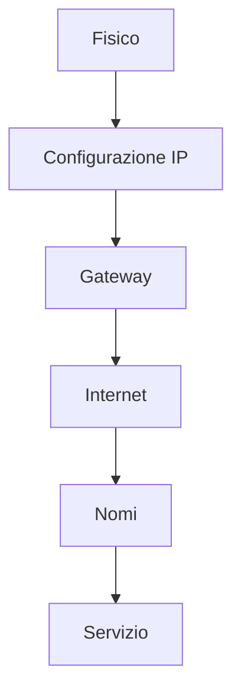

## Contenuti

- Dal basso verso l'alto
- Comandi
- Laboratorio
- Aspetti orientativi

## Dal basso verso l'alto

Un livello alla volta, annotando ogni verifica

## Comandi

| Comando | Verifica |
|---|---|
| `ipconfig /all` | indirizzo, maschera, gateway, DNS, MAC |
| `ping` | raggiungibilità, tempo, perdite |
| `tracert -d` | percorso, router per router |
| `nslookup` | risoluzione dei nomi |
| `Test-NetConnection -Port` | connessione TCP a un servizio |
| `curl.exe -I` | risposta HTTP |

## Laboratorio

1. Configurazione del proprio PC
2. Catena di verifiche: gateway, esterno, percorso, nomi, porte
3. `python diagnosi.py www.wikipedia.org`; 7 test
4. Schede dei guasti A-F

## Aspetti orientativi

- Assistenza tecnica: diagnosi con metodo
- Descrivere un problema con dati precisi
- Perché riavviare il router non spiega la causa?
