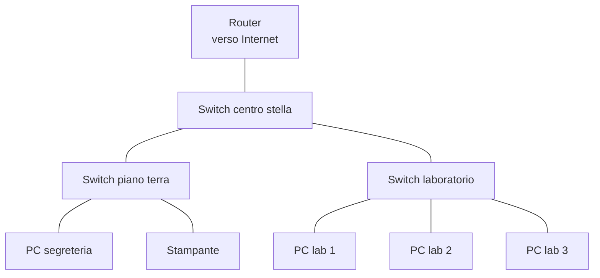
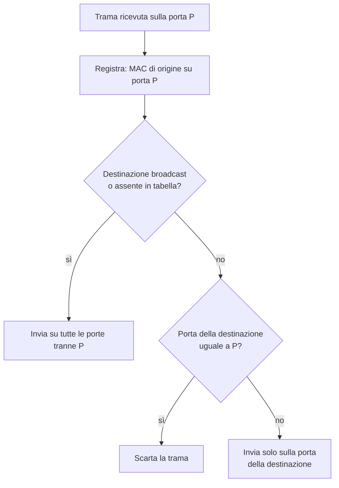
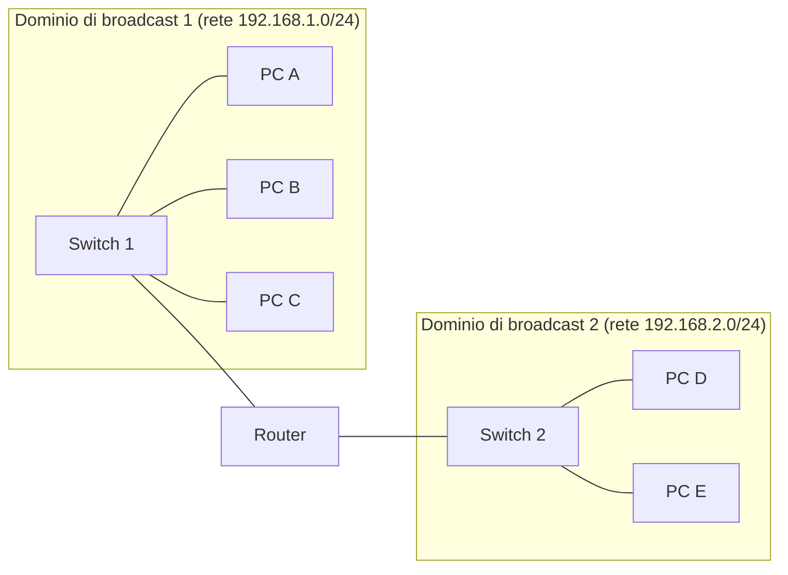

# Lezione 2.1: Ethernet, switch e Filius

> Contenuto originale. Riferimenti: Wikipedia, "Ethernet", https://it.wikipedia.org/wiki/Ethernet ; Wikipedia, "Switch", https://it.wikipedia.org/wiki/Switch ; simulatore Filius, https://www.lernsoftware-filius.de/Herunterladen . Gli script sono nella cartella `laboratorio`.

Obiettivo: descrivere i componenti di una rete locale Ethernet, la struttura della trama e il funzionamento dello switch, e osservarlo nel simulatore e in un programma Python.

## 2.1.1 Reti locali e topologie

Una **rete locale** (LAN, Local Area Network) collega i dispositivi di un'area limitata: una casa, un laboratorio, una scuola, un'azienda. Oggi quasi tutte le reti locali cablate usano **Ethernet** (standard IEEE 802.3), quelle senza fili **Wi-Fi** (IEEE 802.11, lezione 3.4).

La **topologia** descrive la forma dei collegamenti:

- **Bus**
  tutti i dispositivi sullo stesso cavo; usata dalle prime reti Ethernet, oggi abbandonata.
- **Stella**
  ogni dispositivo è collegato con un proprio cavo a un apparato centrale, lo switch; un guasto a un cavo isola un solo dispositivo.
- **Stella estesa (gerarchica)**
  più switch collegati tra loro: un centro stella principale e switch di piano o di laboratorio. È la struttura delle reti di scuole e aziende.
- **Maglia**
  più percorsi tra gli apparati, per continuare a funzionare in caso di guasto; si usa tra router e nei data center (lezione 7.1).

Diagramma: stella estesa in una scuola.



## 2.1.2 Mezzi trasmissivi

| Mezzo | Caratteristiche | Uso tipico |
|---|---|---|
| Rame, doppino ritorto (twisted pair) | 4 coppie di fili intrecciati, connettore RJ45; al massimo 100 m per tratta; categorie 5e (fino a 1 Gbit/s), 6 (10 Gbit/s solo su tratte brevi, circa 55 m) e 6A (10 Gbit/s su 100 m) | dalla presa a muro al PC; tra armadio di rete e prese |
| Fibra ottica multimodale | luce da LED o laser su un nucleo più largo; alcune centinaia di metri alle alte velocità | tra armadi di rete dello stesso edificio |
| Fibra ottica monomodale | nucleo sottilissimo, laser; decine di chilometri | tra edifici, reti dei fornitori, collegamenti geografici |
| Onde radio (Wi-Fi) | nessun cavo; banda condivisa tra i dispositivi collegati allo stesso punto di accesso | dispositivi mobili, lezione 3.4 |

L'intreccio delle coppie riduce i disturbi elettromagnetici; la fibra ne è immune, perché trasporta luce. Approfondimenti: "Doppino ritorto", https://it.wikipedia.org/wiki/Doppino_ritorto ; "Fibra ottica", https://it.wikipedia.org/wiki/Fibra_ottica .

## 2.1.3 La trama Ethernet

La **trama** (frame) è l'unità di dati del livello di collegamento. Nella lezione 1.2 lo script `incapsulamento.py` ne ha costruito l'intestazione di 14 byte; la trama completa, così come viaggia sul cavo, contiene anche un preambolo e un codice di controllo finale.

| Campo | Byte | Contenuto |
|---|---|---|
| Preambolo e delimitatore | 8 | sequenza fissa di bit per sincronizzare il ricevitore |
| MAC di destinazione | 6 | scheda di rete che deve ricevere la trama |
| MAC di origine | 6 | scheda di rete che l'ha inviata |
| Tipo (EtherType) | 2 | protocollo contenuto: `0800` IPv4, `0806` ARP, `86DD` IPv6 |
| Dati | da 46 a 1500 | per esempio un pacchetto IP |
| FCS (Frame Check Sequence) | 4 | codice CRC-32 calcolato su tutta la trama |

- Il ricevitore ricalcola il **CRC**: se non coincide con l'FCS, la trama è danneggiata e viene scartata senza avvisare nessuno; la ritrasmissione, se necessaria, è compito dei livelli superiori (per esempio TCP).
- 1500 byte è la **MTU** (Maximum Transmission Unit) di Ethernet: i pacchetti IP più grandi vanno divisi.
- Gli indirizzi MAC di destinazione possono indicare una sola scheda (**unicast**), tutte le schede della rete locale (**broadcast**, `FF:FF:FF:FF:FF:FF`) o un gruppo (**multicast**). La struttura degli indirizzi MAC è l'argomento della lezione 2.2.

## 2.1.4 Lo switch

Lo **switch** collega i dispositivi di una rete locale e inoltra ogni trama solo verso la porta a cui è collegato il destinatario. Per farlo mantiene una **tabella degli indirizzi MAC** (MAC address table; in Filius si chiama SAT, Source Address Table), che associa a ogni indirizzo MAC la porta su cui si trova.

Le quattro operazioni dello switch:

- **Apprendimento** (learning)
  a ogni trama ricevuta, lo switch registra l'indirizzo MAC di **origine** con la porta di arrivo.
- **Inoltro** (forwarding)
  se il MAC di **destinazione** è nella tabella, la trama esce solo dalla porta corrispondente.
- **Inondazione** (flooding)
  se la destinazione è sconosciuta, oppure è l'indirizzo di broadcast, la trama esce da tutte le porte tranne quella di arrivo.
- **Filtraggio**
  se la destinazione si trova sulla stessa porta di arrivo, la trama viene scartata.

Le voci non aggiornate per un certo tempo scadono (spesso 300 secondi): così la tabella segue i dispositivi spostati o spenti.

Diagramma: decisione dello switch per ogni trama ricevuta.



### Collisioni e domini di broadcast

- Nelle prime reti Ethernet, su un cavo condiviso o con un **hub** (apparato che ripete ogni trama su tutte le porte), due trasmissioni contemporanee si sovrapponevano: una **collisione**. Il metodo **CSMA/CD** faceva ascoltare il cavo prima di trasmettere e ritrasmettere dopo un'attesa casuale. L'insieme dei dispositivi che possono entrare in collisione tra loro è un **dominio di collisione**.
- Con lo switch ogni porta è un dominio di collisione separato; con collegamenti **full duplex** (trasmissione e ricezione contemporanee su coppie di fili diverse) le collisioni non avvengono più.
- Le trame di broadcast raggiungono invece tutti i dispositivi collegati agli switch: l'insieme è un **dominio di broadcast**. Solo un **router** (lezione 3.1), o la divisione in VLAN (lezione 3.4), separa i domini di broadcast.

Diagramma: domini di collisione e di broadcast.



Ogni cavo tra un PC e lo switch è un dominio di collisione a sé; il router separa i due domini di broadcast.

## 2.1.5 Laboratorio

Tempo indicativo: 40 minuti. Cartella di lavoro `C:\corso-reti\lab21`, con i file della cartella `laboratorio`.

### Parte 1: la tabella dello switch in Filius

1. In modalità progettazione creare quattro **Notebook** e uno **Switch**, collegati a stella con quattro **Cable**.
2. Configurare i notebook (doppio clic): nomi `PC-1`...`PC-4`, **IP Address** da `192.168.1.11` a `192.168.1.14`, **Netmask** `255.255.255.0`. Nella stessa finestra annotare il **MAC Address** di ciascuno, assegnato da Filius in modo casuale.
3. Passare in modalità simulazione e fare clic con il tasto sinistro sullo switch: si apre la tabella **SAT table**, con le colonne **MAC**, **Port** e **Last Update**. All'inizio è vuota.
4. Installare **Command Line** su `PC-1` ed eseguire `ping 192.168.1.13`.
5. Riaprire la tabella dello switch: quali indirizzi MAC compaiono, e su quali porte? Confrontare con i MAC annotati al punto 2.
6. Eseguire un `ping` da `PC-2` a `PC-4`: quante righe ha ora la tabella? Perché `PC-3` è già presente anche se non ha iniziato nessuna comunicazione?
7. Con **Clear Table** svuotare la tabella, poi ripetere un `ping`: la tabella si ricostruisce da sola.

### Parte 2: due switch collegati

1. Tornare in modalità progettazione, aggiungere un secondo switch collegato al primo e due notebook `PC-5` (`192.168.1.15`) e `PC-6` (`192.168.1.16`) collegati al secondo switch.
2. In simulazione, eseguire `ping` da `PC-1` a `PC-5` e da `PC-2` a `PC-6`.
3. Aprire la tabella del primo switch: su quale porta si trovano i MAC di `PC-5` e `PC-6`? Perché più indirizzi MAC possono stare sulla stessa porta?
4. Facoltativo: nella configurazione dello switch (modalità progettazione) il campo **Retention Time SAT Entries (Seconds)** imposta la durata delle voci; ridurlo a 30 secondi e osservare la scomparsa delle voci.
5. Salvare il progetto come `lab21_switch.fls`.

### Parte 3: lo switch in Python

Lo script `switch_simulato.py` riproduce le decisioni dello switch su una sequenza di trame:

```powershell
python switch_simulato.py
```

```text
t=0: PC-A -> broadcast: flooding, porte [2, 3, 4]
  Tabella di SW1: MAC -> porta
    02:00:00:00:00:0A  porta 1  (aggiornata a t=0)

t=1: PC-B -> PC-A: inoltro, porte [1]
...
t=3: PC-A -> PC-C: flooding, porte [2, 3, 4]
```

Il cuore del programma è il metodo `ricevi`:

```python
self.tabella[mac_origine] = (porta_arrivo, istante)        # 1. apprendimento
if mac_destinazione == BROADCAST or mac_destinazione not in self.tabella:
    uscite = [p for p in self.porte if p != porta_arrivo]   # 2. flooding
    return "flooding", uscite
porta_destinazione = self.tabella[mac_destinazione][0]
if porta_destinazione == porta_arrivo:
    return "scarto", []                                     # 3. filtraggio
return "inoltro", [porta_destinazione]                      # 4. inoltro
```

- `self.tabella` è un dizionario: la chiave è l'indirizzo MAC, il valore la coppia (porta, istante dell'ultimo aggiornamento)
- la comprensione di lista `[p for p in self.porte if p != porta_arrivo]` costruisce l'elenco di tutte le porte tranne quella di arrivo
- `rimuovi_scadute` elimina le voci più vecchie di `durata_voci` secondi, come l'impostazione vista in Filius

Test: `python test_switch_simulato.py` (11 test).

### Attività

1. Nella sequenza di `dimostrazione`, perché la trama al tempo 3 viene inviata a tutte le porte, mentre quella al tempo 5, con gli stessi mittente e destinatario, no?
2. Aggiungere alla sequenza un quarto PC sulla porta 4 che invia una trama a `PC-B` e verificare la tabella risultante.
3. Aggiungere al metodo `ricevi` un contatore delle trame inoltrate con flooding; in una rete con molti dispositivi e poco traffico, che cosa ci si aspetta dal contatore subito dopo l'accensione dello switch e dopo qualche minuto?

## 2.1.6 Aspetti orientativi (discussione)

- Progettare, installare e certificare il cablaggio strutturato di un edificio è un lavoro tecnico specifico, svolto da installatori e tecnici di rete.
- Negli switch aziendali "gestiti" la tabella degli indirizzi si consulta con comandi o pagine di amministrazione: è uno dei primi strumenti per trovare a quale presa è collegato un dispositivo.
- Domanda: perché in una rete con migliaia di dispositivi collegati agli stessi switch il traffico di broadcast diventa un problema, e come si può ridurre?
