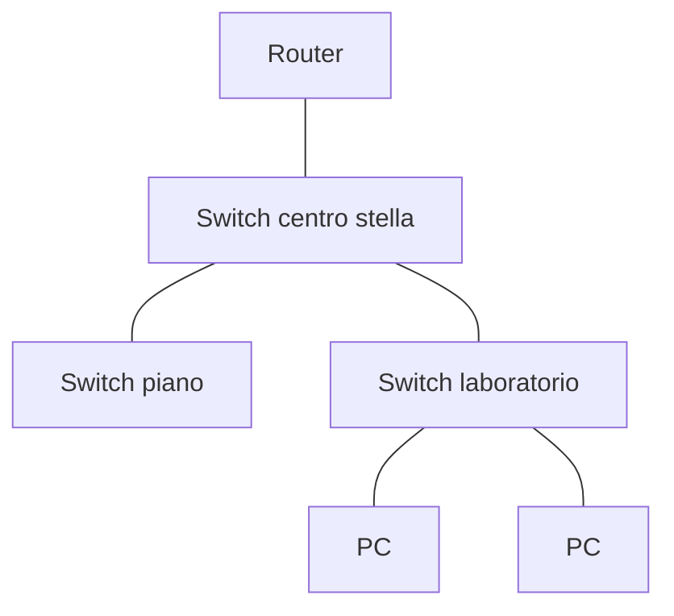
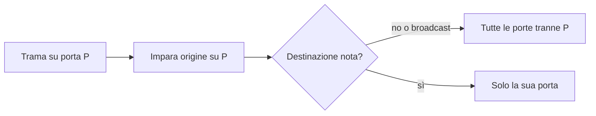

## Lezione 2.1: Ethernet, switch e Filius

Modulo 2: Reti locali e indirizzamento. Reti, Cloud e Gestione dei Dati

---

## Reti locali e topologie

- LAN: Ethernet (IEEE 802.3) cablata, Wi-Fi (IEEE 802.11)
- Bus (storica), stella, stella estesa, maglia

---

## Mezzi trasmissivi

| Mezzo | Distanza | Uso |
|---|---|---|
| Doppino, RJ45 (cat. 5e, 6, 6A) | 100 m | presa, PC |
| Fibra multimodale | centinaia di m | tra armadi |
| Fibra monomodale | decine di km | tra edifici, fornitori |
| Wi-Fi | stanza, piano | dispositivi mobili |

---

## La trama Ethernet

| Preambolo | MAC dest. | MAC orig. | Tipo | Dati | FCS |
|---|---|---|---|---|---|
| 8 | 6 | 6 | 2 | 46-1500 | 4 |

- Tipo: `0800` IPv4, `0806` ARP, `86DD` IPv6
- FCS: CRC-32; trama danneggiata scartata
- MTU 1500 byte; unicast, broadcast, multicast

---

## Lo switch

- Tabella degli indirizzi MAC (in Filius: SAT)
- Apprendimento dal MAC di origine
- Inoltro, flooding, filtraggio in base alla destinazione
- Voci con scadenza (spesso 300 s)

---

## Collisioni e broadcast

- Hub e cavo condiviso: collisioni, CSMA/CD
- Switch e full duplex: nessuna collisione
- Dominio di broadcast: tutti gli switch collegati
- Solo router e VLAN separano i domini di broadcast

---

## Laboratorio

1. Filius: 4 notebook, uno switch; SAT table prima e dopo `ping`
2. Due switch collegati: più MAC sulla stessa porta
3. `python switch_simulato.py`: apprendimento, flooding, inoltro
4. 11 test

---

## Aspetti orientativi

- Cablaggio strutturato: installatori e tecnici di rete
- Tabella degli switch gestiti per trovare un dispositivo
- Perché il broadcast diventa un problema nelle reti grandi?
