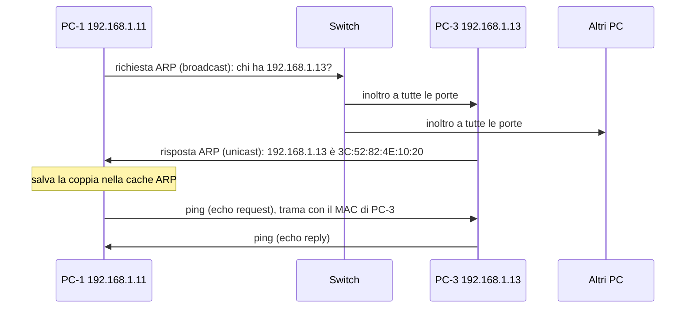
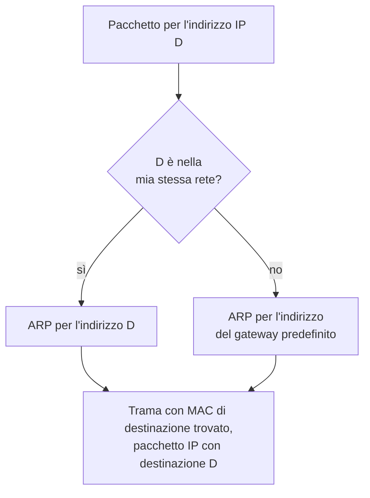

# Lezione 2.2: ARP e indirizzi MAC

> Contenuto originale. Riferimenti: RFC 826, "An Ethernet Address Resolution Protocol", https://www.rfc-editor.org/rfc/rfc826 ; Wikipedia, "Indirizzo MAC", https://it.wikipedia.org/wiki/Indirizzo_MAC ; Wikipedia, "Address Resolution Protocol", https://it.wikipedia.org/wiki/Address_Resolution_Protocol ; documentazione Microsoft del comando `arp`. Gli script sono nella cartella `laboratorio`.

Obiettivo: leggere la struttura di un indirizzo MAC, spiegare come ARP collega gli indirizzi IP agli indirizzi MAC e osservare la cache ARP nel simulatore e sul proprio PC.

## 2.2.1 L'indirizzo MAC

L'**indirizzo MAC** (Media Access Control) identifica una scheda di rete nella rete locale. È lungo 48 bit, cioè 6 byte, e si scrive con 12 cifre esadecimali in coppie separate da trattini (Windows: `3C-52-82-4E-10-20`) o da due punti (Linux, macOS, Filius: `3C:52:82:4E:10:20`).

- **OUI** (Organizationally Unique Identifier)
  i primi 3 byte, assegnati al produttore dall'IEEE; il registro pubblico si consulta nella pagina della IEEE Registration Authority, https://standards.ieee.org/products-programs/regauth/ .
- **Parte assegnata dal produttore**
  gli ultimi 3 byte, diversi per ogni scheda prodotta.

Due bit del primo byte hanno un significato particolare:

| Bit del primo byte | Valore 0 | Valore 1 |
|---|---|---|
| ultimo bit (I/G, individuale o gruppo) | indirizzo di una sola scheda (unicast) | indirizzo di gruppo (multicast; broadcast se tutti i bit sono 1) |
| penultimo bit (U/L, universale o locale) | assegnato dal produttore, unico al mondo | amministrato localmente, scelto via software |

Esempio: nel MAC `7A-2F-91-C4-08-E3` il primo byte `7A` in binario è `01111010`: l'ultimo bit è 0 (unicast), il penultimo è 1 (amministrato localmente).

Molti sistemi usano oggi, per il Wi-Fi, **indirizzi MAC casuali** amministrati localmente, diversi da rete a rete, per impedire che il dispositivo venga riconosciuto e seguito nei luoghi pubblici. In Windows l'opzione si chiama "Indirizzi hardware casuali": https://support.microsoft.com/en-us/windows/how-to-use-random-hardware-addresses-in-windows-ac58de34-35fc-31ff-c650-823fc48eb1bc

L'indirizzo MAC ha valore solo nella rete locale: non attraversa i router, che a ogni passaggio costruiscono una nuova trama con i propri indirizzi MAC (lezione 1.2).

## 2.2.2 ARP: dall'indirizzo IP all'indirizzo MAC

Per inviare un pacchetto IP a un dispositivo della stessa rete locale, il mittente deve inserire nella trama Ethernet l'indirizzo MAC del destinatario, ma conosce solo il suo indirizzo IP. **ARP** (Address Resolution Protocol, RFC 826) risolve il problema:

1. il mittente invia in **broadcast** una **richiesta ARP**: "chi ha l'indirizzo 192.168.1.13? Rispondere a 192.168.1.11";
2. tutti i dispositivi della rete locale ricevono la richiesta, ma risponde solo quello con l'indirizzo cercato, con una **risposta ARP** in **unicast** che contiene il suo MAC;
3. il mittente conserva la coppia IP-MAC nella **cache ARP** per qualche minuto, per non ripetere la richiesta a ogni pacchetto; anche il destinatario registra la coppia del mittente, contenuta nella richiesta.

Diagramma: risoluzione ARP prima di un `ping`.



I messaggi ARP viaggiano direttamente dentro la trama Ethernet (tipo `0806`), senza intestazione IP: ARP lavora tra il livello di collegamento e il livello di rete.

### Destinazione nella stessa rete o in un'altra

Se il destinatario è in un'altra rete, per esempio un server su Internet, il mittente non cerca con ARP il MAC del destinatario, che non è raggiungibile direttamente, ma quello del **gateway predefinito**, il router della rete locale. Il confronto tra la propria rete e quella del destinatario si fa con la maschera di sottorete (lezione 2.3).



In entrambi i casi l'indirizzo IP di destinazione nel pacchetto resta D: cambia solo l'indirizzo MAC nella trama.

### Altri usi e limiti di ARP

- **ARP gratuito** (gratuitous ARP): un dispositivo annuncia il proprio indirizzo con una richiesta ARP per sé stesso, per esempio all'accensione; se qualcun altro risponde, c'è un **conflitto di indirizzi** (scheda F della lezione 1.3).
- ARP **non prevede autenticazione**: qualunque dispositivo della rete locale può inviare risposte ARP, anche false, e i sistemi le accettano. Questa debolezza è alla base dell'attacco noto come **ARP poisoning**, con cui un dispositivo si fa inviare il traffico destinato ad altri. Contromisure: funzioni di controllo degli switch gestiti (limitazione dei MAC per porta, verifica delle risposte ARP rispetto alle assegnazioni DHCP), cifratura del traffico (HTTPS), segmentazione della rete. Descrizione concettuale: https://it.wikipedia.org/wiki/ARP_poisoning
- IPv6 non usa ARP: la stessa funzione è svolta dal protocollo **Neighbor Discovery**, con messaggi ICMPv6 (lezione 2.5).

## 2.2.3 Livello 2 e livello 3 a confronto

| | Livello 2 (collegamento) | Livello 3 (rete) |
|---|---|---|
| Indirizzo | MAC, 48 bit | IP, 32 bit (IPv4) o 128 bit (IPv6) |
| Assegnato da | produttore (o sistema operativo, se casuale) | amministratore di rete o server DHCP |
| Ambito | una sola rete locale | tutta Internet (o la rete privata) |
| Struttura | produttore + numero di serie | rete + host (lezione 2.3) |
| Apparato che lo usa | switch | router |
| Cambia lungo il percorso | sì, a ogni router | no (salvo NAT, lezione 3.3) |

## 2.2.4 Laboratorio

Tempo indicativo: 40 minuti. Cartella di lavoro `C:\corso-reti\lab22`, con i file della cartella `laboratorio`.

### Parte 1: ARP in Filius

1. Aprire `lab21_switch.fls` della lezione precedente (oppure ricreare quattro notebook su uno switch, indirizzi da `192.168.1.11` a `192.168.1.14`, maschera `255.255.255.0`).
2. In modalità simulazione, nella **Command Line** di `PC-1`, eseguire `arp`: la tabella ha le colonne **Internet Address** e **Physical Address** e contiene solo la voce del broadcast, `255.255.255.255` associato a `FF:FF:FF:FF:FF:FF`.
3. Eseguire `ping 192.168.1.13`, poi di nuovo `arp`: è comparsa la voce di `PC-3`. Verificare che il MAC coincida con quello della configurazione di `PC-3`.
4. Con il tasto destro su `PC-1` scegliere **Show data exchange**: le prime righe, con protocollo **ARP**, sono la richiesta e la risposta. Selezionarle e leggere, nella parte inferiore della finestra, indirizzi MAC di origine e destinazione: la richiesta ha come destinazione il broadcast, la risposta il MAC di `PC-1`.
5. Aprire la **Command Line** di `PC-3` ed eseguire `arp`: contiene già `PC-1`, anche se `PC-3` non ha mai inviato richieste. Perché?
6. Su `PC-1` eseguire `arp -d` (svuota la tabella), poi `ping 192.168.1.13` una seconda volta: nello scambio di dati compaiono di nuovo messaggi ARP?
7. Aprire lo scambio di dati di `PC-4`: riceve la richiesta ARP di `PC-1`? Riceve i messaggi del `ping`? Collegare la risposta al funzionamento dello switch (lezione 2.1).

### Parte 2: la cache ARP del proprio PC

```powershell
ipconfig /all          # MAC della propria scheda di rete (Indirizzo fisico)
arp -a                 # cache ARP: indirizzo IP, indirizzo MAC, tipo
ping 192.168.1.1       # sostituire con il gateway del proprio PC
arp -a                 # la voce del gateway è presente
```

- Nell'output di `arp -a` le voci **dinamiche** sono state imparate con ARP e scadono; le voci **statiche** sono fisse. Tra queste compaiono il broadcast e gli indirizzi multicast (`224.x.x.x`, `239.x.x.x`), il cui MAC si ricava dall'indirizzo IP senza ARP.
- `arp -d *` svuota la cache, ma richiede un prompt aperto come amministratore: non è necessario in questa attività.
- Documentazione del comando: https://learn.microsoft.com/en-us/windows-server/administration/windows-commands/arp

Domande: quale MAC ha il gateway? È un indirizzo universale o amministrato localmente? Il proprio PC usa un MAC casuale per il Wi-Fi?

### Parte 3: analisi con Python

```powershell
python mac_e_arp.py                     # esegue arp -a e analizza le voci
python mac_e_arp.py arp_esempio.txt     # analizza l'output di esempio
python mac_e_arp.py --mac 7a-2f-91-c4-08-e3
```

```text
Interfaccia     Indirizzo IP     MAC                Tipo      Destinatari Amministrazione
192.168.1.20    192.168.1.1      3C:52:82:4E:10:20  dinamico  unicast     universale (assegnato dal produttore)
192.168.1.20    192.168.1.50     7A:2F:91:C4:08:E3  dinamico  unicast     locale
192.168.1.20    192.168.1.255    FF:FF:FF:FF:FF:FF  statico   broadcast   -
192.168.1.20    224.0.0.22       01:00:5E:00:00:16  statico   multicast   -
...
Voci: 8, di cui unicast (altri dispositivi della rete locale): 3
```

Punti principali del codice:

```python
primo_byte = int(mac[:2], 16)                 # prime due cifre esadecimali -> numero
if primo_byte & 0b00000001:                   # bit I/G: 1 = gruppo (multicast)
    destinatari = "multicast"
locale = bool(primo_byte & 0b00000010)        # bit U/L: 1 = amministrato localmente
```

- `int(testo, 16)` converte un numero scritto in esadecimale; l'operatore `&` (AND bit a bit) isola un singolo bit
- `leggi_tabella_arp` usa **espressioni regolari** (modulo `re`) per riconoscere le righe con indirizzo IP, MAC e tipo, sia nell'output italiano sia in quello inglese di Windows
- `mac_multicast_ipv4` applica la regola che ricava il MAC dagli indirizzi IPv4 multicast: prefisso `01:00:5E` seguito dagli ultimi 23 bit dell'indirizzo IP
- su Windows, `subprocess.run(["arp", "-a"], ..., encoding="oem")` esegue il comando e legge l'output con la codifica della console, così le lettere accentate restano corrette

Test: `python test_mac_e_arp.py` (17 test).

### Attività

1. Verificare a mano, in binario, la regola multicast per `239.255.255.250`: perché il MAC risultante è `01:00:5E:7F:FF:FA` e non `01:00:5E:FF:FF:FA`?
2. Con il registro pubblico IEEE, cercare il produttore corrispondente all'OUI del MAC del proprio gateway.
3. Nel diagramma di sequenza della sezione 2.2.2, aggiungere i messaggi che servirebbero se `PC-1` volesse raggiungere un server su Internet.

## 2.2.5 Aspetti orientativi (discussione)

- La distinzione tra indirizzi di livello 2 e di livello 3 è alla base della diagnosi di molti guasti: un conflitto di indirizzi, un gateway irraggiungibile, un dispositivo "invisibile".
- La debolezza di ARP è un esempio di protocollo progettato quando le reti locali erano considerate fidate: gli specialisti di sicurezza di rete lavorano anche per compensare queste scelte storiche.
- Domanda: gli indirizzi MAC casuali proteggono la privacy degli utenti; quali difficoltà possono creare a chi gestisce una rete, per esempio quella della scuola?
