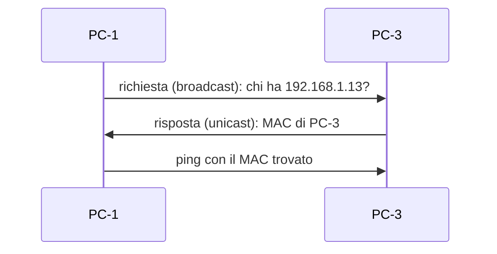
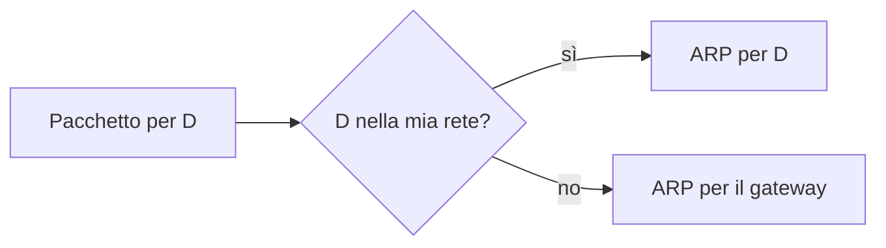

## Lezione 2.2: ARP e indirizzi MAC

Modulo 2: Reti locali e indirizzamento. Reti, Cloud e Gestione dei Dati

---

## L'indirizzo MAC

- 48 bit: `3C-52-82-4E-10-20` (Windows), `3C:52:82:4E:10:20`
- OUI (3 byte, produttore) + 3 byte della scheda
- Bit I/G: unicast o gruppo; bit U/L: universale o locale
- MAC casuali per il Wi-Fi: privacy
- Valido solo nella rete locale

---

## ARP

- Cache ARP; tipo Ethernet `0806`

---

## Stessa rete o gateway

- L'indirizzo IP di destinazione non cambia

---

## Limiti di ARP

- ARP gratuito: annuncio e conflitti di indirizzi
- Nessuna autenticazione: ARP poisoning
- Contromisure: controlli sugli switch gestiti, cifratura, segmentazione
- IPv6: Neighbor Discovery al posto di ARP

---

## Livello 2 e livello 3

| | MAC | IP |
|---|---|---|
| Ambito | rete locale | Internet |
| Apparato | switch | router |
| Cambia lungo il percorso | sì | no (salvo NAT) |

---

## Laboratorio

1. Filius: `arp`, `ping`, `arp -d`, scambio di dati
2. Windows: `ipconfig /all`, `arp -a`
3. `python mac_e_arp.py`: bit I/G e U/L, regola `01:00:5E`
4. 17 test

---

## Aspetti orientativi

- Livello 2 e 3 nella diagnosi dei guasti
- Protocolli nati per reti fidate: il lavoro della sicurezza di rete
- MAC casuali: privacy degli utenti e gestione della rete
