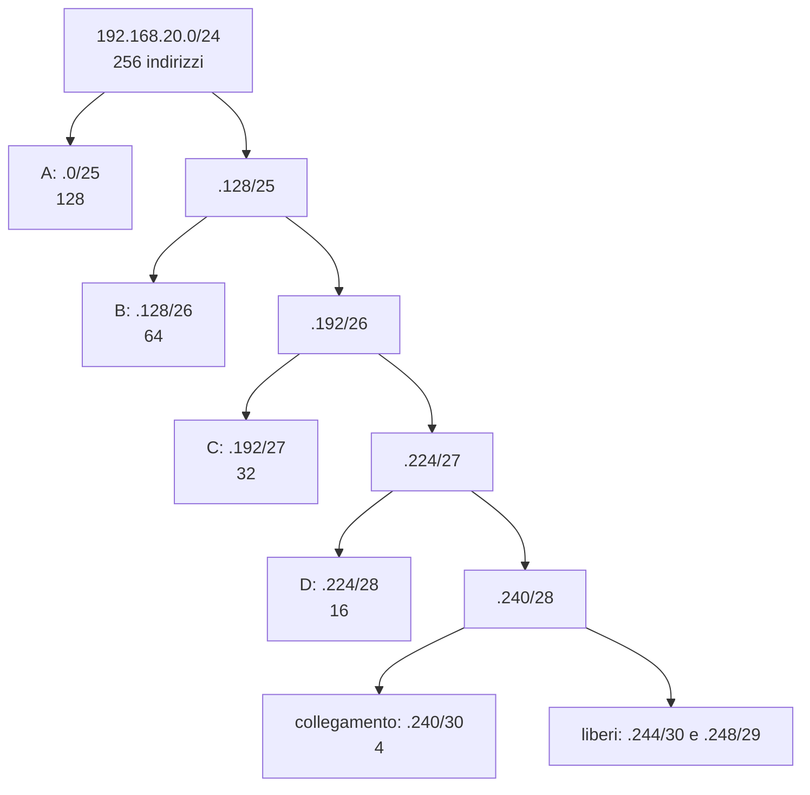

# Lezione 2.4: Sottoreti di dimensione variabile

> Contenuto originale. Riferimenti: RFC 4632, "Classless Inter-domain Routing (CIDR)", https://www.rfc-editor.org/rfc/rfc4632 ; documentazione del modulo Python `ipaddress`, https://docs.python.org/3/library/ipaddress.html . Gli script sono nella cartella `laboratorio`; le soluzioni nel file `laboratorio/soluzioni_docente.md`.

Obiettivo: suddividere un blocco di indirizzi in sottoreti di dimensioni diverse secondo le esigenze, aggregare reti contigue e documentare un piano di indirizzamento.

## 2.4.1 Perché suddividere una rete

Una scuola o un'azienda raramente usa un'unica grande rete. Suddividere lo spazio di indirizzi in **sottoreti** (subnet) serve a:

- **ridurre il traffico di broadcast**, che raggiunge tutti i dispositivi della stessa rete (lezione 2.1)
- **separare gruppi con esigenze di sicurezza diverse**: studenti, segreteria, telecamere, server; tra sottoreti il traffico passa da un router o da un firewall, dove si può controllare (Corso 2, modulo 4)
- **organizzare la rete**: dall'indirizzo si capisce subito a quale reparto appartiene un dispositivo

### Sottoreti di uguale dimensione

Allungare il prefisso di `n` bit divide una rete in `2^n` sottoreti uguali. Da `192.168.10.0/24`, con 2 bit in più:

| Sottorete | Rete | Host | Broadcast |
|---|---|---|---|
| 1 | 192.168.10.0/26 | .1 - .62 | .63 |
| 2 | 192.168.10.64/26 | .65 - .126 | .127 |
| 3 | 192.168.10.128/26 | .129 - .190 | .191 |
| 4 | 192.168.10.192/26 | .193 - .254 | .255 |

Il limite di questo metodo: se la segreteria ha 10 dispositivi e il Wi-Fi degli studenti 300, sottoreti tutte uguali o sono troppo piccole per il Wi-Fi o sprecano indirizzi per la segreteria.

## 2.4.2 VLSM: sottoreti di dimensione variabile

Con **VLSM** (Variable Length Subnet Masking), possibile grazie al CIDR, ogni sottorete ha il prefisso adatto alle proprie esigenze. Procedimento:

1. **Elencare i requisiti**: per ogni sottorete il numero di indirizzi necessari, compreso il gateway e con un margine per la crescita.
2. **Ordinare** le sottoreti dalla più grande alla più piccola.
3. **Scegliere il prefisso**: il più lungo che offre abbastanza host, cioè il più piccolo `h` con `2^h - 2` maggiore o uguale al numero richiesto; prefisso = 32 - `h`.
4. **Assegnare** le sottoreti una dopo l'altra, dall'inizio del blocco.
5. **Documentare** il piano (sezione 2.4.4).

Esempio: blocco `192.168.20.0/24`; requisiti A 100, B 50, C 25, D 10 indirizzi, più un collegamento tra due router (2 indirizzi).

| Sottorete | Richiesti | Prefisso | Rete | Host | Broadcast |
|---|---|---|---|---|---|
| A | 100 | /25 (126 host) | 192.168.20.0/25 | .1 - .126 | .127 |
| B | 50 | /26 (62 host) | 192.168.20.128/26 | .129 - .190 | .191 |
| C | 25 | /27 (30 host) | 192.168.20.192/27 | .193 - .222 | .223 |
| D | 10 | /28 (14 host) | 192.168.20.224/28 | .225 - .238 | .239 |
| collegamento | 2 | /30 (2 host) | 192.168.20.240/30 | .241 - .242 | .243 |

Restano liberi `192.168.20.244/30` e `192.168.20.248/29`, utilizzabili per esigenze future.

Diagramma: suddivisione del blocco /24.



Ogni sottorete si ottiene dividendo a metà un blocco più grande: per questo una rete /p inizia sempre a un indirizzo multiplo della sua dimensione (**allineamento**). Una /26 può iniziare a .0, .64, .128, .192, mai a .100.

Perché dalla più grande alla più piccola: assegnando nell'ordine opposto, il collegamento prenderebbe `.0/30`, D dovrebbe iniziare al primo multiplo di 16 libero (`.16/28`, lasciando inutilizzati gli indirizzi da .4 a .15) e A al primo multiplo di 128 libero (`.128/25`); il blocco si frammenta e B e C potrebbero non trovare più posto.

## 2.4.3 Aggregazione

L'operazione inversa della suddivisione è l'**aggregazione** (supernetting, o riassunto delle rotte): più reti contigue si descrivono con un solo prefisso più corto. Esempio: le reti da `172.16.8.0/24` a `172.16.11.0/24`.

| Rete | Terzo ottetto in binario |
|---|---|
| 172.16.8.0/24 | `000010 00` |
| 172.16.9.0/24 | `000010 01` |
| 172.16.10.0/24 | `000010 10` |
| 172.16.11.0/24 | `000010 11` |

I primi 22 bit sono uguali (16 bit dei primi due ottetti e 6 del terzo): le quattro reti sono riassunte da `172.16.8.0/22`. L'aggregazione è possibile quando le reti sono contigue, in numero pari a una potenza di 2 e il primo indirizzo è allineato alla dimensione totale.

A cosa serve: un router che raggiunge le quattro reti attraverso lo stesso percorso ha bisogno di una sola voce nella tabella di instradamento invece di quattro (lezione 3.1). Su Internet l'aggregazione tiene sotto controllo la dimensione delle tabelle dei router: i fornitori annunciano i propri blocchi interi, non ogni singola rete dei clienti. Un piano VLSM ben fatto assegna a ogni sede o edificio un blocco aggregabile.

## 2.4.4 Il piano di indirizzamento

Il **piano di indirizzamento** è il documento che descrive tutte le sottoreti. Per ciascuna:

- nome e scopo
- rete e prefisso, maschera, broadcast
- **gateway**: per convenzione il primo host (in alcune organizzazioni l'ultimo); l'importante è usare sempre la stessa regola
- indirizzi **statici** riservati (server, stampanti, apparati di rete) e intervallo assegnato dal **DHCP** (lezione 3.3)
- numero di VLAN, se usate (lezione 3.4)
- margine di crescita e note

Un piano aggiornato è il riferimento per configurare gli apparati, diagnosticare i problemi e ampliare la rete senza conflitti di indirizzi.

## 2.4.5 Laboratorio

Tempo indicativo: 45 minuti. Cartella di lavoro `C:\corso-reti\lab24`, con i file della cartella `laboratorio`.

### Parte 1: il piano della scuola, a mano

La scuola riceve il blocco `10.20.0.0/22` (1024 indirizzi). Il file `requisiti_scuola.csv` elenca le sottoreti necessarie, con il numero di indirizzi (gateway compreso):

| Sottorete | Indirizzi |
|---|---|
| studenti_wifi | 300 |
| docenti | 50 |
| laboratorio_1 | 28 |
| laboratorio_2 | 28 |
| telecamere | 20 |
| segreteria | 12 |
| server | 6 |
| collegamento_router | 2 |

A gruppi, calcolare per ogni sottorete prefisso, rete, gateway (primo host) e broadcast, seguendo il procedimento della sezione 2.4.2, e i blocchi rimasti liberi.

### Parte 2: verifica con lo script

```powershell
python piano_vlsm.py 10.20.0.0/22 requisiti_scuola.csv
```

```text
Nome                   Rich.  Rete              Maschera         Gateway        Broadcast       Disp.   Uso
studenti_wifi            300  10.20.0.0/23      255.255.254.0    10.20.0.1      10.20.1.255       510   59%
docenti                   50  10.20.2.0/26      255.255.255.192  10.20.2.1      10.20.2.63         62   81%
...
Indirizzi assegnati: 700 su 1024; blocchi liberi: 10.20.2.188/30, 10.20.2.192/26, 10.20.3.0/24
Verifica (nel blocco, senza sovrapposizioni, sufficienti): superata
Piano salvato in piano_calcolato.csv
```

Punti principali del codice:

```python
def prefisso_necessario(host):
    bit_host = 2
    while 2 ** bit_host - 2 < host:    # aumenta i bit di host finché bastano
        bit_host += 1
    return 32 - bit_host

ordinati = sorted(requisiti, key=lambda r: r[1], reverse=True)   # dalla più grande
```

- `sorted(..., key=..., reverse=True)` ordina l'elenco in base al numero di indirizzi, in ordine decrescente; `lambda r: r[1]` è una piccola funzione che restituisce il secondo elemento di ogni coppia (nome, indirizzi)
- per ogni requisito, la sottorete successiva inizia dove finisce la precedente; `subnet_of` controlla che resti dentro il blocco, altrimenti lo script segnala spazio insufficiente
- `blocchi_liberi` usa `address_exclude`, che toglie una sottorete da una rete più grande e restituisce le parti rimanenti; `collapse_addresses` le riassume
- `verifica_piano` controlla con `overlaps` che nessuna coppia di sottoreti si sovrapponga
- `piano_calcolato.csv` si apre con Excel o LibreOffice Calc, o in VS Code

Test: `python test_piano_vlsm.py` (15 test).

### Parte 3: modifiche al piano

1. La scuola aggiunge una sottorete `aula_magna` con 40 dispositivi: aggiungerla al file CSV e rieseguire lo script. Dove viene collocata? Quali sottoreti cambiano indirizzo?
2. Raddoppiare gli indirizzi di `studenti_wifi` (600): il blocco /22 basta ancora?
3. Provare `python piano_vlsm.py 10.20.0.0/23 requisiti_scuola.csv`: che cosa succede, e perché?
4. Nella modalità interattiva di Python verificare l'aggregazione dell'esempio della sezione 2.4.3:

```python
>>> import ipaddress
>>> reti = [ipaddress.ip_network(f"172.16.{n}.0/24") for n in range(8, 12)]
>>> list(ipaddress.collapse_addresses(reti))
[IPv4Network('172.16.8.0/22')]
```

### Parte 4: lo schema della rete

Con l'estensione **Draw.io Integration** di VS Code (https://marketplace.visualstudio.com/items?itemName=hediet.vscode-drawio) creare il file `rete_scuola.drawio`: un router centrale e un riquadro per ogni sottorete, con nome, rete e gateway presi da `piano_calcolato.csv`. Lo schema sarà la base del progetto della lezione 3.5.

### Attività

1. Aggiungere al piano un margine di crescita: modificare lo script perché aumenti ogni requisito del 20% (arrotondando per eccesso) prima di calcolare i prefissi.
2. Con `requisiti_scuola.csv`, quanti indirizzi si sprecherebbero usando sottoreti tutte uguali, abbastanza grandi per `studenti_wifi`? Il blocco /22 basterebbe?
3. Le sottoreti `laboratorio_1` e `laboratorio_2` si possono aggregare in un solo prefisso? Quale?

## 2.4.6 Aspetti orientativi (discussione)

- Il piano di indirizzamento è uno dei primi documenti prodotti in un progetto di rete: lo preparano i progettisti di rete e lo usano per anni tecnici e sistemisti.
- Gli stessi concetti si usano nel cloud: una rete virtuale si crea indicando un blocco CIDR e si divide in sottoreti per i diversi servizi (modulo 6).
- Domanda: quali informazioni servono per stimare il margine di crescita di una sottorete, per esempio quella del Wi-Fi degli studenti?
