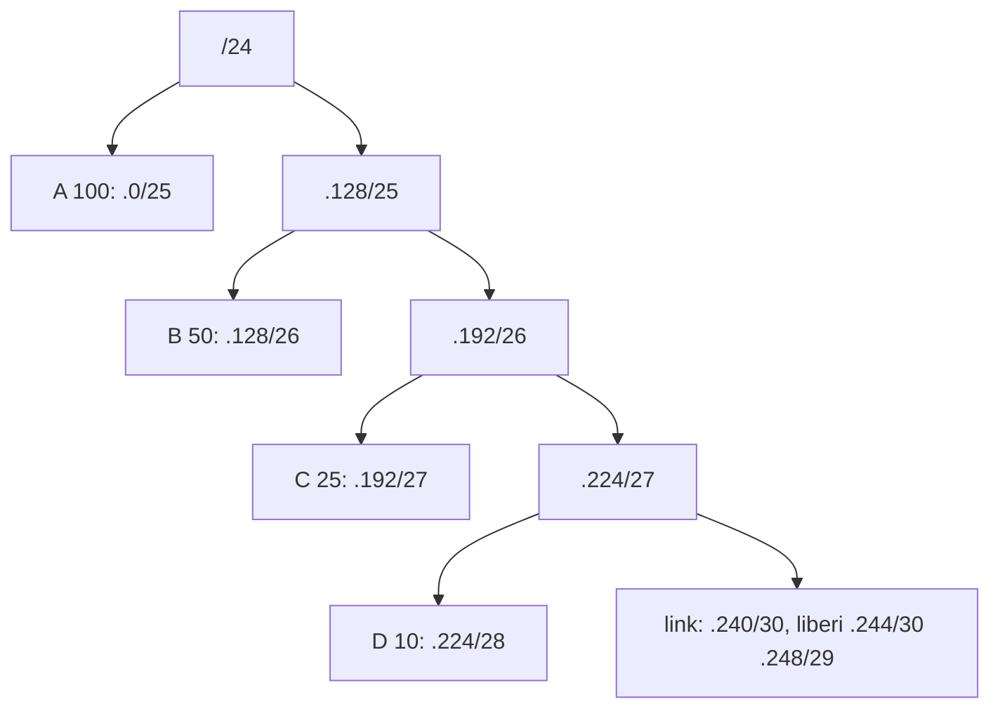

## Lezione 2.4: Sottoreti di dimensione variabile

Modulo 2: Reti locali e indirizzamento. Reti, Cloud e Gestione dei Dati

---

## Perché suddividere

- Meno broadcast
- Gruppi separati per sicurezza, controllo tra sottoreti
- Organizzazione: l'indirizzo indica il reparto
- `n` bit in più: `2^n` sottoreti uguali

---

## VLSM

1. Requisiti (gateway e margine compresi)
2. Ordine decrescente
3. Prefisso: minimo `h` con `2^h - 2` sufficiente
4. Assegnazione in sequenza, allineata
5. Documentazione

---

## Esempio: 192.168.20.0/24

---

## Aggregazione

- 172.16.8.0/24 ... 172.16.11.0/24 = 172.16.8.0/22
- Reti contigue, potenza di 2, allineate
- Meno voci nelle tabelle dei router

---

## Piano di indirizzamento

- Rete, maschera, broadcast
- Gateway: primo host (regola costante)
- Indirizzi statici e intervallo DHCP
- VLAN, margine di crescita, note

---

## Laboratorio

1. Piano della scuola `10.20.0.0/22`, a mano
2. `python piano_vlsm.py 10.20.0.0/22 requisiti_scuola.csv`
3. Modifiche: aula magna, Wi-Fi raddoppiato, blocco /23
4. Schema con Draw.io in VS Code; 15 test

---

## Aspetti orientativi

- Il piano di indirizzamento: primo documento di un progetto di rete
- Stessi concetti nelle reti virtuali del cloud
- Come stimare il margine di crescita?
