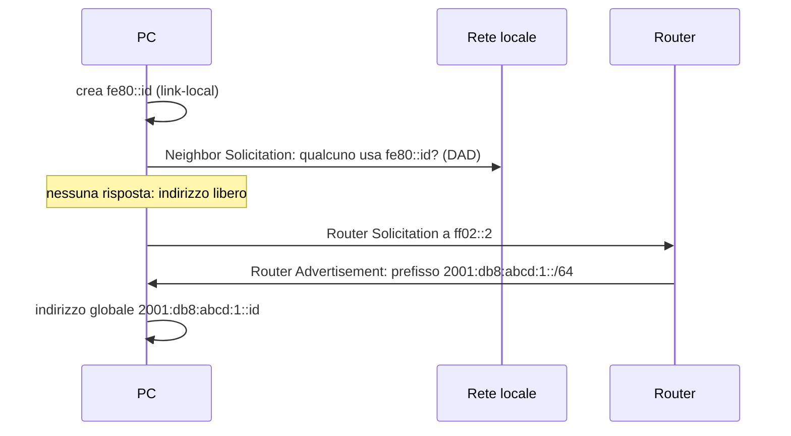

# Lezione 2.5: IPv6

> Contenuto originale. Riferimenti: RFC 4291, "IP Version 6 Addressing Architecture", https://www.rfc-editor.org/rfc/rfc4291 ; RFC 5952, "A Recommendation for IPv6 Address Text Representation", https://www.rfc-editor.org/rfc/rfc5952 ; RFC 4862, "IPv6 Stateless Address Autoconfiguration", https://www.rfc-editor.org/rfc/rfc4862 ; Wikipedia, "IPv6", https://it.wikipedia.org/wiki/IPv6 . Gli script sono nella cartella `laboratorio`; le soluzioni degli esercizi nel file `laboratorio/soluzioni_docente.md`.

Obiettivo: leggere e abbreviare gli indirizzi IPv6, riconoscerne i tipi, spiegare come un dispositivo configura da solo il proprio indirizzo e come IPv6 convive con IPv4.

## 2.5.1 Perché IPv6

- **Esaurimento di IPv4**: i circa 4,3 miliardi di indirizzi IPv4 non bastano per tutti i dispositivi collegati (lezione 2.3). IPv6 usa indirizzi di **128 bit**: circa 3,4 × 10^38.
- **Fine della dipendenza dal NAT**: ogni dispositivo può avere un indirizzo pubblico; il controllo degli accessi resta compito del firewall.
- **Configurazione automatica** degli indirizzi senza server (sezione 2.5.5).
- **Intestazione semplificata**, di lunghezza fissa (40 byte), più rapida da elaborare per i router.

IPv6 è stato definito negli anni Novanta, ma la diffusione è graduale: la percentuale di utenti che raggiungono Google tramite IPv6, per paese, si consulta alla pagina https://www.google.com/intl/en/ipv6/statistics.html . Nella maggior parte delle reti IPv4 e IPv6 funzionano insieme.

## 2.5.2 Notazione

Un indirizzo IPv6 si scrive con **8 gruppi di 16 bit**, ciascuno in 4 cifre esadecimali, separati da due punti:

```text
2001:0db8:0000:0000:0000:ff00:0042:8329
```

Regole di abbreviazione (RFC 5952):

1. in ogni gruppo si omettono gli **zeri iniziali**: `0db8` diventa `db8`, `0042` diventa `42`, `0000` diventa `0`;
2. **una sola** sequenza di due o più gruppi consecutivi a zero si sostituisce con `::`; se ce ne sono più di una si abbrevia la più lunga, a parità di lunghezza la prima;
3. le lettere si scrivono in **minuscolo**.

| Forma completa | Forma abbreviata |
|---|---|
| `2001:0db8:0000:0000:0000:ff00:0042:8329` | `2001:db8::ff00:42:8329` |
| `fe80:0000:0000:0000:0000:0000:0000:0001` | `fe80::1` |
| `2001:0db8:0000:0001:0000:0000:0000:0001` | `2001:db8:0:1::1` |
| `0000:0000:0000:0000:0000:0000:0000:0001` | `::1` |

Il simbolo `::` può comparire una sola volta: con due `::` non si potrebbe sapere quanti gruppi a zero rappresenta ciascuno. Per espandere un indirizzo abbreviato si contano i gruppi presenti e si inseriscono al posto di `::` i gruppi mancanti fino a 8.

Due notazioni particolari:

- negli URL l'indirizzo va tra parentesi quadre, per distinguere i due punti dalla porta: `http://[2001:db8::1]:8080/`
- `%11` dopo un indirizzo link-local (per esempio `fe80::1%11`) è l'**indice di zona**: indica su quale scheda di rete usarlo, perché lo stesso indirizzo link-local può esistere su più reti collegate al PC

## 2.5.3 Prefissi e struttura

Come in IPv4, la notazione con la barra indica il prefisso. Nelle reti locali il prefisso è quasi sempre **/64**: 64 bit per la rete, 64 bit per l'**identificativo di interfaccia**.

Diagramma: struttura di un indirizzo unicast globale in una rete /64.


- Un'organizzazione riceve spesso un blocco **/48**: 16 bit per le sottoreti, cioè 65 536 reti /64. Una connessione domestica riceve di solito un /56 (256 reti) o un /64.
- In ogni rete /64 ci sono 2^64 indirizzi: non ha senso contare gli host come in IPv4. La suddivisione si fa sul confine delle sottoreti, non per risparmiare indirizzi.
- Esempio di piano: blocco `2001:db8:abcd::/48`; laboratorio 1 `2001:db8:abcd:1::/64`, laboratorio 2 `2001:db8:abcd:2::/64`, segreteria `2001:db8:abcd:10::/64`. L'ID di sottorete (il quarto gruppo) può rispecchiare il numero di VLAN o del piano.

## 2.5.4 Tipi di indirizzo

| Tipo | Prefisso | Uso |
|---|---|---|
| Unicast globale | `2000::/3` (iniziano con 2 o 3) | raggiungibili da Internet, equivalenti agli indirizzi pubblici IPv4 |
| Link-local | `fe80::/10` | validi solo nella rete locale; **ogni** interfaccia IPv6 ne ha uno, anche senza router; usati per i messaggi di servizio |
| Locale unico (ULA) | `fc00::/7` (in pratica `fd00::/8`) | reti interne non raggiungibili da Internet, simili agli indirizzi privati IPv4 |
| Loopback | `::1/128` | il computer stesso, come `127.0.0.1` |
| Non specificato | `::/128` | "nessun indirizzo", per esempio prima della configurazione |
| Multicast | `ff00::/8` | gruppi di destinatari: `ff02::1` tutti i dispositivi della rete locale, `ff02::2` tutti i router |
| Documentazione | `2001:db8::/32` | riservato agli esempi (RFC 3849) |

In IPv6 **non esiste il broadcast**: le sue funzioni sono svolte dal multicast, che raggiunge solo i dispositivi interessati. Esiste anche l'**anycast**: lo stesso indirizzo assegnato a più server, e il pacchetto raggiunge il più vicino; lo usano per esempio i servizi DNS pubblici.

Un dispositivo IPv6 ha normalmente **più indirizzi** sulla stessa scheda: almeno il link-local, e uno o più globali.

## 2.5.5 Autoconfigurazione e Neighbor Discovery

IPv6 sostituisce ARP con il protocollo **Neighbor Discovery** (ND), basato su messaggi ICMPv6 inviati in multicast. Lo stesso protocollo permette al dispositivo di configurarsi da solo con **SLAAC** (Stateless Address Autoconfiguration, RFC 4862):

1. il dispositivo crea il proprio indirizzo **link-local** (`fe80::` + identificativo di interfaccia);
2. verifica che nessun altro lo usi (**Duplicate Address Detection**);
3. chiede ai router della rete il prefisso con un **Router Solicitation** a `ff02::2`;
4. il router risponde con un **Router Advertisement** che contiene il prefisso /64 (e si propone come gateway);
5. il dispositivo unisce prefisso e identificativo di interfaccia e ottiene il proprio indirizzo **globale**.

Diagramma: autoconfigurazione SLAAC.



L'identificativo di interfaccia:

- in origine si ricavava dal MAC con il metodo **EUI-64**: si inserisce `fffe` al centro del MAC e si inverte il bit U/L (lezione 2.2). Da `00:1B:21:3A:5C:01` si ottiene `021b:21ff:fe3a:5c01`;
- poiché il MAC rendeva il dispositivo riconoscibile su qualunque rete, i sistemi attuali usano identificativi **casuali** o **stabili ma diversi per ogni rete**, e in più **indirizzi temporanei** che cambiano periodicamente per le connessioni in uscita (RFC 8981, https://www.rfc-editor.org/rfc/rfc8981 ). Per questo `ipconfig` di Windows mostra un "Indirizzo IPv6" e un "Indirizzo IPv6 temporaneo".

In alternativa a SLAAC, o insieme, si può usare un server **DHCPv6**, quando si vuole controllare centralmente l'assegnazione.

## 2.5.6 Coesistenza con IPv4

- **Dual stack**: il dispositivo ha indirizzi IPv4 e IPv6 e usa quello disponibile. È la soluzione più diffusa. Il DNS restituisce indirizzi IPv4 (record `A`) e IPv6 (record `AAAA`, lezione 1.3); i browser provano entrambi e usano la connessione che risponde prima.
- **Tunnel**: pacchetti IPv6 trasportati dentro pacchetti IPv4 per attraversare reti solo IPv4.
- **Traduzione** (NAT64 e DNS64): permette a reti solo IPv6, frequenti nelle reti mobili, di raggiungere i servizi solo IPv4.

## 2.5.7 Laboratorio

Tempo indicativo: 40 minuti. Cartella di lavoro `C:\corso-reti\lab25`, con i file della cartella `laboratorio`. Filius non gestisce IPv6: le attività si svolgono sul proprio PC e in Python.

### Parte 1: gli indirizzi IPv6 del proprio PC

```powershell
ipconfig                                   # indirizzi IPv6 di ogni scheda
python ipv6.py --ipconfig                  # stessi indirizzi, con il tipo
ping ::1                                   # loopback IPv6
nslookup -type=AAAA www.wikipedia.org      # indirizzo IPv6 di un sito
curl.exe -6 -I https://www.wikipedia.org   # connessione solo via IPv6
```

```text
2001:db8:4a2c:1100:8d1f:3b2e:c5a0:1f27    documentazione (esempi)   Indirizzo IPv6
2001:db8:4a2c:1100:5c9e:a7:e21b:9d04      documentazione (esempi)   Indirizzo IPv6 temporaneo
fe80::8d1f:3b2e:c5a0:1f27                 link-local                Indirizzo IPv6 locale rispetto al collegamento
fe80::1                                   link-local                Gateway predefinito
```

L'output mostrato è quello del file `ipconfig_esempio.txt` (`python ipv6.py --ipconfig ipconfig_esempio.txt`), che usa indirizzi di documentazione; su una rete reale gli indirizzi globali iniziano con 2 o 3 e compaiono come "unicast globale".

Domande:

1. Il PC ha un indirizzo link-local? Ha indirizzi globali? Se ha solo il link-local, che cosa si conclude sulla rete della scuola?
2. Il gateway IPv6 è indicato con un indirizzo link-local: perché basta?
3. `curl.exe -6` riesce? Se non riesce, la rete non offre connettività IPv6: è un'osservazione, non un errore. La pagina https://test-ipv6.com/ (APNIC Labs, senza registrazione) riassume la situazione della connessione.

### Parte 2: esercizi di abbreviazione ed espansione

Abbreviare:

1. `2001:0db8:0000:0000:0008:0800:200c:417a`
2. `fe80:0000:0000:0000:0204:61ff:fe9d:f156`
3. `2001:0db8:0000:0000:0001:0000:0000:0001`
4. `ff02:0000:0000:0000:0000:0000:0000:0001`
5. `2001:0DB8:00A0:0000:0000:0000:0000:0000`

Espandere: `fe80::1`, `2001:db8:a::`, `::ffff:0:1`. Per ciascun indirizzo indicare anche il tipo.

Verifica:

```powershell
python ipv6.py 2001:0db8:0000:0000:0008:0800:200c:417a
```

```text
Forma completa:    2001:0db8:0000:0000:0008:0800:200c:417a
Forma abbreviata:  2001:db8::8:800:200c:417a
Tipo:              documentazione (esempi)
Prefisso /64:      2001:0db8:0000:0000  (rete)
Identificativo:    0008:0800:200c:417a  (interfaccia)
Controllo con ipaddress: concorde
```

Punti principali del codice:

```python
gruppi = gruppi_sx + ["0"] * mancanti + gruppi_dx   # '::' sostituisce i gruppi a zero
return ":".join(g.zfill(4) for g in gruppi)          # zeri a sinistra fino a 4 cifre
```

- `espandi` divide l'indirizzo sul simbolo `::`, conta i gruppi a sinistra e a destra e inserisce gli zeri mancanti; `zfill(4)` completa ogni gruppo a 4 cifre
- `abbrevia` toglie gli zeri iniziali con `format(int(g, 16), "x")`, cerca la sequenza più lunga di gruppi `0` e la sostituisce con `::`, applicando le regole dell'RFC 5952
- `tipo` confronta l'indirizzo con i blocchi della tabella della sezione 2.5.4, dal più specifico al più generale, usando `ipaddress`
- `indirizzi_da_ipconfig` cerca nelle righe dell'output di `ipconfig` le sequenze che hanno la forma di un indirizzo IPv6, toglie l'indice di zona e tiene solo quelle che `ipaddress` riconosce come valide

Test: `python test_ipv6.py` (19 test, tra cui il confronto con `ipaddress` su 3000 indirizzi casuali).

### Parte 3: EUI-64

```powershell
python ipv6.py --eui64 00-1b-21-3a-5c-01
```

Calcolare prima a mano l'identificativo EUI-64 del MAC `00-1B-21-3A-5C-01`, poi del MAC della propria scheda di rete (da `ipconfig /all`), e verificare con lo script. L'identificativo del proprio indirizzo IPv6 globale coincide con quello EUI-64? Che cosa se ne conclude sul metodo usato da Windows?

### Attività

1. Scrivere un piano di indirizzamento IPv6 per le sottoreti di `requisiti_scuola.csv` (lezione 2.4) a partire dal blocco `2001:db8:5c01::/48`: una /64 per ogni sottorete. Perché non serve calcolare i prefissi in base al numero di dispositivi?
2. Aggiungere a `ipv6.py` il riconoscimento degli indirizzi IPv4 mappati (`::ffff:0:0/96`), con un test.
3. Perché IPv6 non ha bisogno del broadcast?

## 2.5.8 Aspetti orientativi (discussione)

- Le reti mobili, i grandi fornitori di servizi cloud e molti data center usano già IPv6 in modo esteso: la competenza è richiesta a tecnici di rete, sistemisti e sviluppatori di servizi di rete.
- La transizione da IPv4 a IPv6 dura da decenni: è un esempio di quanto sia difficile cambiare un'infrastruttura usata da miliardi di dispositivi.
- Domanda: se ogni dispositivo ha un indirizzo pubblico IPv6, che cosa protegge la rete di casa, che con IPv4 era "nascosta" dietro il NAT?
