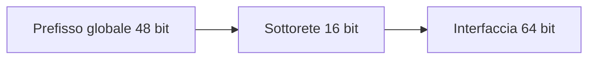
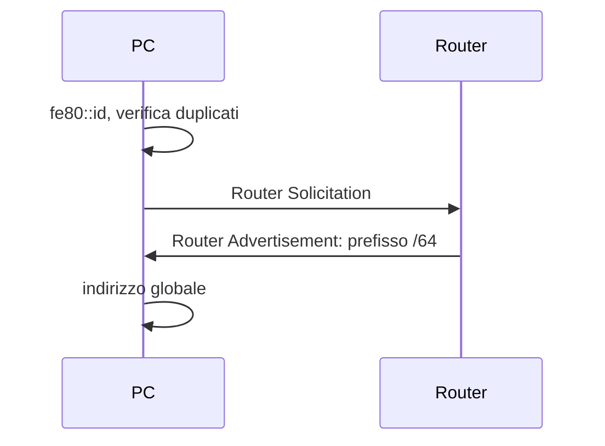

## Contenuti

- Perché IPv6
- Notazione
- Prefissi
- Tipi di indirizzo
- SLAAC e Neighbor Discovery
- Coesistenza
- Laboratorio
- Aspetti orientativi

## Perché IPv6

- 128 bit: circa 3,4 × 10^38 indirizzi
- Indirizzi pubblici senza NAT; firewall per il controllo
- Autoconfigurazione
- Intestazione fissa di 40 byte

## Notazione

- 8 gruppi da 16 bit in esadecimale
- Zeri iniziali omessi; una sola sequenza di zeri con `::`
- Sequenza più lunga, a parità la prima; minuscole
- `2001:0db8:0000:0000:0000:ff00:0042:8329` = `2001:db8::ff00:42:8329`
- URL: `http://[2001:db8::1]:8080/`; zona: `fe80::1%11`

## Prefissi

- Reti locali /64; sedi /48; case /56 o /64

## Tipi di indirizzo

| Tipo | Prefisso |
|---|---|
| Unicast globale | `2000::/3` |
| Link-local | `fe80::/10` |
| ULA | `fc00::/7` |
| Loopback | `::1` |
| Multicast | `ff00::/8` |
| Documentazione | `2001:db8::/32` |

- Nessun broadcast; anycast

## SLAAC e Neighbor Discovery

- EUI-64 dal MAC, oggi identificativi casuali e indirizzi temporanei

## Coesistenza

- Dual stack: record A e AAAA
- Tunnel
- NAT64 e DNS64

## Laboratorio

1. `ipconfig`, `python ipv6.py --ipconfig`, `curl.exe -6`
2. Esercizi di abbreviazione ed espansione
3. EUI-64 del proprio MAC
4. 19 test, confronto su 3000 indirizzi

## Aspetti orientativi

- IPv6 nelle reti mobili, nel cloud, nei data center
- Una transizione lunga decenni
- Senza NAT, che cosa protegge la rete di casa?
