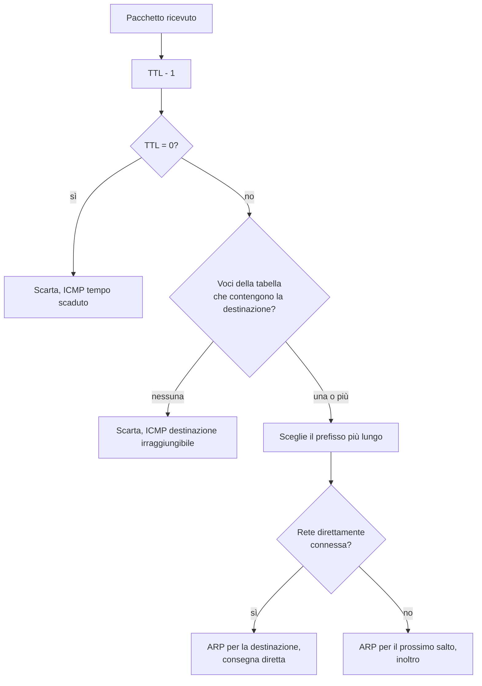
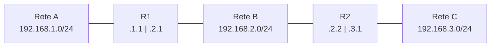

# Lezione 3.1: Router e instradamento statico

> Contenuto originale. Riferimenti: documentazione Microsoft del comando `route`, https://learn.microsoft.com/en-us/windows-server/administration/windows-commands/route_ws2008 ; simulatore Filius, https://www.lernsoftware-filius.de/Herunterladen . Gli script sono nella cartella `laboratorio`.

Obiettivo: spiegare come un router sceglie dove inoltrare un pacchetto, leggere e scrivere una tabella di instradamento e collegare più reti con rotte statiche.

## 3.1.1 Il router

Il **router** collega reti diverse e inoltra i pacchetti IP dall'una all'altra. A differenza dello switch (lezione 2.1), che lavora con gli indirizzi MAC dentro una sola rete, il router lavora con gli indirizzi IP (livello 3).

- Ha un'**interfaccia per ogni rete** a cui è collegato, ciascuna con un proprio indirizzo IP di quella rete.
- Per ogni pacchetto ricevuto legge l'indirizzo IP di destinazione e cerca nella **tabella di instradamento** (routing table) dove inviarlo.
- Diminuisce di 1 il **TTL** (Time To Live) del pacchetto; se arriva a 0, scarta il pacchetto e avvisa il mittente con un messaggio ICMP "tempo scaduto". Così un pacchetto non può girare all'infinito in caso di errori (è il principio usato da `tracert`, lezione 1.3).
- Costruisce una **nuova trama** Ethernet per la rete successiva, con il proprio MAC come origine e il MAC del prossimo dispositivo come destinazione (lezione 2.2).
- Separa i **domini di broadcast**: le trame di broadcast non attraversano il router.

Il **gateway predefinito** di un PC è l'indirizzo del router della sua rete: il PC gli consegna tutti i pacchetti destinati a reti diverse dalla propria.

## 3.1.2 La tabella di instradamento

Ogni voce della tabella contiene:

| Campo | Significato |
|---|---|
| Destinazione e maschera | la rete che la voce permette di raggiungere |
| Prossimo salto (next hop, gateway) | l'indirizzo del router successivo; per le reti **direttamente connesse** non c'è, il router consegna direttamente |
| Interfaccia | l'interfaccia da cui far uscire il pacchetto |
| Metrica | il "costo" della rotta, usato per scegliere tra rotte equivalenti |

Le voci hanno tre origini:

- **reti direttamente connesse**: aggiunte automaticamente quando si configura un'interfaccia;
- **rotte statiche**: scritte a mano dall'amministratore;
- **rotte dinamiche**: apprese dai protocolli di instradamento (lezione 3.2).

La **rotta predefinita** (default route) ha destinazione `0.0.0.0/0`: contiene tutti gli indirizzi e si usa quando nessuna altra voce è applicabile. Il gateway predefinito di un PC è, in pratica, la sua rotta predefinita.

### La regola del prefisso più lungo

Un indirizzo può appartenere a più voci: `10.1.2.3` è contenuto in `10.0.0.0/8`, in `10.1.0.0/16`, in `10.1.2.0/24` e in `0.0.0.0/0`. Il router sceglie la voce con il **prefisso più lungo** (longest prefix match), cioè la più specifica. Se nessuna voce è applicabile, scarta il pacchetto e invia al mittente un messaggio ICMP "destinazione irraggiungibile".

Diagramma: decisione del router per ogni pacchetto.



## 3.1.3 Instradamento statico

Esempio: tre reti in fila, collegate da due router.



R1 conosce da solo le reti A e B, a cui è collegato; per raggiungere C ha bisogno di una rotta statica. Lo stesso vale per R2 e la rete A.

| Router | Destinazione | Maschera | Prossimo salto |
|---|---|---|---|
| R1 | 192.168.3.0 | 255.255.255.0 | 192.168.2.2 (R2) |
| R2 | 192.168.1.0 | 255.255.255.0 | 192.168.2.1 (R1) |

Le rotte servono **in entrambe le direzioni**: se R1 sa raggiungere C ma R2 non sa tornare verso A, i pacchetti arrivano ma le risposte si perdono.

Vantaggi e limiti delle rotte statiche:

- semplici, prevedibili, nessun traffico di servizio: adatte a reti piccole e alla rotta predefinita verso il fornitore di accesso;
- non si adattano ai guasti e vanno aggiornate a mano a ogni modifica: con molte reti diventano ingestibili e gli errori possono creare **cicli di instradamento**, in cui due router si rimandano i pacchetti fino all'esaurimento del TTL.

## 3.1.4 Laboratorio

Tempo indicativo: 45 minuti. Cartella di lavoro `C:\corso-reti\lab31`, con i file della cartella `laboratorio`.

### Parte 1: tre reti e due router in Filius

1. In modalità progettazione costruire la rete del diagramma della sezione 3.1.3: per ogni rete uno **Switch** e due **Notebook**; due **Router**, ciascuno con due interfacce (numero richiesto quando si inserisce il router).
2. Configurare i notebook: rete A `192.168.1.10` e `.11`, gateway `192.168.1.1`; rete B `192.168.2.10` e `.11`, gateway `192.168.2.1`; rete C `192.168.3.10` e `.11`, gateway `192.168.3.1`; maschera sempre `255.255.255.0`.
3. Configurare i router (doppio clic): per ogni interfaccia, nella scheda corrispondente, **IP Address** e **Netmask** della rete a cui è collegata (R1: `192.168.1.1` e `192.168.2.1`; R2: `192.168.2.2` e `192.168.3.1`). Verificare con la scheda **General** o con il pulsante **Manage connections** quale interfaccia è collegata a quale switch.
4. In simulazione, da un PC della rete A: `ping 192.168.2.10` (funziona: R1 conosce la rete B) e `ping 192.168.3.10` (non funziona). Perché?
5. In progettazione, nella scheda **Forwarding table** di R1, con **New entry**, aggiungere la rotta: **Destination** `192.168.3.0`, **Netmask** `255.255.255.0`, **Next gateway** `192.168.2.2`, **NIC** l'interfaccia `192.168.2.1`. Con **Show all entries** si vedono anche le voci delle reti direttamente connesse.
6. Ripetere `ping 192.168.3.10`: ancora nessuna risposta. Con **Show data exchange** sul PC della rete C verificare se la richiesta arriva. Che cosa manca?
7. Aggiungere a R2 la rotta verso `192.168.1.0/24` tramite `192.168.2.1` e verificare che il `ping` funzioni.
8. Nella Command Line eseguire `traceroute 192.168.3.10` e `route`: il primo mostra i router attraversati, il secondo la tabella di instradamento del PC (con la rotta predefinita verso il gateway).
9. Facoltativo: installare un **Webbrowser** su un PC e aprire `http://192.168.1.1/routes`: il router mostra la propria tabella in una pagina web.
10. Salvare il progetto come `lab31_tre_reti.fls`: servirà nelle lezioni 3.2 e 3.3.

### Parte 2: la tabella di instradamento del proprio PC

```powershell
route print
```

Nella sezione **IPv4** dell'output compaiono: la rotta predefinita `0.0.0.0` con il gateway, la rete locale con gateway **On-link** (direttamente connessa), il loopback `127.0.0.0`, gli indirizzi di broadcast e multicast. La colonna della metrica indica la preferenza tra rotte con lo stesso prefisso: più basso è il valore, più la rotta è preferita.

```powershell
python instradamento.py route_esempio.txt
```

Lo script legge un output salvato di `route print` (italiano o inglese; per il proprio PC: `route print > mie_rotte.txt`, poi `python instradamento.py mie_rotte.txt`) e indica quale rotta verrebbe usata per `8.8.8.8`.

### Parte 3: il percorso dei pacchetti in Python

```powershell
python instradamento.py
```

```text
da 192.168.1.x a 192.168.3.20: consegnato; router: R1 -> R2
da 192.168.1.x a 203.0.113.80: consegnato; router: R1 -> R2 -> R3
da 192.168.1.x a 198.51.100.7: destinazione irraggiungibile (ICMP destination unreachable); router: R1 -> R2 -> R3
con un ciclo di instradamento e TTL 8: TTL scaduto (ICMP time exceeded); router: R1 -> R2 -> R1 -> R2 -> R1 -> R2 -> R1 -> R2
```

La scelta della rotta:

```python
def scegli(self, indirizzo):
    indirizzo = ipaddress.ip_address(indirizzo)
    candidate = [voce for voce in self.tabella if indirizzo in voce[0]]   # voci applicabili
    if not candidate:
        return None                                                       # irraggiungibile
    return max(candidate, key=lambda voce: voce[0].prefixlen)             # prefisso più lungo
```

- `indirizzo in rete` usa il modulo `ipaddress` per verificare l'appartenenza (lezione 2.3)
- `max(..., key=...)` sceglie la voce con il valore più alto di `prefixlen`
- la funzione `percorso` segue il pacchetto di router in router, diminuendo il TTL, finché viene consegnato, scartato per mancanza di rotta o per TTL esaurito
- nella rete di esempio R3 non ha una rotta predefinita verso il fornitore: per questo `198.51.100.7` risulta irraggiungibile

Test: `python test_instradamento.py` (18 test).

### Attività

1. In `rete_di_esempio` aggiungere un router `R4` del fornitore, con indirizzo `203.0.113.1` e una voce `0.0.0.0/0` direttamente connessa (consegna qualunque destinazione), e a R3 una rotta predefinita verso `203.0.113.1`; verificare il percorso verso `198.51.100.7`.
2. Nella rete di Filius, sostituire le rotte statiche di R1 verso la rete C con una rotta predefinita verso R2: funziona ancora? Quali vantaggi e quali rischi ha questa scelta?
3. Perché nella rete di esempio R3 può usare una sola voce `192.168.0.0/22` per raggiungere le reti A, B e C? (lezione 2.4, aggregazione)

## 3.1.5 Aspetti orientativi (discussione)

- Configurare e verificare router e tabelle di instradamento è il lavoro quotidiano di tecnici e ingegneri di rete; nelle aziende e nel cloud le stesse idee si ritrovano nelle "tabelle di routing" delle reti virtuali.
- Molti guasti nascono da una rotta mancante nel percorso di ritorno: il metodo di verifica visto (controllare entrambe le direzioni) vale anche nelle reti reali.
- Domanda: in una rete con 50 sedi, che cosa comporterebbe gestire solo rotte statiche?
