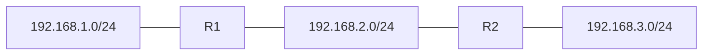

## Contenuti

- Il router
- Tabella di instradamento
- Rotte statiche
- Laboratorio
- Aspetti orientativi

## Il router

- Collega reti diverse, un'interfaccia per rete
- Legge l'IP di destinazione, consulta la tabella
- TTL - 1; a 0 scarta e invia ICMP "tempo scaduto"
- Nuova trama per ogni rete; separa i domini di broadcast
- Gateway predefinito = router della propria rete

## Tabella di instradamento

| Campo | Significato |
|---|---|
| Destinazione, maschera | rete raggiungibile |
| Prossimo salto | router successivo (nessuno se diretta) |
| Interfaccia, metrica | uscita, preferenza |

- Reti connesse, rotte statiche, rotte dinamiche
- Rotta predefinita `0.0.0.0/0`; prefisso più lungo

## Rotte statiche

- R1: 192.168.3.0/24 via 192.168.2.2
- R2: 192.168.1.0/24 via 192.168.2.1
- Servono in entrambe le direzioni; rischio di cicli

## Laboratorio

1. Filius: tre reti, due router, Forwarding table
2. `traceroute`, `route`, pagina `/routes` del router
3. `route print` sul PC; `python instradamento.py route_esempio.txt`
4. `python instradamento.py`: prefisso più lungo, TTL, cicli; 18 test

## Aspetti orientativi

- Router e tabelle: lavoro quotidiano di tecnici di rete e cloud
- Verificare sempre anche il percorso di ritorno
- 50 sedi con sole rotte statiche?
