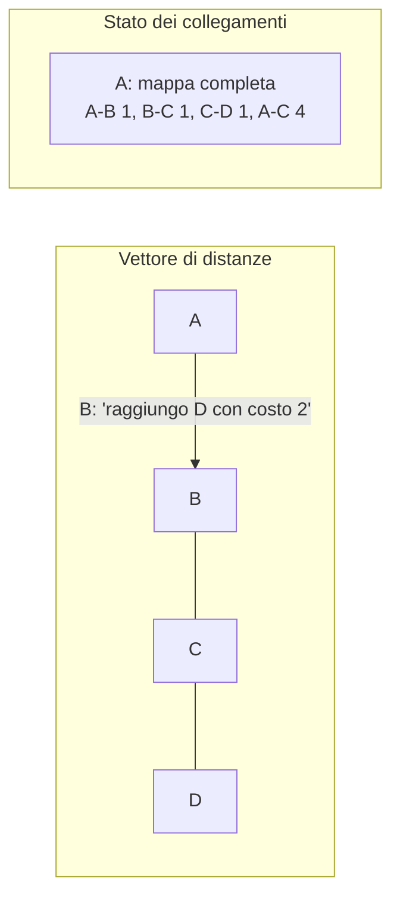
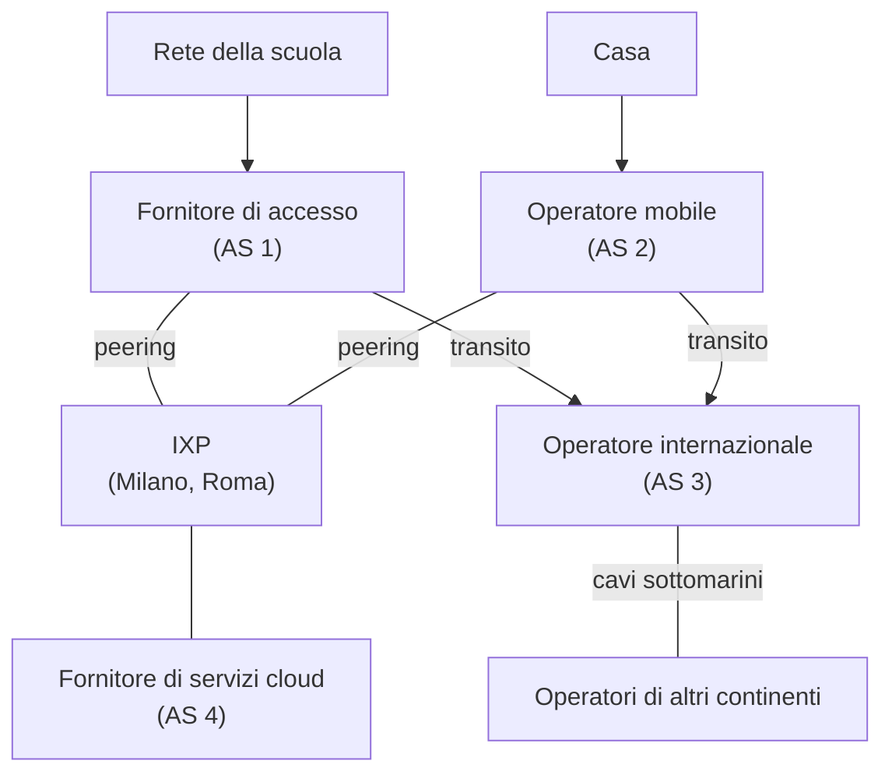

# Lezione 3.2: Instradamento dinamico e Internet

> Contenuto originale. Riferimenti: RFC 2453, "RIP Version 2", https://www.rfc-editor.org/rfc/rfc2453 ; RFC 2328, "OSPF Version 2", https://www.rfc-editor.org/rfc/rfc2328 ; RFC 4271, "A Border Gateway Protocol 4 (BGP-4)", https://www.rfc-editor.org/rfc/rfc4271 . Gli script sono nella cartella `laboratorio`.

Obiettivo: spiegare come i router imparano da soli le rotte, confrontare i principali tipi di protocolli di instradamento e descrivere come è organizzata Internet.

## 3.2.1 Perché l'instradamento dinamico

Con le rotte statiche (lezione 3.1) ogni modifica della rete e ogni guasto richiedono un intervento manuale. Con un **protocollo di instradamento** i router si scambiano informazioni sulle reti che conoscono, costruiscono da soli le tabelle e le aggiornano quando un collegamento si guasta o ne viene aggiunto uno nuovo. Il tempo che serve perché tutti i router abbiano tabelle di nuovo coerenti dopo un cambiamento si chiama **tempo di convergenza**.

Due famiglie principali:

- **Vettore di distanze** (distance vector)
  ogni router comunica periodicamente ai vicini la propria tabella: "raggiungo la rete X con costo N". Ogni router conosce solo i vicini e le distanze che gli annunciano, non la forma della rete.
- **Stato dei collegamenti** (link state)
  ogni router descrive a tutti gli altri i propri collegamenti e il loro costo; ognuno costruisce la **mappa completa** della rete e calcola da solo i percorsi migliori con l'algoritmo di **Dijkstra**.

| | RIP | OSPF |
|---|---|---|
| Tipo | vettore di distanze | stato dei collegamenti |
| Metrica | numero di router attraversati (salti), al massimo 15; 16 = irraggiungibile | costo, di solito legato alla velocità del collegamento |
| Aggiornamenti | tabella completa ai vicini ogni 30 secondi | solo quando qualcosa cambia |
| Convergenza | lenta; possibili cicli temporanei | rapida |
| Uso | reti piccole, didattica | reti aziendali e dei fornitori |

Diagramma: che cosa sa ogni router.



Con il vettore di distanze le cattive notizie viaggiano lentamente: quando un collegamento si guasta, un router può credere per qualche turno alla distanza annunciata da un vicino che, a sua volta, passava proprio da lui. Nascono **cicli temporanei**, che il limite di 16 salti di RIP e altri accorgimenti rendono comunque finiti.

## 3.2.2 Sistemi autonomi e BGP

Internet è una rete di reti: decine di migliaia di reti indipendenti, gestite da fornitori di accesso, operatori di telecomunicazioni, università, grandi aziende, fornitori di servizi cloud. Ciascuna è un **sistema autonomo** (AS, Autonomous System), identificato da un numero (ASN) assegnato da un registro regionale (per l'Europa il RIPE NCC).

- **Dentro** un sistema autonomo si usa un protocollo interno (IGP), come OSPF: l'obiettivo è il percorso più veloce.
- **Tra** sistemi autonomi si usa **BGP** (Border Gateway Protocol): ogni AS annuncia ai vicini i blocchi di indirizzi che raggiunge, con l'elenco degli AS da attraversare. Le scelte non dipendono solo dalla velocità ma da **politiche** e accordi commerciali: da chi comprare il transito, con chi scambiare traffico gratuitamente.

Accordi tra sistemi autonomi:

- **transito**: un AS paga un fornitore più grande per raggiungere tutto il resto di Internet;
- **peering**: due AS si scambiano direttamente il traffico dei rispettivi clienti, di solito senza pagamento.

Il peering avviene spesso negli **IXP** (Internet Exchange Point), centri in cui molte reti si collegano tra loro. In Italia i principali sono MIX a Milano (https://www.mix-it.net/ ) e Namex a Roma (https://www.namex.it/ ). Tra i continenti il traffico viaggia soprattutto su **cavi sottomarini** in fibra ottica: la mappa aggiornata è pubblicata da TeleGeography, https://www.submarinecablemap.com/ .

Diagramma: struttura semplificata di Internet.



BGP funziona sulla fiducia tra reti: un annuncio sbagliato, per errore o intenzionale, può deviare il traffico di interi servizi. Per questo si stanno diffondendo sistemi di verifica crittografica degli annunci (RPKI).

## 3.2.3 Laboratorio

Tempo indicativo: 45 minuti. Cartella di lavoro `C:\corso-reti\lab32`, con i file della cartella `laboratorio`.

### Parte 1: instradamento automatico in Filius

1. Aprire `lab31_tre_reti.fls` e salvarlo come `lab32_rip.fls`.
2. Aggiungere un terzo router R3 con due interfacce, collegato allo switch della rete A (`192.168.1.254`) e allo switch della rete C (`192.168.3.254`): ora tra A e C esistono due percorsi.
3. Nella configurazione di R1 e R2 cancellare le rotte statiche aggiunte nella lezione 3.1. Su tutti e tre i router attivare la casella **Automatic Routing**: il router usa RIP e la scheda della tabella di instradamento manuale non è più modificabile.
4. Passare in simulazione e attendere qualche decina di secondi: i router si scambiano gli annunci RIP (visibili in **Show data exchange** di un router).
5. Da un PC della rete A eseguire `ping 192.168.3.10` e `traceroute 192.168.3.10`: quale percorso viene usato?
6. Con un **Webbrowser** su un PC aprire `http://192.168.1.1/routes`: la pagina di R1 mostra la tabella costruita da RIP, con il numero di salti per ogni rete.
7. Tornare in progettazione, togliere il cavo tra R3 e lo switch della rete C (o tra R2 e la rete C, secondo il percorso osservato), tornare in simulazione e ripetere `traceroute` più volte: dopo quanto tempo la rete trova il percorso alternativo?

### Parte 2: vettore di distanze e stato dei collegamenti in Python

```powershell
python instradamento_dinamico.py
```

```text
Vettore di distanze: convergenza in 4 turni di scambio
  A: B:1 via B, C:2 via B, D:3 via B, E:4 via B
...
Guasto del collegamento C-D
Dijkstra, ricalcolato subito con la nuova mappa:
  A: B:1 via B, C:2 via B, D:6 via B, E:7 via B
Vettore di distanze, a partire dalle tabelle precedenti:
  turno 1: C raggiunge D con costo 3 via B; B con costo 2 via C
  turno 2: C raggiunge D con costo 3 via B; B con costo 4 via A
  turno 3: C raggiunge D con costo 5 via B; B con costo 4 via A
  convergenza dopo 6 turni:
  A: B:1 via B, C:2 via B, D:6 via B, E:7 via B
```

La rete di esempio ha cinque router (da A a E) e sette collegamenti con costi diversi. Dopo il guasto, al primo turno C manda il traffico per D verso B e B lo rimanda verso C: è un **ciclo temporaneo**, che si risolve solo dopo diversi turni. Dijkstra, che lavora sulla mappa completa, ottiene subito il risultato corretto.

Punti principali del codice:

```python
for vicino, costo_link in grafo[router].items():
    for destinazione, (costo, _) in tabelle[vicino].items():
        totale = min(costo_link + costo, INFINITO)       # costo del collegamento + costo annunciato
        if totale < INFINITO and (destinazione not in tabella or totale < tabella[destinazione][0]):
            tabella[destinazione] = (totale, vicino)     # rotta migliore: si passa per quel vicino
```

- il grafo è un dizionario di dizionari: `grafo["A"]["B"]` è il costo del collegamento tra A e B
- nel vettore di distanze ogni router usa solo le tabelle dei vicini; la simulazione procede a turni finché nessuna tabella cambia più
- `dijkstra` usa una **coda con priorità** (modulo `heapq`): estrae ogni volta il router non ancora raggiunto con il costo minore, come nell'algoritmo di Dijkstra
- `INFINITO = 16` riproduce il limite di RIP: nei test, in una catena di 17 router, la destinazione a 16 salti risulta irraggiungibile

Test: `python test_instradamento_dinamico.py` (14 test).

### Parte 3: un percorso reale su Internet

```powershell
tracert -d www.wikipedia.org > vicino.txt
tracert -d <sito di un altro continente> > lontano.txt
python leggi_tracert.py lontano.txt
```

Scegliere come secondo sito quello di un'università o di un ente pubblico di un altro continente. `leggi_tracert.py` calcola per ogni passo il tempo mediano, stima la distanza massima e segnala gli aumenti bruschi:

```text
Passo  Indirizzo         Mediana   Distanza max
    1  192.168.1.1         0.5 ms         50 km
    2  100.64.0.1          6.0 ms        600 km
...
    6  198.51.100.33      24.0 ms       2400 km
    7  203.0.113.1       112.0 ms      11200 km  <- aumento brusco
```

(output del file `tracert_esempio.txt`, con indirizzi di documentazione)

- la luce nella fibra percorre circa 200 km in un millisecondo; poiché il tempo misurato è di andata e ritorno, `t` ms corrispondono al massimo a circa `t` × 100 km: è un limite superiore, perché ai tempi di propagazione si sommano quelli di elaborazione e di attesa nei router
- un aumento di decine di millisecondi tra due passi consecutivi indica spesso un collegamento molto lungo, per esempio un cavo sottomarino
- le righe con `*` sono router che non rispondono ai messaggi ICMP: non significa che il percorso sia interrotto
- un indirizzo `100.64.x.x` al secondo passo indica un fornitore che usa il NAT su larga scala (lezione 2.3)

Test: `python test_leggi_tracert.py` (10 test).

### Attività

1. Nel file `tracert_esempio.txt` l'ultima distanza massima stimata supera 20 000 km, cioè metà della circonferenza terrestre. Che cosa se ne conclude sul percorso e sui tempi di elaborazione?
2. Confrontare `vicino.txt` e `lontano.txt`: quanti passi sono dentro la rete del proprio fornitore? Dove avviene il salto più grande?
3. In `instradamento_dinamico.py` aggiungere un collegamento diretto A-E con costo 2 e verificare come cambiano le tabelle.

## 3.2.4 Aspetti orientativi (discussione)

- Gli ingegneri di rete dei fornitori di accesso e dei grandi servizi progettano e gestiscono l'instradamento tra sistemi autonomi; un errore di configurazione BGP può rendere irraggiungibile un servizio usato da milioni di persone.
- Gli IXP, i data center e i cavi sottomarini sono infrastrutture strategiche, con ricadute economiche e geopolitiche.
- Domanda: perché due siti ugualmente lontani possono avere tempi di risposta molto diversi?
