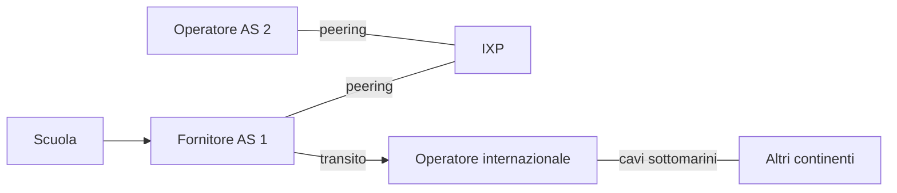

## Lezione 3.2: Instradamento dinamico e Internet

Modulo 3: Instradamento, servizi e progetto. Reti, Cloud e Gestione dei Dati

---

## Protocolli di instradamento

| | RIP | OSPF |
|---|---|---|
| Tipo | vettore di distanze | stato dei collegamenti |
| Metrica | salti (max 15) | costo |
| Aggiornamenti | ogni 30 s | a ogni cambiamento |
| Convergenza | lenta | rapida |

---

## Vettore di distanze e stato dei collegamenti

- Vettore: "raggiungo X con costo N", solo dai vicini
- Stato: mappa completa, algoritmo di Dijkstra
- Guasti: cicli temporanei nel vettore di distanze

---

## Sistemi autonomi e BGP

- IGP dentro l'AS, BGP tra AS: politiche e accordi
- IXP italiani: MIX (Milano), Namex (Roma)

---

## Laboratorio

1. Filius: Automatic Routing (RIP), percorso alternativo dopo un guasto
2. `python instradamento_dinamico.py`: convergenza e cicli temporanei; 14 test
3. `tracert` vicino e lontano; `python leggi_tracert.py`; 10 test
4. 1 ms di andata e ritorno: al massimo circa 100 km

---

## Aspetti orientativi

- Ingegneri di rete dei fornitori e dei grandi servizi
- IXP, data center, cavi sottomarini: infrastrutture strategiche
- Stessa distanza, tempi diversi: perché?
