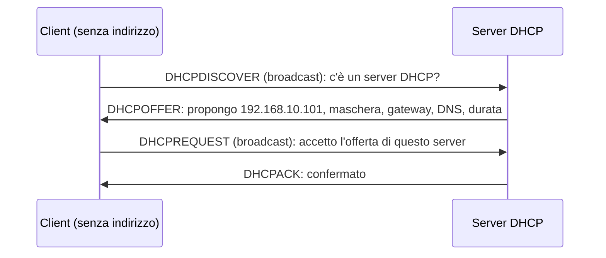
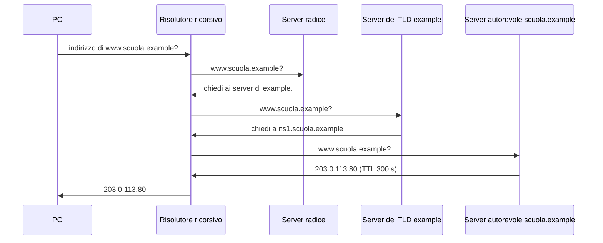
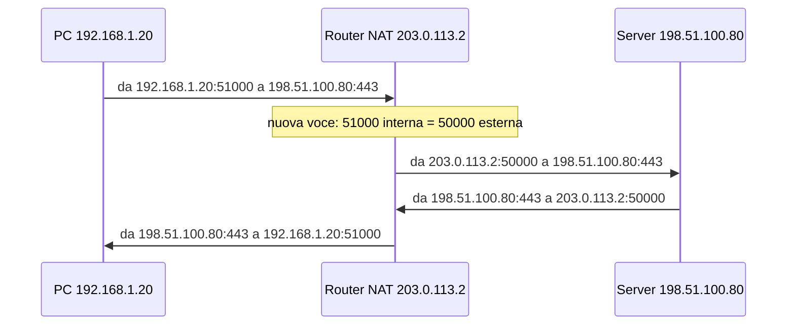

# Lezione 3.3: DHCP, DNS e NAT

> Contenuto originale. Riferimenti: RFC 2131, "Dynamic Host Configuration Protocol", https://www.rfc-editor.org/rfc/rfc2131 ; RFC 1034, "Domain Names - Concepts and Facilities", https://www.rfc-editor.org/rfc/rfc1034 ; RFC 3022, "Traditional IP Network Address Translator", https://www.rfc-editor.org/rfc/rfc3022 ; Wikipedia, "Domain Name System", https://it.wikipedia.org/wiki/Domain_Name_System . Gli script sono nella cartella `laboratorio`.

Obiettivo: descrivere tre servizi senza i quali una rete non è utilizzabile in pratica: l'assegnazione automatica degli indirizzi, la risoluzione dei nomi e la traduzione degli indirizzi privati in pubblici.

## 3.3.1 DHCP: configurazione automatica

Un PC appena collegato non ha un indirizzo IP. Il **DHCP** (Dynamic Host Configuration Protocol) glielo assegna, insieme alle altre impostazioni: maschera, gateway predefinito, server DNS. Lo scambio ha quattro messaggi (in sigla **DORA**):



- Il client usa il **broadcast** perché non conosce ancora né il proprio indirizzo né quello del server; il server ascolta sulla porta UDP 67, il client sulla 68.
- L'indirizzo è concesso in **locazione** (lease) per un tempo limitato; il client chiede il rinnovo a metà della durata. Così gli indirizzi dei dispositivi che lasciano la rete tornano disponibili.
- Il server assegna indirizzi da un **intervallo** (pool) configurato; può riservare sempre lo stesso indirizzo a un certo MAC (**prenotazione**), utile per stampanti e apparati.
- Poiché il broadcast non attraversa i router, in una rete con più sottoreti si usa un solo server centrale e, sui router, un **relay DHCP** che inoltra le richieste.
- Se nessun server risponde, Windows si assegna un indirizzo `169.254.x.x` (lezione 1.3, scheda A).
- Un server DHCP non autorizzato, collegato per errore o di proposito, può distribuire configurazioni sbagliate: gli switch gestiti possono accettare risposte DHCP solo dalle porte autorizzate (DHCP snooping).

## 3.3.2 DNS: dai nomi agli indirizzi

Il **DNS** (Domain Name System) traduce i nomi in indirizzi IP. Lo spazio dei nomi è un **albero**: si legge da destra a sinistra, dalla radice (il punto finale, di solito sottinteso) al dominio di primo livello (TLD: `it`, `com`, `org`), al dominio di secondo livello (`wikipedia`), ai nomi dei singoli servizi (`www`).

Nessun server conosce tutti i nomi: ogni parte dell'albero (**zona**) è gestita dai propri **server autorevoli**, e ogni livello **delega** il successivo.

- **Server radice**: 13 identità, da `a` a `m`, gestite da organizzazioni diverse e replicate in centinaia di server nel mondo (https://www.iana.org/domains/root/servers ); conoscono i server di ogni TLD.
- **Server dei TLD**: conoscono i server autorevoli di ogni dominio registrato sotto di loro (per `.it` il registro è gestito in Italia).
- **Server autorevoli** del dominio: contengono i record veri e propri.

Il PC non interroga direttamente questa gerarchia: invia la domanda a un **risolutore ricorsivo** (quello indicato dal DHCP, di solito del fornitore di accesso o della rete aziendale), che fa le domande **iterative** ai vari livelli e restituisce la risposta finale.

Diagramma: risoluzione di `www.scuola.example` (senza nulla in memoria).



Tipi di record principali:

| Tipo | Contenuto | Esempio |
|---|---|---|
| A | indirizzo IPv4 | `www.scuola.example` → `203.0.113.80` |
| AAAA | indirizzo IPv6 | `www.scuola.example` → `2001:db8:5c01::80` |
| CNAME | alias verso un altro nome | `portale.scuola.example` → `www.scuola.example` |
| MX | server di posta del dominio | `scuola.example` → `posta.scuola.example` |
| NS | server autorevoli della zona | `scuola.example` → `ns1.scuola.example` |
| TXT | testo libero, usato per verifiche e regole della posta | |

Ogni risposta ha un **TTL**: per quanti secondi il risolutore e il PC possono conservarla in memoria (**cache**) senza chiedere di nuovo. TTL lunghi riducono il traffico; TTL brevi fanno propagare più in fretta le modifiche. Il DNS usa di norma la porta UDP 53. I nomi `.example`, `.test` e `.invalid` sono riservati alla documentazione e alle prove (RFC 2606, https://www.rfc-editor.org/rfc/rfc2606 ).

## 3.3.3 NAT: indirizzi privati e indirizzo pubblico

Gli indirizzi privati (lezione 2.3) non sono instradati su Internet. Il router di confine esegue il **NAT** (Network Address Translation): sostituisce l'indirizzo privato di origine dei pacchetti in uscita con il proprio indirizzo pubblico. Nella forma più diffusa, **PAT** o **NAPT** (traduzione di indirizzi e porte), sostituisce anche la porta di origine, così molti dispositivi condividono un solo indirizzo pubblico. Una **tabella NAT** ricorda le corrispondenze per tradurre all'indietro le risposte.

| Interno (privato) | Esterno (pubblico) | Destinazione |
|---|---|---|
| 192.168.1.20:51000 | 203.0.113.2:50000 | 198.51.100.80:443 |
| 192.168.1.35:51000 | 203.0.113.2:50001 | 198.51.100.80:443 |

Diagramma: traduzione di una connessione in uscita e della risposta.



Conseguenze:

- i pacchetti in ingresso **non richiesti** non trovano una voce nella tabella e vengono scartati: i dispositivi interni non sono raggiungibili da Internet. Il NAT non è un firewall, ma ha un effetto simile per le connessioni in ingresso;
- per rendere raggiungibile un server interno si configura un **inoltro di porta** (port forwarding): per esempio la porta 8080 pubblica verso `192.168.1.10:80`;
- con il **CGNAT** del fornitore (indirizzi `100.64.0.0/10`, RFC 6598) la traduzione avviene due volte e l'inoltro delle porte non è possibile;
- con IPv6 (lezione 2.5) il NAT non serve: il controllo degli accessi resta al firewall.

## 3.3.4 Laboratorio

Tempo indicativo: 50 minuti. Cartella di lavoro `C:\corso-reti\lab33`, con i file della cartella `laboratorio`.

### Parte 1: DHCP, DNS e web in Filius

1. Costruire una rete `192.168.10.0/24`: uno **Switch**, un **Computer** `server` (`192.168.10.2`), un **Computer** `web` (`192.168.10.3`), tre **Notebook** client.
2. Nella configurazione di `server` aprire **DHCP server setup**: **Lower bound of address** `192.168.10.100`, **Upper bound of address** `192.168.10.150`, **Netmask** `255.255.255.0`, **Gateway** `192.168.10.1`, **DNS server** `192.168.10.2`; attivare **Activate DHCP**.
3. Nei tre notebook attivare **Use DHCP for configuration**.
4. In simulazione, su un notebook, eseguire `ipconfig` nella **Command Line**: quale indirizzo ha ricevuto? Nello scambio di dati del notebook individuare i quattro messaggi DHCP e i loro indirizzi di origine e destinazione (`0.0.0.0`, `255.255.255.255`).
5. Su `web` installare e avviare **Webserver**. Su `server` installare **DNS server**, aggiungere un record **Address (A)** con **Host/domain name** `www.scuola.example` e **IP address** `192.168.10.3`, poi **Start**.
6. Su un notebook: `host www.scuola.example` nella Command Line, poi un **Webbrowser** con l'indirizzo `http://www.scuola.example`. Nello scambio di dati: prima la domanda DNS (UDP, porta 53), poi la connessione TCP alla porta 80.
7. Facoltativo: nella scheda **Static Address Assignment** del DHCP prenotare per il MAC di un notebook l'indirizzo `192.168.10.50` e verificare.

### Parte 2: NAT in Filius

1. Aggiungere un **Home Router** (router domestico con NAT): collegare la porta LAN allo switch della rete `192.168.10.0/24` (indirizzo LAN `192.168.10.1`, il gateway già distribuito dal DHCP) e la porta WAN a un secondo switch che rappresenta "Internet" (indirizzo WAN `203.0.113.2/24`).
2. Collegare al secondo switch un **Computer** `sito-esterno`, `203.0.113.80/24`, gateway `203.0.113.2`, con **Webserver** avviato. Aggiungere al DNS il record `www.esterno.example` → `203.0.113.80`.
3. Da un notebook aprire `http://www.esterno.example`. Nello scambio di dati di `sito-esterno` qual è l'indirizzo di origine delle richieste? Confrontarlo con lo scambio di dati del notebook.
4. Da `sito-esterno` eseguire `ping 192.168.10.3`: perché non funziona?
5. Salvare il progetto come `lab33_servizi.fls`.

### Parte 3: i servizi reali del proprio PC

```powershell
ipconfig /all                        # Server DHCP, Lease ottenuto, Scadenza lease, Server DNS
ipconfig /displaydns                 # nomi in cache, con il TTL residuo in secondi
nslookup -type=NS wikipedia.org      # server autorevoli del dominio
nslookup -type=MX wikipedia.org      # server di posta
curl.exe https://api.ipify.org       # indirizzo pubblico con cui il PC esce su Internet
```

Domande: quanto dura la locazione DHCP? L'indirizzo restituito da `api.ipify.org` (servizio gratuito, senza registrazione: https://www.ipify.org/ ) coincide con quello di `ipconfig`? Che cosa dimostra? Eseguendo `ipconfig /displaydns` due volte a distanza di un minuto, come cambia il TTL?

### Parte 4: simulazioni in Python

```powershell
python risolutore_dns.py                        # www.scuola.example a 0, 60 e 400 secondi
python risolutore_dns.py portale.scuola.example  # alias CNAME
python nat_simulato.py
```

```text
t=  0 s  www.scuola.example -> ['203.0.113.80']
         domanda a radice: www.scuola.example. A
         domanda a tld-example: www.scuola.example. A
         domanda a ns1.scuola.example: www.scuola.example. A
t= 60 s  www.scuola.example -> ['203.0.113.80']
         risposta dalla cache, nessuna domanda ai server
t=400 s  www.scuola.example -> ['203.0.113.80']
         domanda a ns1.scuola.example: www.scuola.example. A
```

- `ZONE` è un dizionario che descrive i record di ogni server simulato; `interroga` restituisce la risposta oppure la **delega** al server responsabile di una parte più specifica del nome
- `Risolutore` conserva nella cache ogni risposta con l'istante di scadenza calcolato dal TTL; dopo 400 secondi il record A (TTL 300) è scaduto, ma la delega a `ns1.scuola.example` (TTL 86 400) è ancora valida: per questo basta una sola domanda
- in `nat_simulato.py` la tabella NAT è un dizionario con chiave (protocollo, indirizzo privato, porta privata) e valore (porta pubblica, ultimo uso); `ingresso` restituisce `None`, cioè scarta il pacchetto, se non trova una corrispondenza né una regola di inoltro

```text
uscita:   TCP 192.168.1.20:51000 -> 198.51.100.80:443  diventa  TCP 203.0.113.2:50000 -> 198.51.100.80:443
uscita:   TCP 192.168.1.35:51000 -> 198.51.100.80:443  diventa  TCP 203.0.113.2:50001 -> 198.51.100.80:443
...
ingresso non richiesto sulla porta 3389: None
con inoltro della porta 8080 verso il server interno: TCP 198.51.100.9:40000 -> 192.168.1.10:80
```

Test: `python test_risolutore_dns.py` (12 test), `python test_nat_simulato.py` (11 test).

### Attività

1. Aggiungere a `ZONE` un record `AAAA` per `posta.scuola.example` e un test.
2. In `nat_simulato.py`, perché due PC con la stessa porta di origine non creano confusione? Che cosa succederebbe se il router esaurisse le porte pubbliche disponibili?
3. Una scuola cambia l'indirizzo del proprio sito: perché alcuni utenti continuano per un po' a raggiungere il vecchio server? Come si può ridurre questo tempo prima del cambio?

## 3.3.5 Aspetti orientativi (discussione)

- DHCP e DNS sono servizi che i sistemisti configurano in ogni rete aziendale; un guasto del DNS rende "irraggiungibile" tutta Internet anche se la rete funziona.
- Il DNS è anche uno strumento di sicurezza e di controllo: filtri dei contenuti, blocchi disposti dalle autorità, protezione dai siti malevoli si basano spesso sulla risoluzione dei nomi.
- Domanda: quali servizi e applicazioni hanno difficoltà a funzionare dietro un NAT, e perché?
