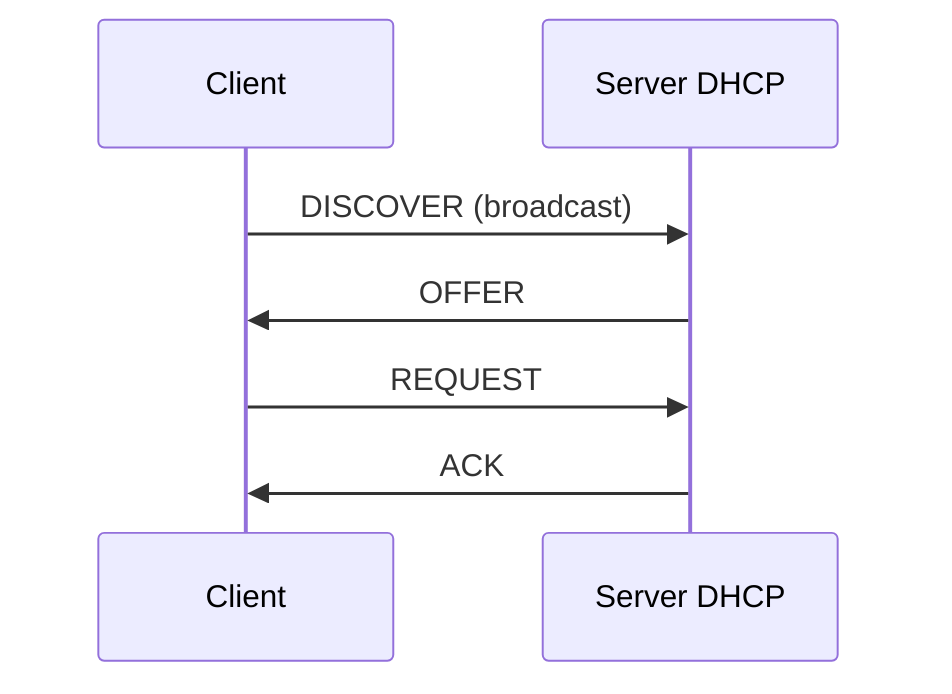

## Lezione 3.3: DHCP, DNS e NAT

Modulo 3: Instradamento, servizi e progetto. Reti, Cloud e Gestione dei Dati

---

## DHCP

- Locazione, intervallo, prenotazioni, relay tra sottoreti

---

## DNS

- Albero: radice, TLD, domini, nomi
- Risolutore ricorsivo, domande iterative, deleghe
- Record A, AAAA, CNAME, MX, NS, TXT
- TTL e cache; UDP 53; `.example`, `.test`, `.invalid`

---

## NAT

| Interno | Esterno |
|---|---|
| 192.168.1.20:51000 | 203.0.113.2:50000 |
| 192.168.1.35:51000 | 203.0.113.2:50001 |

- Ingressi non richiesti scartati; inoltro delle porte
- CGNAT (100.64.0.0/10); IPv6 senza NAT

---

## Laboratorio

1. Filius: DHCP, DNS, web; Home Router con NAT
2. PC: `ipconfig /all`, `/displaydns`, `nslookup`, `api.ipify.org`
3. `python risolutore_dns.py`: gerarchia, cache, TTL; 12 test
4. `python nat_simulato.py`: tabella NAT, inoltro; 11 test

---

## Aspetti orientativi

- DHCP e DNS: servizi di base di ogni rete aziendale
- DNS come strumento di sicurezza e di controllo
- Che cosa non funziona bene dietro un NAT?
