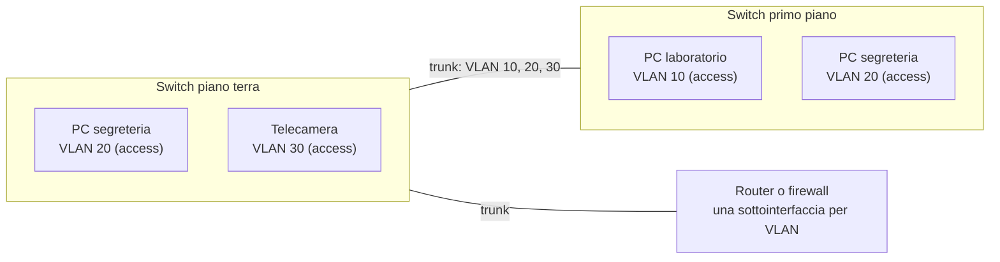
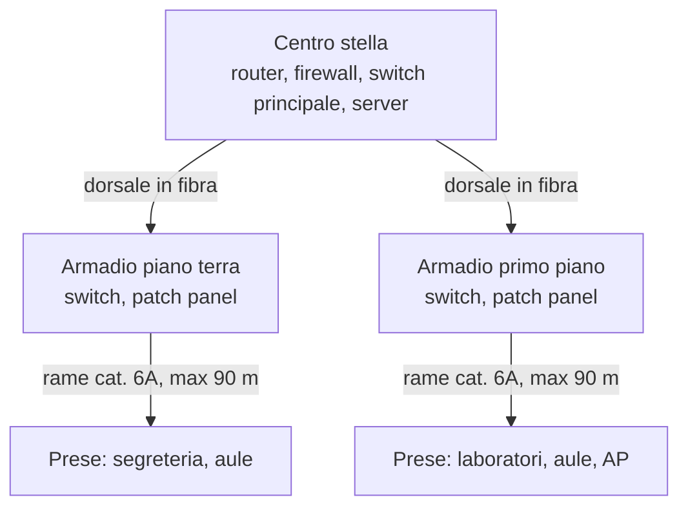

# Lezione 3.4: VLAN, Wi-Fi e cablaggio

> Contenuto originale. Riferimenti: Wikipedia, "IEEE 802.1Q", https://it.wikipedia.org/wiki/IEEE_802.1Q ; "IEEE 802.11", https://it.wikipedia.org/wiki/IEEE_802.11 ; "Wi-Fi Protected Access", https://it.wikipedia.org/wiki/Wi-Fi_Protected_Access ; "Power over Ethernet", https://it.wikipedia.org/wiki/Power_over_Ethernet ; "Cablaggio strutturato", https://it.wikipedia.org/wiki/Cablaggio_strutturato . Gli script sono nella cartella `laboratorio`.

Obiettivo: segmentare una rete con le VLAN, conoscere le caratteristiche principali delle reti Wi-Fi e della loro sicurezza, e dimensionare il cablaggio di un piano di un edificio.

## 3.4.1 VLAN

Una **VLAN** (Virtual LAN) è una rete locale logica: su uno stesso switch fisico si creano più reti separate, ciascuna con il proprio dominio di broadcast, come se ci fossero switch distinti. Ogni VLAN corrisponde di solito a una sottorete IP del piano di indirizzamento (lezione 2.4).

Perché si usano:

- separare gruppi di dispositivi (studenti, segreteria, telecamere, ospiti) senza moltiplicare gli switch
- limitare il broadcast
- controllare il traffico tra gruppi: tra una VLAN e l'altra si passa solo attraverso un router o un firewall, dove si applicano le regole

Tipi di porte di uno switch gestito:

- **porta access**
  appartiene a una sola VLAN; il dispositivo collegato (un PC, una stampante) non sa nulla delle VLAN.
- **porta trunk**
  trasporta più VLAN, per esempio tra due switch o verso il router; ogni trama porta un'**etichetta** che indica la sua VLAN.

L'etichetta è definita dallo standard **IEEE 802.1Q**: 4 byte inseriti nella trama Ethernet dopo gli indirizzi MAC.

| Campo | Bit | Significato |
|---|---|---|
| TPID | 16 | valore fisso `0x8100`: segue un'etichetta VLAN |
| PCP | 3 | priorità, da 0 a 7 (per esempio più alta per la voce) |
| DEI | 1 | trama scartabile per prima in caso di congestione |
| VID | 12 | numero della VLAN, da 1 a 4094 |

Diagramma: due switch con tre VLAN, collegati da un trunk, e un router che collega le VLAN tra loro.



Il router collegato con un trunk ha una **sottointerfaccia** per ogni VLAN, con l'indirizzo del gateway di quella sottorete. In alternativa si usa uno **switch di livello 3**, che svolge anche la funzione di router tra le VLAN.

Filius non gestisce le VLAN: in un progetto in Filius ogni VLAN si rappresenta con uno switch separato collegato a un'interfaccia del router.

## 3.4.2 Reti Wi-Fi

Le reti senza fili seguono gli standard **IEEE 802.11**; la Wi-Fi Alliance le identifica con un numero di generazione.

| Generazione | Standard | Bande | Note |
|---|---|---|---|
| Wi-Fi 4 | 802.11n | 2,4 e 5 GHz | ancora diffuso nei dispositivi meno recenti |
| Wi-Fi 5 | 802.11ac | 5 GHz | |
| Wi-Fi 6 e 6E | 802.11ax | 2,4 e 5 GHz; 6 GHz per la 6E | più efficiente con molti dispositivi contemporanei |
| Wi-Fi 7 | 802.11be | 2,4, 5 e 6 GHz | canali più larghi, uso contemporaneo di più bande |

- La banda a **2,4 GHz** arriva più lontano e attraversa meglio i muri, ma ha pochi canali: solo tre non si sovrappongono (1, 6, 11). Le bande a **5 e 6 GHz** hanno più canali e più velocità, con una portata minore.
- Tutti i dispositivi collegati allo stesso **access point** (AP) su un canale condividono la stessa banda: la velocità indicata dallo standard è un massimo teorico, suddiviso tra gli utenti. Per questo in una scuola si installa di norma un AP per aula e AP vicini usano canali diversi.
- Il nome della rete è l'**SSID**. Uno stesso AP può offrire più SSID, ciascuno associato a una VLAN (per esempio studenti, docenti, ospiti). Nelle reti con molti AP un **controller** ne gestisce la configurazione in modo centralizzato.

Sicurezza delle reti Wi-Fi:

| Modalità | Autenticazione | Uso |
|---|---|---|
| WPA2 o WPA3 Personal | una password condivisa da tutti | casa, piccoli uffici |
| WPA2 o WPA3 Enterprise | credenziali personali di ogni utente, verificate da un server (802.1X con RADIUS) | scuole, aziende, università |
| Rete ospiti | spesso con pagina di accesso (captive portal) | visitatori, isolati dalla rete interna |

WPA3 protegge meglio dai tentativi di indovinare la password registrando lo scambio iniziale. Le modalità più vecchie (WEP, WPA con TKIP) non sono più sicure e vanno disattivate. Con una password condivisa, chi la conosce può accedere alla rete anche dopo aver lasciato l'organizzazione: per questo le reti di scuole e aziende usano credenziali personali.

## 3.4.3 Cablaggio strutturato

Il **cablaggio strutturato** organizza i cavi di un edificio in modo ordinato e standard (norme della serie EN 50173 in Europa, TIA-568 negli Stati Uniti), indipendente dagli apparati che vi saranno collegati.

- **Centro stella di edificio**: l'armadio principale (rack), di solito nella sala server, con il router o firewall e lo switch principale.
- **Dorsali**: collegamenti in fibra ottica (o rame, se brevi) tra il centro stella e gli armadi di piano.
- **Armadi di piano**: switch e **pannelli di permutazione** (patch panel), su cui terminano i cavi che raggiungono le prese.
- **Cablaggio orizzontale**: dal pannello di permutazione alla presa a muro, cavo in rame di categoria 6 o 6A; tratta fissa al massimo **90 m**, più 10 m complessivi di cavi di collegamento (patch), per rispettare i 100 m di Ethernet.
- **Etichettatura e documentazione**: ogni presa ha un codice (per esempio `P1-A12-03`: piano 1, aula 12, presa 3) riportato sul pannello e nel documento del progetto.

Diagramma: struttura del cablaggio di un edificio di due piani.



**PoE** (Power over Ethernet): lo switch alimenta i dispositivi attraverso lo stesso cavo di rete, senza prese elettriche vicino ad access point, telecamere e telefoni.

| Standard | Potenza erogata dallo switch per porta | Potenza disponibile al dispositivo | Dispositivi tipici |
|---|---|---|---|
| 802.3af (PoE) | 15,4 W | 12,95 W | telefoni, telecamere |
| 802.3at (PoE+) | 30 W | 25,5 W | access point |
| 802.3bt (PoE++) | 60 o 90 W | fino a 71 W | access point di fascia alta, schermi |

Ogni switch PoE ha un **budget** totale di potenza, indicato nella scheda tecnica, da confrontare con la somma dei consumi. Gli apparati degli armadi vanno protetti con un **gruppo di continuità** (UPS).

## 3.4.4 Laboratorio

Tempo indicativo: 45 minuti. Cartella di lavoro `C:\corso-reti\lab34`, con i file della cartella `laboratorio`.

### Parte 1: progetto di un piano

Il primo piano di una scuola ha quattro aule, un laboratorio di informatica, la segreteria, la sala docenti e due corridoi. Il file `stanze_piano.csv` indica per ogni stanza postazioni cablate, dispositivi Wi-Fi contemporanei previsti, telecamere, stampanti e distanza del percorso dei cavi dall'armadio di piano.

| Stanza | Postazioni | Utenti Wi-Fi | Telecamere | Stampanti | Distanza (m) |
|---|---|---|---|---|---|
| aula_1 ... aula_4 | 2 | 28 | 0 | 0 | 25-48 |
| laboratorio_info | 25 | 5 | 0 | 1 | 20 |
| segreteria | 6 | 6 | 0 | 2 | 15 |
| sala_docenti | 4 | 30 | 0 | 1 | 55 |
| corridoio_est | 0 | 20 | 2 | 0 | 70 |
| corridoio_ovest | 0 | 20 | 2 | 0 | 95 |

A gruppi, con le regole di progetto indicate all'inizio dello script (30 utenti per access point, access point e telecamere alimentati in PoE, 20% di porte di riserva, switch da 48 porte di cui 2 per il collegamento verso il centro stella):

1. calcolare per ogni stanza access point e prese;
2. assegnare ogni presa a una VLAN: 10 didattica, 20 uffici, 30 telecamere, 40 gestione degli access point, 50 stampanti;
3. calcolare porte e switch necessari e la potenza PoE;
4. individuare le tratte di cavo non conformi e proporre una soluzione;
5. scegliere la modalità di sicurezza per gli SSID `studenti`, `docenti` e `ospiti`, e la VLAN di ciascuno.

### Parte 2: verifica con lo script

```powershell
python progetto_piano.py stanze_piano.csv
```

```text
Stanza              AP  Prese
aula_1               1      3
...
laboratorio_info     1     27
...
Prese per VLAN:
  VLAN 10  didattica        33
  VLAN 20  uffici           10
  VLAN 30  telecamere        4
  VLAN 40  wifi_gestione     9
  VLAN 50  stampanti         4

Porte necessarie: 60; con il 20% di riserva: 72
Switch da 48 porte (2 di uplink): 2
Access point: 9; potenza PoE stimata: 281.3 W
AVVISO: corridoio_ovest: 95 m dall'armadio, oltre 90 m: serve un armadio di piano più vicino o una tratta in fibra
```

- `math.ceil` arrotonda per eccesso: 31 utenti richiedono 2 access point, non 1,03
- le costanti all'inizio del file (`UTENTI_PER_AP`, `MARGINE`, `BUDGET_POE_SWITCH_W`...) sono le regole di progetto: modificarle permette di confrontare scelte diverse
- il budget PoE di 370 W per switch è un valore tipico; nel progetto reale si usa quello della scheda tecnica dello switch scelto

Test: `python test_progetto_piano.py` (10 test).

### Parte 3: l'etichetta 802.1Q in Python

```powershell
python vlan_8021q.py
```

```text
senza etichetta: 3c 52 82 4e 10 20 00 1b 21 3a 5c 01 08 00 70 61
con etichetta:   3c 52 82 4e 10 20 00 1b 21 3a 5c 01 81 00 a0 14 08 00
VLAN e priorità lette: (20, 5)
lunghezze: 32 e 36 byte
```

```python
tci = (priorita << 13) | vid       # PCP nei 3 bit alti, DEI = 0, VID nei 12 bit bassi
etichetta = struct.pack("!HH", TPID, tci)
return trama[:12] + etichetta + trama[12:]
```

- `priorita << 13` sposta la priorità nei tre bit più alti dei 16 bit del campo TCI; `| vid` inserisce il numero di VLAN nei 12 bit più bassi: priorità 5 e VLAN 20 danno `0xa014`
- `trama[:12]` sono i due indirizzi MAC (6 + 6 byte): l'etichetta si inserisce subito dopo
- `togli_etichetta` fa l'operazione inversa, come lo switch quando invia la trama su una porta access

Test: `python test_vlan_8021q.py` (9 test).

### Parte 4: schema del piano

Con l'estensione Draw.io Integration di VS Code (lezione 2.4) disegnare lo schema logico del piano: armadio, switch, collegamenti trunk verso il centro stella, access point, VLAN di ogni gruppo di prese. Salvare come `piano_primo.drawio`.

### Attività

1. Nella sala docenti gli utenti Wi-Fi salgono a 60: come cambia il progetto?
2. Il corridoio ovest è a 95 m: confrontare le due soluzioni (armadio aggiuntivo o dorsale in fibra con un piccolo switch) in termini di costi e manutenzione.
3. Perché conviene separare in VLAN diverse le telecamere e gli access point?

## 3.4.5 Aspetti orientativi (discussione)

- Progettare il cablaggio e la copertura Wi-Fi di un edificio è un lavoro specialistico: sopralluoghi, misure del segnale, preventivi, collaudo e certificazione delle tratte.
- Le VLAN e le reti Wi-Fi con credenziali personali sono la base della sicurezza delle reti aziendali (Corso 2, modulo 4).
- Domanda: perché in una scuola una sola rete Wi-Fi con una password condivisa da tutti è una scelta rischiosa?
