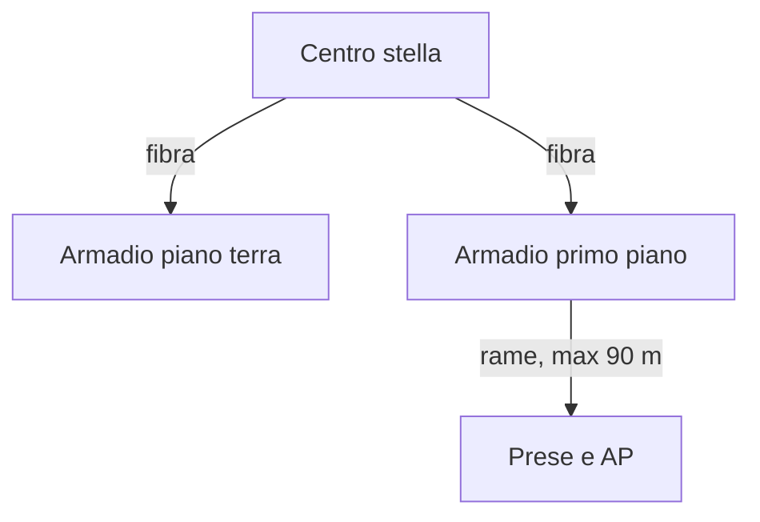

## Lezione 3.4: VLAN, Wi-Fi e cablaggio

Modulo 3: Instradamento, servizi e progetto. Reti, Cloud e Gestione dei Dati

---

## VLAN

- Reti logiche separate sullo stesso switch
- Porte access (una VLAN) e trunk (più VLAN)
- IEEE 802.1Q: TPID 0x8100, PCP, DEI, VID 12 bit
- Tra VLAN: router o switch di livello 3

---

## Wi-Fi

| Generazione | Standard | Bande |
|---|---|---|
| Wi-Fi 5 | 802.11ac | 5 GHz |
| Wi-Fi 6/6E | 802.11ax | 2,4, 5 (6) GHz |
| Wi-Fi 7 | 802.11be | 2,4, 5, 6 GHz |

- Banda condivisa per AP; canali 1, 6, 11 a 2,4 GHz
- WPA2/WPA3 Personal ed Enterprise (802.1X); rete ospiti

---

## Cablaggio strutturato

- PoE 15,4 W, PoE+ 30 W, PoE++ 60-90 W; budget dello switch; UPS

---

## Laboratorio

1. Progetto di un piano: prese, AP, VLAN, switch, PoE, distanze
2. `python progetto_piano.py stanze_piano.csv`; 10 test
3. `python vlan_8021q.py`: etichetta 802.1Q; 9 test
4. Schema del piano con Draw.io

---

## Aspetti orientativi

- Cablaggio e copertura Wi-Fi: lavoro specialistico
- VLAN e credenziali personali: base della sicurezza di rete
- Una sola password Wi-Fi per tutta la scuola?
