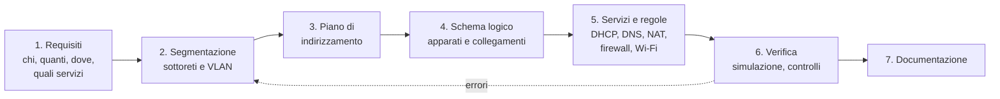

# Lezione 3.5: Progetto di una rete aziendale

> Contenuto originale. L'azienda del progetto è inventata; i nomi usano il dominio riservato `.example`. Gli strumenti sono quelli delle lezioni 2.4 (`piano_vlsm.py`), 3.1-3.4 e l'estensione Draw.io Integration di VS Code. I file sono nella cartella `laboratorio`; la traccia di soluzione per il docente nel file `laboratorio/soluzioni_docente.md`.

Obiettivo: applicare i contenuti dei moduli 1-3 a un progetto completo, dai requisiti del cliente alla documentazione, lavorando in gruppo come in un'attività professionale.

## 3.5.1 Dai requisiti al progetto

Un progetto di rete segue alcune fasi, in cui le scelte di ogni fase dipendono da quelle precedenti:



- **Requisiti**: si raccolgono con il cliente e si scrivono in forma verificabile ("60 dispositivi in produzione, crescita prevista del 20%"), dichiarando le ipotesi fatte quando un dato manca.
- **Segmentazione**: si raggruppano i dispositivi per funzione e livello di fiducia; ogni gruppo diventa una VLAN e una sottorete.
- **Piano di indirizzamento**: si calcola con il metodo VLSM (lezione 2.4), lasciando blocchi liberi per il futuro.
- **Schema logico**: mostra apparati, collegamenti, VLAN e punti di controllo; è diverso dalla planimetria, che mostra dove si trovano fisicamente cavi e armadi.
- **Servizi e regole**: dove si trovano DHCP e DNS, come si accede a Internet, quali sottoreti possono comunicare tra loro.
- **Verifica**: controlli automatici del piano e prova di un modello ridotto nel simulatore.
- **Documentazione**: permette a chi installerà e gestirà la rete di capire le scelte fatte.

## 3.5.2 La richiesta del cliente

**Meccanica Esempio S.r.l.** produce componenti meccanici. Ha una palazzina uffici di due piani e un capannone di produzione collegato da un cortile di 120 m. Il fornitore di accesso ha installato la connessione nella sala server della palazzina. Il responsabile chiede una rete nuova con questi requisiti:

- **amministrazione** (piano terra della palazzina): 40 dispositivi tra PC, stampanti e telefoni;
- **progettazione** (primo piano): 25 postazioni CAD, che scambiano file di grandi dimensioni con il server;
- **produzione** (capannone): 60 dispositivi tra terminali di reparto e macchine a controllo numerico collegate in rete;
- **Wi-Fi per i dipendenti** in tutti gli edifici: fino a 150 dispositivi contemporanei;
- **Wi-Fi per gli ospiti**, solo accesso a Internet: fino a 100 dispositivi;
- **telecamere** di sorveglianza: 16, con registrazione su un server interno e nessun accesso a Internet;
- **server** (sala server): file server, intranet, DNS e DHCP, registrazione delle telecamere, 10 indirizzi;
- **gestione** degli apparati di rete (switch, access point, firewall): 20 indirizzi, accessibili solo dai tecnici;
- un collegamento tra lo switch principale e il firewall verso Internet.

Il fornitore di servizi IT dell'azienda ha riservato alla rete il blocco privato `10.50.0.0/22`. È richiesto un margine di crescita del 20% su ogni sottorete. Il dominio interno è `meccanica.example`.

## 3.5.3 Laboratorio: il progetto

Tempo indicativo: 60 minuti in classe, più il completamento della documentazione. Gruppi di 3-4 persone. Cartella di lavoro `C:\corso-reti\lab35`, con i file della cartella `laboratorio` e `piano_vlsm.py` della lezione 2.4.

Ruoli suggeriti, da ruotare nelle diverse fasi: responsabile del piano di indirizzamento, responsabile dello schema, responsabile della simulazione, responsabile della documentazione.

### Fase 1: requisiti e piano (20 minuti)

1. Completare le sezioni 2 e 3 di `modello_documento_progetto.md` (aprirlo in VS Code e salvarlo come `progetto_gruppo.md`).
2. Applicare il margine del 20% ai numeri di `requisiti_azienda.csv`, salvare il risultato come `requisiti_con_margine.csv` e calcolare il piano:

```powershell
python ..\lab24\piano_vlsm.py 10.50.0.0/22 requisiti_con_margine.csv
```

3. Assegnare a ogni sottorete una VLAN, gli indirizzi statici (server, stampanti, apparati) e l'intervallo DHCP, e scrivere il piano nel file `piano_gruppo.csv` con le colonne del file di esempio `piano_esempio.csv` (il piano della scuola della lezione 2.4):

```text
nome,vlan,rete,gateway,dhcp_inizio,dhcp_fine,statici,host_richiesti
docenti,20,10.20.2.0/26,10.20.2.1,10.20.2.10,10.20.2.62,10.20.2.2,50
telecamere,30,10.20.2.128/27,10.20.2.129,,,10.20.2.130;10.20.2.131;10.20.2.132;10.20.2.133,4
```

4. Verificare il piano:

```powershell
python verifica_progetto.py piano_gruppo.csv 10.50.0.0/22
```

Lo script controlla: reti scritte correttamente e contenute nel blocco, nessuna sovrapposizione, VLAN valide e diverse, gateway e indirizzi statici tra gli host della rete, intervallo DHCP interno alla rete e senza indirizzi fissi, indirizzi sufficienti per i dispositivi previsti. Per vedere come segnala gli errori: `python verifica_progetto.py piano_con_errori.csv 10.30.0.0/22`.

### Fase 2: schema e servizi (20 minuti)

1. Con Draw.io Integration disegnare `rete_meccanica.drawio`: firewall e collegamento a Internet, switch principale nella sala server, switch di piano e di capannone, dorsale verso il capannone, access point, server; per ogni collegamento indicare se è access (con la VLAN) o trunk.
2. Completare le sezioni 5 e 6 del documento: dove si trovano DHCP e DNS, quali SSID e con quale sicurezza (lezione 3.4), quali sottoreti possono comunicare tra loro.
3. Scelta da motivare nel documento: il capannone è a 120 m. Che tipo di collegamento serve (lezioni 2.1 e 3.4)?

### Fase 3: verifica in Filius (20 minuti)

Filius non gestisce VLAN e relay DHCP: si costruisce un **modello ridotto** in cui ogni VLAN è uno switch separato collegato a un'interfaccia del router (al massimo 8 interfacce).

1. Un **Router** con quattro interfacce: amministrazione, produzione, server, collegamento verso un **Home Router** che rappresenta il firewall con NAT verso "Internet" (come nella lezione 3.3).
2. Almeno due client per sottorete, con gli indirizzi del piano; nella sottorete server un **DNS server** con i record della zona `meccanica.example` e un **Webserver** per l'intranet.
3. Prove da documentare nella sezione 8: `ping` tra sottoreti, `traceroute` verso un server esterno, apertura di `http://intranet.meccanica.example` da un client, `host` per i nomi interni.
4. Salvare come `lab35_progetto.fls`.

### Consegna

Una cartella con `progetto_gruppo.md`, `piano_gruppo.csv`, `rete_meccanica.drawio`, `lab35_progetto.fls`. Ogni gruppo presenta il progetto in 5 minuti: scelte principali, un problema incontrato e come è stato risolto.

Test dello script di verifica: `python test_verifica_progetto.py` (15 test).

## 3.5.4 Griglia di valutazione

| Criterio | Peso | Livello pieno |
|---|---|---|
| Requisiti | 10% | tutti riportati, ipotesi dichiarate |
| Piano di indirizzamento | 25% | corretto, con margine, verificato senza errori da `verifica_progetto.py`, blocchi liberi indicati |
| Segmentazione e regole | 20% | VLAN coerenti; ospiti e telecamere isolati; accesso alla gestione limitato; scelte motivate |
| Schema logico | 15% | corrispondente al piano, leggibile, collegamenti access e trunk indicati |
| Servizi | 10% | DHCP, DNS, NAT e Wi-Fi descritti in modo completo e coerente |
| Verifica in Filius | 10% | modello funzionante, prove documentate con l'esito |
| Documentazione e presentazione | 10% | chiara, completa, adatta a un tecnico che deve installare la rete |

## 3.5.5 Aspetti orientativi (discussione)

- Il lavoro svolto riproduce, in piccolo, quello di un progettista di reti o di un tecnico presso un system integrator: raccogliere requisiti, fare scelte motivate, documentarle per altri.
- La documentazione è parte del prodotto: una rete senza schema e piano aggiornati è difficile da gestire e da rendere sicura.
- Il lavoro in gruppo con ruoli e scadenze è la norma nei progetti informatici.
- Domanda: quali requisiti andrebbero chiesti al cliente prima di iniziare, che la richiesta non contiene?
