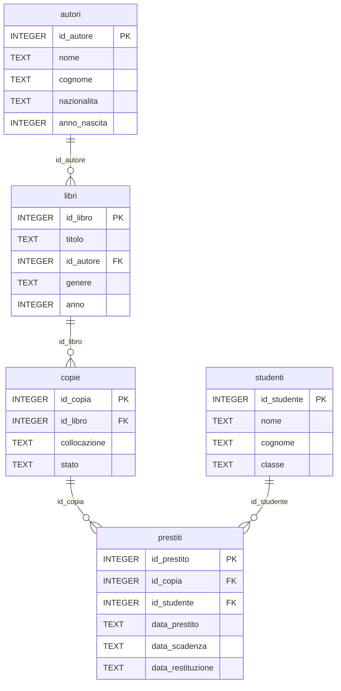

# Lezione 4.1: Dati e modello relazionale

> Fonte delle sezioni 4.1.2 e 4.1.3: adattamento e traduzione da Microsoft, "Data Science for Beginners", lezione "Working with Data: Relational Databases", licenza MIT, https://github.com/microsoft/Data-Science-For-Beginners/blob/main/2-Working-With-Data/05-relational-databases/README.md (esempio delle città e delle precipitazioni, con i valori originali). Il resto della lezione è contenuto originale. Riferimenti: Wikipedia, "Modello relazionale", https://it.wikipedia.org/wiki/Modello_relazionale ; documentazione di SQLite, "Datatypes In SQLite", https://www.sqlite.org/datatype3.html . Gli script sono nella cartella `laboratorio`.

Obiettivo: spiegare come un database relazionale organizza i dati in tabelle collegate da chiavi, ed esplorare un database reale con Visual Studio Code.

## 4.1.1 Dati, database e DBMS

Quasi ogni servizio informatico conserva dati: il registro elettronico, un negozio online, la biblioteca della scuola. Un **database** (base di dati) è un insieme organizzato di dati, conservato in modo permanente e condiviso tra più programmi e utenti. Il software che lo gestisce è il **DBMS** (Database Management System).

Che cosa offre un DBMS rispetto a semplici file o fogli di calcolo:

- **integrità**: regole (vincoli) che impediscono di registrare dati incoerenti, per esempio un prestito di un libro inesistente
- **accesso contemporaneo** di molti utenti senza che le modifiche di uno cancellino quelle di un altro
- **transazioni**: gruppi di modifiche eseguite tutte o nessuna (lezione 4.5)
- **interrogazioni** efficienti anche su milioni di righe, con un linguaggio standard, **SQL**
- **sicurezza**: utenti, permessi, copie di backup

I DBMS più diffusi seguono il **modello relazionale**, proposto da Edgar F. Codd nel 1970: PostgreSQL, MySQL e MariaDB, Microsoft SQL Server, Oracle, e **SQLite**, usato in questo modulo. SQLite non è un server: il database è un **singolo file**, letto e scritto direttamente dai programmi; è incluso in Python, nei browser, negli smartphone e in moltissime applicazioni.

## 4.1.2 Tabelle, righe e colonne

Il concetto centrale del modello relazionale è la **tabella** (in termini formali, relazione). Come in un foglio di calcolo:

- ogni **colonna** (attributo) ha un nome e descrive un tipo di informazione;
- ogni **riga** (record, tupla) contiene le informazioni su un singolo elemento.

Esempio: una tabella di città.

| city | country |
|---|---|
| Tokyo | Japan |
| Atlanta | United States |
| Auckland | New Zealand |

Si vogliono aggiungere le precipitazioni annuali (in millimetri) degli anni 2018-2020. Una prima idea è una riga per città e anno:

| city | country | year | amount |
|---|---|---|---|
| Tokyo | Japan | 2020 | 1690 |
| Tokyo | Japan | 2019 | 1874 |
| Tokyo | Japan | 2018 | 1445 |

Nome e paese della città sono **ripetuti** a ogni riga: spreco di spazio e rischio di incoerenze (basta un errore di battitura in una riga perché "Tokyo" diventi una città diversa). Una seconda idea è una colonna per anno:

| city | country | 2018 | 2019 | 2020 |
|---|---|---|---|---|
| Tokyo | Japan | 1445 | 1874 | 1690 |
| Atlanta | United States | 1779 | 1111 | 1683 |
| Auckland | New Zealand | 1386 | 942 | 1176 |

Le ripetizioni spariscono, ma a ogni nuovo anno bisogna cambiare la struttura della tabella, e i calcoli su più anni diventano scomodi. La soluzione del modello relazionale è **dividere i dati in più tabelle collegate**.

## 4.1.3 Chiavi primarie ed esterne

Per collegare le tabelle, ogni riga deve essere identificata in modo univoco. La **chiave primaria** (PK, primary key) è la colonna, o l'insieme di colonne, il cui valore è diverso per ogni riga e non può mancare. Di solito è un codice numerico senza significato, perché i valori "naturali" (un nome, un titolo) possono ripetersi o cambiare.

Tabella `cities`:

| city_id | city | country |
|---|---|---|
| 1 | Tokyo | Japan |
| 2 | Atlanta | United States |
| 3 | Auckland | New Zealand |

Tabella `rainfall`:

| rainfall_id | city_id | year | amount |
|---|---|---|---|
| 1 | 1 | 2018 | 1445 |
| 2 | 1 | 2019 | 1874 |
| 3 | 1 | 2020 | 1690 |
| 4 | 2 | 2018 | 1779 |
| 5 | 2 | 2019 | 1111 |
| 6 | 2 | 2020 | 1683 |
| 7 | 3 | 2018 | 1386 |
| 8 | 3 | 2019 | 942 |
| 9 | 3 | 2020 | 1176 |

La colonna `city_id` di `rainfall` contiene valori della chiave primaria di `cities`: è una **chiave esterna** (FK, foreign key), un riferimento a una riga di un'altra tabella. `city_id` 1 indica Tokyo. Con la chiave esterna il DBMS può garantire l'**integrità referenziale**: non si possono registrare precipitazioni di una città che non esiste, né cancellare una città a cui fanno riferimento altre righe.

Con SQL (lezioni 4.3 e 4.4) le tabelle si ricongiungono quando servono:

```sql
SELECT cities.city, rainfall.amount
FROM cities
    INNER JOIN rainfall ON cities.city_id = rainfall.city_id
WHERE rainfall.year = 2019;
```

Risultato: Tokyo 1874, Atlanta 1111, Auckland 942.

## 4.1.4 Tipi di dati e valori mancanti

Ogni colonna ha un **tipo**. In SQLite i tipi di memorizzazione sono cinque:

| Tipo | Contenuto | Esempio |
|---|---|---|
| `INTEGER` | numeri interi | anno 1947, codici |
| `REAL` | numeri con la virgola | prezzo 12.50 |
| `TEXT` | testo | titolo, nome |
| `BLOB` | dati binari, memorizzati così come sono | un'immagine |
| `NULL` | valore mancante | data di restituzione di un libro non ancora restituito |

- SQLite non ha un tipo apposito per le date: si usano stringhe `TEXT` nel formato `AAAA-MM-GG`, che si confrontano e ordinano correttamente come testo, e le funzioni di data (`julianday`, `date`).
- SQLite è flessibile: il tipo dichiarato è un'indicazione, non un obbligo rigido. Altri DBMS (PostgreSQL, SQL Server) sono più rigorosi e hanno molti più tipi (`DATE`, `DECIMAL`, `VARCHAR(n)`...).
- `NULL` non è zero né testo vuoto: significa "valore sconosciuto o non applicabile".

## 4.1.5 Il database della biblioteca

Il database del laboratorio descrive la biblioteca di una scuola. Titoli, autori e anni di prima pubblicazione sono reali; studenti, collocazioni e prestiti sono inventati.

Diagramma: tabelle e chiavi del database `biblioteca.db`.



- Un **libro** (un'opera, per esempio "1984") può avere più **copie** fisiche sugli scaffali; si presta una copia, non il libro.
- Un **prestito** collega una copia e uno studente, con le date; `data_restituzione` è `NULL` finché la copia non viene riportata.
- Le linee del diagramma si leggono così: un autore ha zero o più libri; ogni libro ha un solo autore (semplificazione, discussa nella lezione 4.2).

Il file `biblioteca.sql` contiene le istruzioni che creano le tabelle, con i **vincoli**, e quelle che inseriscono i dati:

```sql
CREATE TABLE copie (
    id_copia      INTEGER PRIMARY KEY,
    id_libro      INTEGER NOT NULL REFERENCES libri(id_libro),
    collocazione  TEXT NOT NULL UNIQUE,   -- scaffale e posizione, per esempio A1-2
    stato         TEXT NOT NULL CHECK (stato IN ('buono', 'usurato', 'smarrita'))
);
```

- `PRIMARY KEY`: chiave primaria; in SQLite una colonna `INTEGER PRIMARY KEY` riceve automaticamente il numero successivo se non viene indicata
- `REFERENCES libri(id_libro)`: chiave esterna verso la tabella `libri`
- `NOT NULL`: valore obbligatorio; `UNIQUE`: valore diverso per ogni riga; `CHECK`: condizione che ogni riga deve rispettare

In SQLite il controllo delle chiavi esterne è **disattivato per impostazione predefinita** e si attiva per ogni connessione con `PRAGMA foreign_keys = ON` (https://www.sqlite.org/foreignkeys.html ).

## 4.1.6 Laboratorio

Tempo indicativo: 40 minuti. Cartella di lavoro `C:\corso-reti\lab41`, con i file della cartella `laboratorio`.

### Parte 1: creazione del database

```powershell
python crea_database.py
```

```text
autori       15 righe
copie        46 righe
libri        29 righe
prestiti    200 righe
studenti     41 righe
Database creato: C:\corso-reti\lab41\biblioteca.db
```

- `sqlite3.connect("biblioteca.db")` apre il file del database e lo crea se non esiste
- `executescript` esegue in sequenza tutte le istruzioni SQL di `biblioteca.sql`
- `riepilogo` interroga la tabella di sistema `sqlite_master`, che elenca le tabelle, e conta le righe di ciascuna
- rieseguendo lo script il database viene ricreato con i dati originali: utile dopo le prove di modifica

Test: `python test_crea_database.py` (12 test: numero di righe, coerenza dei dati, funzionamento dei vincoli).

### Parte 2: esplorazione con Visual Studio Code

1. Installare l'estensione **SQLite** (https://marketplace.visualstudio.com/items?itemName=alexcvzz.vscode-sqlite ), che include il programma SQLite per Windows. L'estensione non è aggiornata dal 2022; se non funziona si usa l'alternativa portatile **DB Browser for SQLite**, archivio ZIP `win64` da https://github.com/sqlitebrowser/sqlitebrowser/releases .
2. Aprire la cartella `C:\corso-reti\lab41` in VS Code. Con la tavolozza dei comandi (`Ctrl+Shift+P`) eseguire **SQLite: Open Database** e scegliere `biblioteca.db`: nel pannello **Explorer** compare la sezione **SQLite Explorer** con le tabelle.
3. Espandere le tabelle per vedere le colonne; con il tasto destro su una tabella scegliere **Show Table** per vederne il contenuto.
4. Aprire `esplora.sql`, eseguire **SQLite: Use Database** e scegliere `biblioteca.db`. Selezionare un'interrogazione alla volta ed eseguire **SQLite: Run Selected Query**; `Ctrl+Shift+Q` (**SQLite: Run Query**) esegue invece tutto il file.
5. Seguire "a mano" il prestito numero 1: quale copia? Di quale libro? Chi lo ha preso in prestito (tabella `studenti`)? È stato restituito in tempo?

### Parte 3: domande sui dati

Rispondere guardando le tabelle, senza ancora scrivere interrogazioni:

1. Quante copie ha "I promessi sposi"? Dove si trovano?
2. Quale libro non ha nessuna copia disponibile, e perché?
3. Nella tabella `prestiti`, quali colonne sono chiavi esterne? Verso quali tabelle?
4. Perché la collocazione non è stata scelta come chiave primaria di `copie`, anche se è unica?
5. Che cosa succederebbe se si potesse cancellare uno studente che ha dei prestiti registrati?

## 4.1.7 Aspetti orientativi (discussione)

- I database sono presenti in quasi ogni sistema informatico: chi sviluppa software, chi amministra sistemi e chi analizza dati li usa ogni giorno. Le figure specializzate sono l'amministratore di database (DBA) e il progettista di database.
- SQL è uno dei linguaggi più richiesti negli annunci di lavoro informatici, anche per ruoli non di programmazione (analisti, uffici amministrativi, marketing).
- Domanda: quali dati conserva il registro elettronico della scuola? Come potrebbero essere divisi in tabelle?
