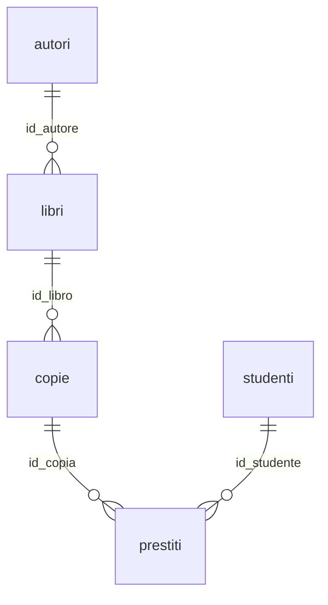

## Contenuti

- Database e DBMS
- Una tabella non basta
- Chiavi
- Tipi in SQLite
- Il database della biblioteca
- Laboratorio
- Aspetti orientativi

Fonte sezioni 4.1.2-4.1.3: Microsoft, "Data Science for Beginners", licenza MIT, https://github.com/microsoft/Data-Science-For-Beginners

## Database e DBMS

- Dati organizzati, permanenti, condivisi
- DBMS: integrità, accesso contemporaneo, transazioni, SQL, sicurezza
- Modello relazionale (Codd, 1970)
- SQLite: un database in un singolo file

## Una tabella non basta

| city | country | year | amount |
|---|---|---|---|
| Tokyo | Japan | 2020 | 1690 |
| Tokyo | Japan | 2019 | 1874 |

- Ripetizioni e rischio di incoerenze
- Soluzione: più tabelle collegate

## Chiavi

- Chiave primaria: identifica ogni riga
- Chiave esterna: riferimento alla chiave primaria di un'altra tabella
- `rainfall.city_id` → `cities.city_id`
- Integrità referenziale

## Tipi in SQLite

- INTEGER, REAL, TEXT, BLOB, NULL
- Date come testo `AAAA-MM-GG`
- NULL: valore mancante, non zero

## Il database della biblioteca

- Vincoli: PRIMARY KEY, REFERENCES, NOT NULL, UNIQUE, CHECK
- `PRAGMA foreign_keys = ON`

## Laboratorio

1. `python crea_database.py`; 12 test
2. VS Code: estensione SQLite, SQLite Explorer, Show Table
3. `esplora.sql`: SQLite: Use Database, Run Selected Query
4. Seguire un prestito tra le tabelle

## Aspetti orientativi

- Database ovunque: sviluppatori, sistemisti, analisti, DBA
- SQL richiesto anche fuori dall'informatica
- Il registro elettronico in tabelle?
