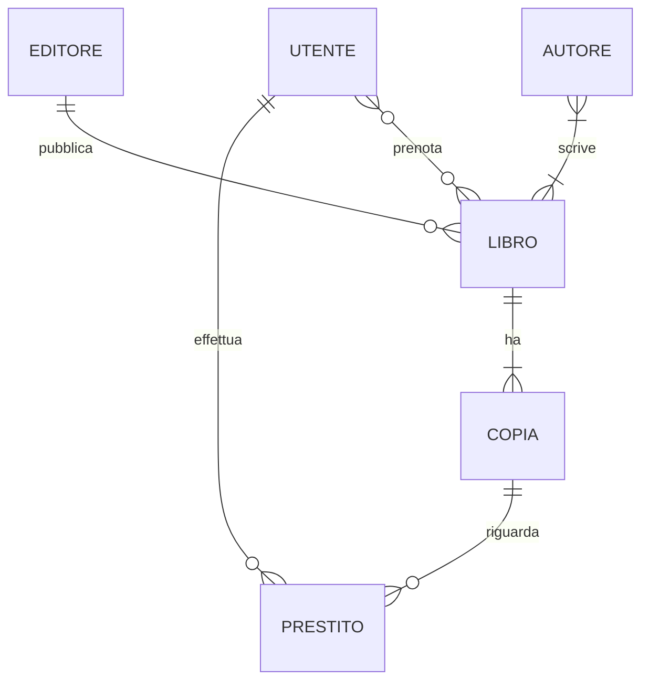

# Lezione 4.2: traccia di soluzione

Una delle soluzioni possibili; lo schema SQL corrispondente è nel file `soluzione_schema.sql` della lezione 4.4, verificato con `controlla_schema.py`.

## Entità e attributi

| Entità | Identificatore | Attributi |
|---|---|---|
| Editore | codice | nome, città |
| Autore | codice | nome, cognome |
| Libro | codice | titolo, anno, genere |
| Copia | codice | collocazione (unica), stato |
| Utente | codice | nome, cognome, tipo (studente o docente), classe (solo studenti), email (unica) |

## Relazioni

| Relazione | Entità | Cardinalità | Motivazione dal testo |
|---|---|---|---|
| pubblica | Editore, Libro | 1:N (un libro ha un solo editore) | "casa editrice" al singolare |
| scrive | Autore, Libro | N:M | "un libro può avere più autori" |
| ha | Libro, Copia | 1:N, obbligatoria per la copia | "di ogni libro possiamo avere più copie" |
| prestito | Utente, Copia | N:M nel tempo, con attributi data prestito, scadenza, restituzione | lo stesso utente prende più copie; la stessa copia va a utenti diversi in momenti diversi |
| prenota | Utente, Libro | N:M con attributo data | "chi ha prenotato quale libro e in che data" |

Il prestito può essere modellato anche come entità (con un proprio codice), legata a Utente e Copia con due relazioni 1:N: è la scelta più comoda, perché la stessa coppia utente-copia può ripetersi in date diverse.

## Diagramma E-R

## Tabelle

- editori (**id_editore**, nome, citta)
- autori (**id_autore**, nome, cognome)
- libri (**id_libro**, titolo, anno, genere, *id_editore*)
- libri_autori (***id_libro***, ***id_autore***)
- copie (**id_copia**, *id_libro*, collocazione, stato)
- utenti (**id_utente**, nome, cognome, tipo, classe, email)
- prestiti (**id_prestito**, *id_copia*, *id_utente*, data_prestito, data_scadenza, data_restituzione)
- prenotazioni (***id_libro***, ***id_utente***, data)

In grassetto la chiave primaria, in corsivo le chiavi esterne.

## Domande per il confronto

- Studenti e docenti in un'unica tabella `utenti`: i prestiti hanno una sola chiave esterna; il vincolo `CHECK` impone la classe solo agli studenti. Con due tabelle separate servirebbero due colonne nel prestito (una delle due vuota) o due tabelle di prestiti.
- La prenotazione riguarda il libro: chi prenota vuole una copia qualsiasi, la prima che rientra.
- La chiave primaria composta (`id_libro`, `id_utente`) di `prenotazioni` impedisce la doppia prenotazione; se si volesse conservare lo storico delle prenotazioni servirebbe una chiave diversa.

## Esercizio aggiuntivo (torneo)

Entità Squadra, Giocatore, Partita, Arbitro. Squadra 1:N Giocatore; Arbitro 1:N Partita; tra Partita e Squadra due relazioni 1:N con ruoli diversi, tradotte con due chiavi esterne in `partite`: `id_squadra_casa`, `id_squadra_ospite`, più `gol_casa`, `gol_ospite`, `data`, `id_arbitro`; vincolo `CHECK (id_squadra_casa <> id_squadra_ospite)`.
