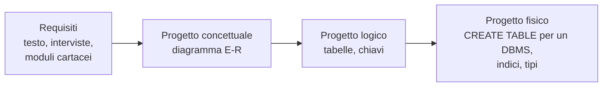
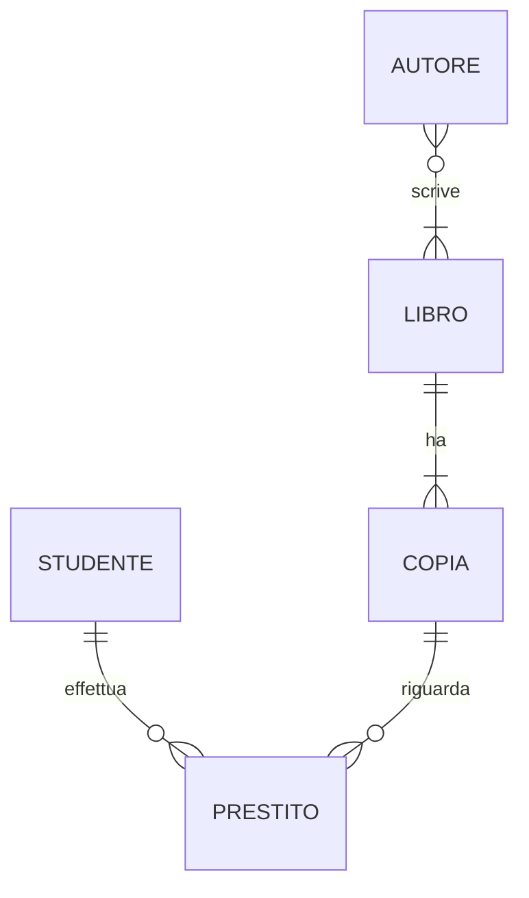
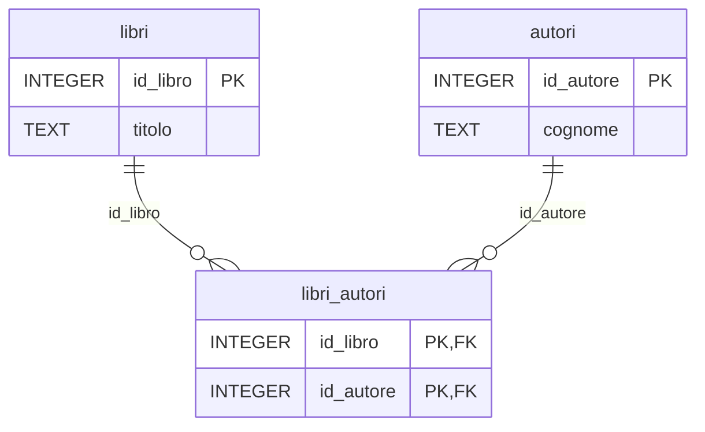

# Lezione 4.2: Progettazione concettuale

> Contenuto originale. Riferimenti: Wikipedia, "Modello E-R", https://it.wikipedia.org/wiki/Modello_E-R ; documentazione Mermaid dei diagrammi entità-relazione, https://github.com/mermaid-js/mermaid/blob/develop/packages/mermaid/src/docs/syntax/entityRelationshipDiagram.md . La traccia di soluzione è nel file `laboratorio/soluzioni_docente.md`.

Obiettivo: descrivere la realtà da rappresentare con un diagramma entità-relazione e tradurlo in tabelle relazionali.

## 4.2.1 Le fasi della progettazione

Prima di creare le tabelle occorre capire che cosa il database deve rappresentare. La progettazione procede per livelli:

- Il **progetto concettuale** descrive la realtà indipendentemente dal DBMS: quali oggetti esistono, con quali proprietà e legami. Lo strumento è il **modello entità-relazione** (E-R), proposto da Peter Chen nel 1976.
- Il **progetto logico** traduce lo schema E-R in tabelle con chiavi primarie ed esterne.
- Il **progetto fisico** scrive le istruzioni per un DBMS preciso (lezione 4.4).

## 4.2.2 Entità, attributi, relazioni

- **Entità**
  una classe di oggetti con esistenza autonoma, di cui interessa conservare informazioni: Libro, Studente, Autore. Ogni oggetto concreto è un'**istanza** (il libro "1984", lo studente Luca Rossi).
- **Attributo**
  una proprietà di un'entità: titolo, anno, cognome. L'**identificatore** è l'attributo, o l'insieme di attributi, che distingue ogni istanza: diventerà la chiave primaria.
- **Relazione** (o associazione)
  un legame tra entità: un Autore *scrive* un Libro, uno Studente *prende in prestito* una Copia. Anche una relazione può avere attributi: la data del prestito non appartiene né allo studente né alla copia, ma al loro legame.

## 4.2.3 Cardinalità

La **cardinalità** indica quante istanze di un'entità possono essere legate a un'istanza dell'altra:

| Tipo | Significato | Esempio |
|---|---|---|
| uno a uno (1:1) | a ogni istanza di A corrisponde al massimo una di B, e viceversa | Classe, Aula assegnata (se ogni classe ha una sola aula e ogni aula una sola classe) |
| uno a molti (1:N) | un'istanza di A è legata a molte di B, ognuna di B a una sola di A | Libro, Copia: un libro ha molte copie, ogni copia è di un solo libro |
| molti a molti (N:M) | molte istanze di A legate a molte di B | Libro, Autore: un libro può avere più autori, un autore scrive più libri |

Si indica anche la **partecipazione**: obbligatoria (ogni copia *deve* appartenere a un libro) o opzionale (un autore può non avere libri nella biblioteca).

Nei diagrammi di questo corso si usa la notazione "a zampa di gallina" (crow's foot), la stessa di Mermaid e di Draw.io. Simboli alle estremità delle linee:

- `||` vicino all'entità: esattamente uno
- `o|`: zero o uno
- `|{`: uno o più
- `o{`: zero o più

Diagramma: tre relazioni della biblioteca.

Lettura: ogni libro ha uno o più autori, ogni autore zero o più libri (N:M); ogni libro ha una o più copie, ogni copia un solo libro (1:N); il prestito lega uno studente e una copia e ha come attributi le date.

## 4.2.4 Dal diagramma E-R alle tabelle

Regole di traduzione:

1. Ogni **entità** diventa una tabella; l'identificatore diventa la chiave primaria.
2. Relazione **1:N**: si aggiunge una chiave esterna nella tabella dal lato "molti". Copia contiene `id_libro`.
3. Relazione **N:M**: si crea una **tabella ponte** con le chiavi delle due entità, che insieme formano la chiave primaria, più gli eventuali attributi della relazione. Libro-Autore diventa `libri_autori(id_libro, id_autore)`.
4. Relazione **1:1**: chiave esterna in una delle due tabelle, con il vincolo `UNIQUE`; spesso le due entità si possono unire in una sola tabella.
5. Gli **attributi di una relazione** vanno nella tabella che la rappresenta: le date del prestito nella tabella `prestiti`.

Diagramma: la relazione N:M tra libri e autori diventa tre tabelle.

Il database della lezione 4.1 semplifica: ogni libro ha un solo autore (chiave esterna `id_autore` in `libri`). Per un'antologia o un libro scritto a più mani non basterebbe.

### Evitare le ridondanze

Uno schema ben progettato non ripete la stessa informazione in più punti (lezione 4.1: città e precipitazioni). Tre controlli pratici, che corrispondono alle prime **forme normali**:

- ogni cella contiene un solo valore: non "Calvino, Levi" in una colonna `autori`, non colonne `telefono1`, `telefono2`, `telefono3` (prima forma normale);
- in una tabella con chiave composta, ogni attributo dipende da tutta la chiave: in `libri_autori` non va il titolo del libro, che dipende solo da `id_libro` (seconda forma normale);
- ogni attributo dipende dalla chiave e non da un altro attributo: se `studenti` contenesse classe e nome del coordinatore di classe, il coordinatore dipenderebbe dalla classe, non dallo studente, e andrebbe in una tabella `classi` (terza forma normale).

## 4.2.5 Laboratorio

Tempo indicativo: 50 minuti, a coppie. Cartella di lavoro `C:\corso-reti\lab42`.

### Requisiti: la nuova biblioteca scolastica

La scuola vuole un nuovo sistema per la biblioteca, più completo del database della lezione 4.1. Dall'intervista con la bibliotecaria:

> "Registriamo i libri con titolo, anno di pubblicazione, genere e casa editrice; della casa editrice ci interessano il nome e la città. Un libro può avere più autori, per esempio le antologie. Di ogni libro possiamo avere più copie, ognuna con la sua collocazione sullo scaffale e il suo stato: buono, usurato o smarrita. Prendono libri in prestito sia gli studenti, di cui conosciamo la classe, sia i docenti, a cui scriviamo per email. Per ogni prestito annotiamo la data, la scadenza e la data in cui il libro torna. Quando tutte le copie di un libro sono fuori, uno studente o un docente può prenotarlo: ci basta sapere chi ha prenotato quale libro e in che data."

1. Individuare entità, attributi (con gli identificatori) e relazioni. Sottolineare nel testo i sostantivi (candidati a entità o attributi) e i verbi (candidati a relazioni).
2. Per ogni relazione stabilire la cardinalità e la partecipazione, motivandola con una frase del testo.
3. Disegnare il diagramma E-R con l'estensione **Draw.io Integration** di VS Code (file `biblioteca_er.drawio`; nella libreria di forme "Entity Relation" ci sono entità e connettori con la notazione a zampa di gallina), oppure su carta.
4. Tradurre il diagramma in tabelle: per ciascuna nome, colonne, chiave primaria, chiavi esterne. Scriverle in un file di testo `biblioteca_tabelle.md`.
5. Verificare le tabelle con i tre controlli sulle ridondanze della sezione 4.2.4.

Domande per il confronto tra le coppie:

- Studenti e docenti: due entità separate o una sola, con un attributo che indica il tipo? Vantaggi e svantaggi.
- La prenotazione riguarda un libro o una copia? Perché?
- Quale vincolo impedisce che la stessa persona prenoti due volte lo stesso libro?

Lo schema progettato verrà creato in SQLite nella lezione 4.4.

### Esercizio aggiuntivo

Progettare il diagramma E-R per la gestione di un torneo sportivo scolastico: squadre (nome, classe), giocatori (appartenenti a una sola squadra), partite tra due squadre con data e risultato, arbitri (uno per partita). Attenzione alla relazione tra partita e squadre: due squadre per partita, con ruoli diversi (casa e ospite).

## 4.2.6 Aspetti orientativi (discussione)

- La progettazione dei dati è una fase in cui si parla soprattutto con le persone che useranno il sistema: capire il loro lavoro è più importante della conoscenza del DBMS.
- Errori di progettazione sono costosi da correggere quando il database è pieno di dati e usato da molti programmi.
- Domanda: quali informazioni della biblioteca potrebbero essere dati personali, e come andrebbero protette?
