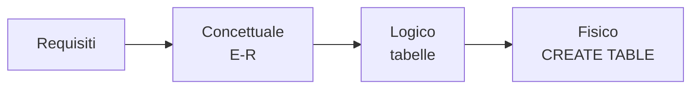
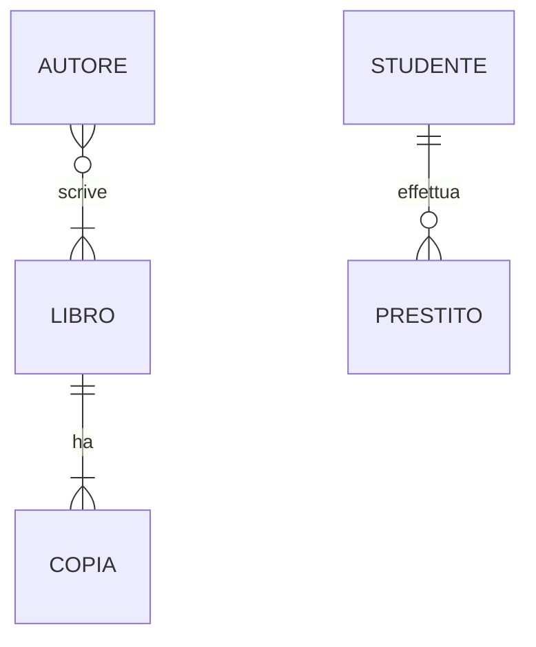

## Contenuti

- Fasi della progettazione
- Entità, attributi, relazioni
- Cardinalità
- Dal diagramma alle tabelle
- Laboratorio
- Aspetti orientativi

## Fasi della progettazione

## Entità, attributi, relazioni

- Entità: classi di oggetti (Libro, Studente)
- Attributi e identificatore
- Relazioni, anche con attributi (date del prestito)

## Cardinalità

- 1:1, 1:N, N:M; partecipazione obbligatoria o opzionale

## Dal diagramma alle tabelle

1. Entità → tabella, identificatore → chiave primaria
2. 1:N → chiave esterna dal lato "molti"
3. N:M → tabella ponte con chiave composta
4. Attributi della relazione nella tabella che la rappresenta
5. Nessuna ridondanza: prime tre forme normali

## Laboratorio

1. Requisiti della nuova biblioteca: entità, attributi, relazioni
2. Cardinalità motivate dal testo
3. Diagramma con Draw.io (libreria Entity Relation)
4. Tabelle e controllo delle ridondanze

## Aspetti orientativi

- Progettare significa capire il lavoro degli utenti
- Gli errori di progetto costano cari
- Dati personali nella biblioteca?
