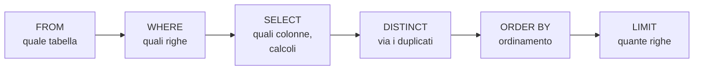

# Lezione 4.3: SQL, interrogazioni

> Contenuto originale; la struttura della sezione 4.3.1 segue la lezione "Working with Data: Relational Databases" di Microsoft "Data Science for Beginners" (licenza MIT), https://github.com/microsoft/Data-Science-For-Beginners/blob/main/2-Working-With-Data/05-relational-databases/README.md . Riferimenti: documentazione di SQLite, "SELECT", https://www.sqlite.org/lang_select.html , e "Built-In Scalar SQL Functions", https://www.sqlite.org/lang_corefunc.html . Gli esercizi e lo script di correzione sono nella cartella `laboratorio`; le soluzioni, per il docente, nel file `laboratorio/soluzioni_esercizi_4_3.sql`.

Obiettivo: scrivere interrogazioni SQL su una tabella: selezionare colonne, filtrare, ordinare, calcolare.

## 4.3.1 SELECT e FROM

**SQL** (Structured Query Language) è il linguaggio standard dei database relazionali. Un'interrogazione (query) indica **che cosa** si vuole ottenere, non come trovarlo: è il DBMS a scegliere il modo più efficiente.

```sql
SELECT titolo, anno      -- colonne da mostrare
FROM libri;              -- tabella da cui leggerle
```

- `SELECT *` mostra tutte le colonne; nei programmi è meglio elencarle, così il risultato non cambia se si aggiungono colonne alla tabella
- le parole chiave non distinguono maiuscole e minuscole (`select` = `SELECT`); per convenzione si scrivono in maiuscolo
- il `;` termina l'istruzione; `--` inizia un commento
- i testi vanno tra **apici singoli** (`'fantascienza'`); un apice dentro un testo si raddoppia: `'L''isola di Arturo'`

## 4.3.2 WHERE: filtrare le righe

```sql
SELECT titolo, anno FROM libri WHERE anno < 1900;
```

| Operatore | Significato | Esempio |
|---|---|---|
| `=`, `<>` | uguale, diverso | `genere = 'romanzo'` |
| `<`, `<=`, `>`, `>=` | confronto | `anno >= 1950` |
| `AND`, `OR`, `NOT` | combinazione di condizioni | `anno > 1950 AND genere = 'romanzo'` |
| `BETWEEN a AND b` | intervallo, estremi compresi | `anno BETWEEN 1940 AND 1960` |
| `IN (...)` | uno dei valori elencati | `classe IN ('4A', '4B')` |
| `LIKE` | confronto con un modello: `%` qualsiasi sequenza di caratteri, `_` un carattere | `titolo LIKE 'Il %'` |
| `IS NULL`, `IS NOT NULL` | valore mancante o presente | `data_restituzione IS NULL` |

Attenzione a `NULL`: la condizione `data_restituzione = NULL` non è mai vera, perché un confronto con un valore sconosciuto dà un risultato sconosciuto. Si usa sempre `IS NULL`.

In SQLite `LIKE` non distingue maiuscole e minuscole per le lettere senza accenti: `'la %'` trova anche "La Storia".

## 4.3.3 ORDER BY, DISTINCT, LIMIT

```sql
SELECT titolo, anno FROM libri
WHERE anno BETWEEN 1940 AND 1960
ORDER BY anno, titolo;       -- per anno; a parità di anno, per titolo
```

- `ORDER BY colonna DESC` ordina in senso decrescente (`ASC`, crescente, è il valore predefinito)
- senza `ORDER BY` l'ordine delle righe **non è garantito**
- `SELECT DISTINCT genere FROM libri` elimina le righe ripetute
- `LIMIT 5` restituisce solo le prime 5 righe, di solito dopo un `ORDER BY`

L'ordine delle clausole è fisso: `SELECT ... FROM ... WHERE ... ORDER BY ... LIMIT ...`. Il DBMS le elabora in un ordine diverso da quello di scrittura:



## 4.3.4 Espressioni e funzioni

Nella clausola `SELECT` si possono calcolare valori; `AS` dà un nome alla colonna calcolata:

```sql
SELECT titolo, 2026 - anno AS anni FROM libri;
```

| Funzione | Risultato | Esempio |
|---|---|---|
| `UPPER(t)`, `LOWER(t)` | testo in maiuscolo, minuscolo | `UPPER(titolo)` |
| `LENGTH(t)` | numero di caratteri | `LENGTH(titolo)` |
| `SUBSTR(t, inizio, n)` | parte del testo | `SUBSTR(data_prestito, 1, 7)` dà anno e mese |
| `ROUND(x, cifre)` | arrotondamento | `ROUND(AVG(anno))` |
| `julianday(d)` | data convertita in numero di giorni | differenza tra due date |
| `date(d, '+30 days')` | data spostata | scadenza a 30 giorni |

In SQLite `UPPER` e `LOWER` convertono solo le lettere senza accenti: `UPPER('città')` dà `CITTà`. Per il testo con accenti occorre un'estensione del DBMS, oppure la conversione nel programma (lezione 4.5).

Le **funzioni di aggregazione** riassumono molte righe in un solo valore:

| Funzione | Risultato |
|---|---|
| `COUNT(*)` | numero di righe |
| `COUNT(colonna)` | numero di valori non `NULL` |
| `SUM`, `AVG` | somma, media |
| `MIN`, `MAX` | minimo, massimo |

```sql
SELECT COUNT(*) FROM prestiti WHERE data_restituzione IS NULL;     -- prestiti in corso
SELECT MIN(anno), MAX(anno), ROUND(AVG(anno)) FROM libri;
```

Il raggruppamento (`GROUP BY`) e le interrogazioni su più tabelle sono l'argomento della lezione 4.4.

## 4.3.5 Laboratorio

Tempo indicativo: 50 minuti. Cartella di lavoro `C:\corso-reti\lab43`, con i file della cartella `laboratorio` e una copia di `biblioteca.db` della lezione 4.1.

### Parte 1: esercizi graduati

Aprire `esercizi_4_3.sql` in VS Code, eseguire **SQLite: Use Database** con `biblioteca.db` e scrivere sotto ogni intestazione l'interrogazione richiesta. Ogni interrogazione si prova selezionandola ed eseguendo **SQLite: Run Selected Query**. Gli esercizi vanno dal più semplice (1: tutte le righe di una tabella) al più complesso (13: durata dei prestiti calcolata con le date).

```sql
-- esercizio 3 (ordinato)
-- Titolo e anno dei libri pubblicati prima del 1900, dal più antico al più recente.
SELECT titolo, anno FROM libri WHERE anno < 1900 ORDER BY anno;
```

### Parte 2: correzione automatica

```powershell
python correttore.py esercizi_4_3.sql attesi_4_3.json biblioteca.db
```

Esempio di output, con alcune risposte sbagliate:

```text
esercizio  1: corretto
esercizio  2: corretto
esercizio  3: righe giuste, ordine sbagliato
esercizio  4: colonne: 3 invece di 2
...
Corretti: 11 su 14
```

Come funziona lo script:

- divide il file in blocchi con l'espressione regolare `^--\s*esercizio\s+(\d+)`, cioè le righe che iniziano con `-- esercizio` seguito da un numero
- esegue ogni interrogazione su `biblioteca.db` aperto **in sola lettura** (`mode=ro`): un errore nelle risposte non può modificare il database
- confronta il risultato con un'**impronta** (hash SHA-256, Corso 2) del risultato atteso, conservata in `attesi_4_3.json`: così il file non contiene le soluzioni
- quando l'ordine non fa parte della risposta, ordina le righe prima di calcolare l'impronta; quando l'ordine conta, distingue "righe giuste in ordine sbagliato" da "valori diversi"

L'esito "corretto" indica che il risultato coincide con quello atteso sui dati attuali; un'interrogazione diversa da quella della soluzione può essere comunque corretta. Test: `python test_correttore.py` (15 test).

### Attività

1. Esercizio 12: perché il titolo "Le città invisibili" in maiuscolo contiene una lettera minuscola?
2. Scrivere un'interrogazione che mostri i prestiti del mese di dicembre 2025 usando `LIKE`, e una che faccia la stessa cosa con `BETWEEN`. Quale è più chiara?
3. Scrivere un'interrogazione con `date(data_prestito, '+30 days')` e verificare che dia sempre `data_scadenza`.

## 4.3.6 Aspetti orientativi (discussione)

- SQL è nato negli anni Settanta ed è ancora il linguaggio standard dei dati: lo usano sviluppatori, analisti, amministratori di sistema, giornalisti che lavorano con i dati.
- Molti strumenti di analisi e di intelligenza artificiale generano interrogazioni SQL: saperle leggere e verificare resta necessario.
- Domanda: perché il correttore apre il database in sola lettura? Che cosa potrebbe succedere altrimenti?
