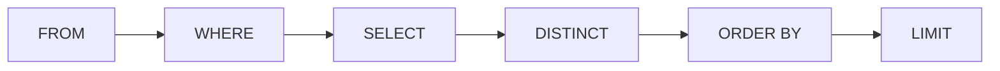

## Contenuti

- SELECT e WHERE
- Ordinare e limitare
- Espressioni e funzioni
- Laboratorio
- Aspetti orientativi

## SELECT e WHERE

```sql
SELECT titolo, anno FROM libri WHERE anno < 1900;
```

- `=`, `<>`, `<`, `AND`, `OR`, `BETWEEN`, `IN`, `LIKE`
- `IS NULL`, mai `= NULL`
- Testi tra apici singoli; `'L''isola'`

## Ordinare e limitare

- `ORDER BY anno, titolo`; `DESC`
- Senza ORDER BY l'ordine non è garantito
- `DISTINCT`, `LIMIT`



## Espressioni e funzioni

- `2026 - anno AS anni`
- `UPPER`, `LENGTH`, `SUBSTR`, `ROUND`, `julianday`, `date`
- `UPPER` di SQLite: solo lettere senza accenti
- `COUNT`, `SUM`, `AVG`, `MIN`, `MAX`

## Laboratorio

1. 14 esercizi graduati in `esercizi_4_3.sql`
2. `python correttore.py esercizi_4_3.sql attesi_4_3.json biblioteca.db`
3. Database in sola lettura, impronte SHA-256; 15 test

## Aspetti orientativi

- SQL: linguaggio standard dei dati da cinquant'anni
- Verificare le interrogazioni generate dagli strumenti
- Perché il correttore usa la sola lettura?
