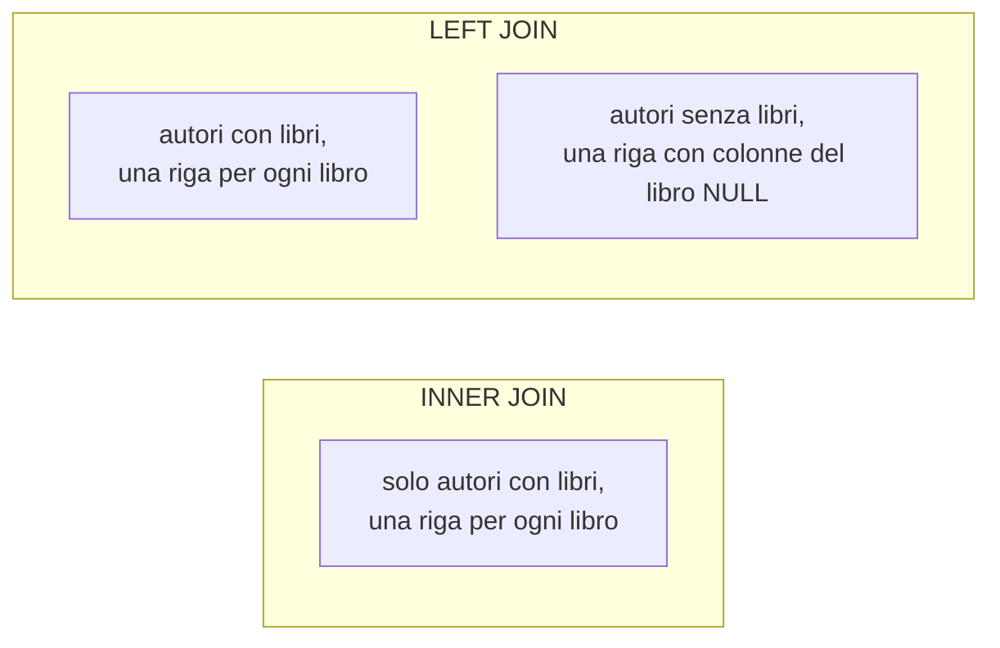

# Lezione 4.4: SQL, join, aggregazioni e modifiche

> Contenuto originale; l'esempio di `INNER JOIN` della sezione 4.4.1 riprende quello della lezione "Working with Data: Relational Databases" di Microsoft "Data Science for Beginners" (licenza MIT), https://github.com/microsoft/Data-Science-For-Beginners/blob/main/2-Working-With-Data/05-relational-databases/README.md . Riferimenti: documentazione di SQLite, https://www.sqlite.org/lang_select.html e https://www.sqlite.org/foreignkeys.html . Gli esercizi e gli script sono nella cartella `laboratorio`; le soluzioni, per il docente, nei file `soluzioni_esercizi_4_4.sql` e `soluzione_schema.sql`.

Obiettivo: interrogare più tabelle insieme, calcolare totali per gruppi, creare tabelle con vincoli e modificare i dati in sicurezza.

## 4.4.1 JOIN: dati da più tabelle

Un **join** affianca le righe di due tabelle che soddisfano una condizione, di solito l'uguaglianza tra una chiave esterna e la chiave primaria a cui si riferisce:

```sql
SELECT l.titolo, a.cognome
FROM libri AS l
JOIN autori AS a ON l.id_autore = a.id_autore;
```

- `AS l` e `AS a` sono **alias**: nomi brevi delle tabelle, usati per indicare da quale tabella proviene ogni colonna (`l.titolo`)
- `JOIN` è l'abbreviazione di `INNER JOIN`: compaiono solo le coppie di righe che si corrispondono
- si possono concatenare più join, seguendo le chiavi esterne: prestito → copia → libro → autore

```sql
SELECT s.cognome, l.titolo, p.data_prestito
FROM prestiti AS p
JOIN studenti AS s ON p.id_studente = s.id_studente
JOIN copie    AS c ON p.id_copia    = c.id_copia
JOIN libri    AS l ON c.id_libro    = l.id_libro;
```

### LEFT JOIN: anche le righe senza corrispondenza

Con `LEFT JOIN` compaiono **tutte** le righe della tabella di sinistra; quando non c'è corrispondenza, le colonne della tabella di destra valgono `NULL`. È il modo per trovare ciò che "manca":

```sql
SELECT a.nome, a.cognome
FROM autori AS a
LEFT JOIN libri AS l ON l.id_autore = a.id_autore
WHERE l.id_libro IS NULL;           -- autori senza libri nella biblioteca
```

Diagramma: righe restituite da `INNER JOIN` e `LEFT JOIN` tra autori e libri.



Un errore frequente è dimenticare la condizione `ON`: si ottiene il **prodotto cartesiano**, cioè ogni riga della prima tabella affiancata a ogni riga della seconda (15 autori × 29 libri = 435 righe senza significato).

## 4.4.2 GROUP BY e HAVING

`GROUP BY` divide le righe in gruppi con lo stesso valore e calcola le funzioni di aggregazione per ciascun gruppo:

```sql
SELECT s.classe, COUNT(*) AS prestiti
FROM prestiti AS p JOIN studenti AS s ON p.id_studente = s.id_studente
GROUP BY s.classe
ORDER BY s.classe;
```

| classe | prestiti |
|---|---|
| 3A | 45 |
| 3B | 38 |
| 4A | 40 |
| 4B | 39 |
| 5A | 38 |

- nella clausola `SELECT` di un'interrogazione con `GROUP BY` si mettono le colonne di raggruppamento e le funzioni di aggregazione
- `WHERE` filtra le **righe prima** del raggruppamento; `HAVING` filtra i **gruppi dopo** il calcolo:

```sql
SELECT a.cognome, COUNT(*) AS numero_libri
FROM libri AS l JOIN autori AS a ON l.id_autore = a.id_autore
GROUP BY a.id_autore
HAVING COUNT(*) >= 3;               -- solo gli autori con almeno 3 libri
```

Ordine completo di elaborazione: `FROM` e `JOIN` → `WHERE` → `GROUP BY` → `HAVING` → `SELECT` → `ORDER BY` → `LIMIT`.

## 4.4.3 Creare tabelle e modificare i dati

### CREATE TABLE e vincoli

```sql
CREATE TABLE utenti (
    id_utente  INTEGER PRIMARY KEY,
    nome       TEXT NOT NULL,
    tipo       TEXT NOT NULL CHECK (tipo IN ('studente', 'docente')),
    classe     TEXT,
    email      TEXT UNIQUE
);
```

| Vincolo | Effetto |
|---|---|
| `PRIMARY KEY` | valore unico e presente per ogni riga; può essere composto: `PRIMARY KEY (id_libro, id_autore)` |
| `NOT NULL` | valore obbligatorio |
| `UNIQUE` | nessun valore ripetuto |
| `CHECK (condizione)` | ogni riga deve rispettare la condizione |
| `DEFAULT valore` | valore usato se non indicato |
| `REFERENCES tabella(colonna)` | chiave esterna: il valore deve esistere nell'altra tabella |

I vincoli spostano i controlli dal programma al database: valgono per tutti i programmi e gli utenti che lo usano.

### INSERT, UPDATE, DELETE

```sql
INSERT INTO studenti (id_studente, nome, cognome, classe) VALUES (42, 'Rita', 'Galli', '3A');

UPDATE prestiti SET data_restituzione = '2026-06-20'
WHERE id_copia = 46 AND data_restituzione IS NULL;

DELETE FROM prenotazioni WHERE data < '2026-01-01';
```

- `UPDATE` e `DELETE` **senza** `WHERE` agiscono su **tutte** le righe della tabella. Prima di eseguirli conviene scrivere la `SELECT` con la stessa condizione e controllare quali righe sono coinvolte.
- Un'istruzione che viola un vincolo viene rifiutata per intero e il database resta invariato.
- Con le chiavi esterne attive (`PRAGMA foreign_keys = ON` in SQLite), non si può cancellare una riga a cui fanno riferimento altre righe: per esempio uno studente con prestiti registrati.

## 4.4.4 Laboratorio

Tempo indicativo: 60 minuti. Cartella di lavoro `C:\corso-reti\lab44`, con i file della cartella `laboratorio` e una copia di `biblioteca.db` della lezione 4.1.

### Parte 1: domande sui dati (join e aggregazioni)

Completare `esercizi_4_4.sql` (12 esercizi, dal join tra due tabelle ai libri meno prestati con `LEFT JOIN` e `GROUP BY`) e verificare con lo stesso correttore della lezione 4.3:

```powershell
python ..\lab43\correttore.py esercizi_4_4.sql attesi_4_4.json biblioteca.db
```

### Parte 2: modifiche e vincoli

1. Copiare il database: `copy biblioteca.db prove.db`. Tutte le modifiche si fanno sulla copia.
2. Aprire `modifiche.sql`, eseguire **SQLite: Use Database** con `prove.db` ed eseguire le istruzioni una alla volta con **SQLite: Run Selected Query**, verificando dopo ogni modifica il contenuto delle tabelle.
3. Le istruzioni della sezione 5 del file devono essere rifiutate: per ciascuna annotare il messaggio di errore e il vincolo che interviene (chiave esterna, `UNIQUE`, `CHECK`).

Nelle istruzioni che dipendono dalle chiavi esterne, `PRAGMA foreign_keys = ON;` è scritto sulla stessa riga, così viene selezionato ed eseguito insieme all'istruzione.

### Parte 3: il database progettato nella lezione 4.2

1. Scrivere nel file `schema_gruppo.sql` le istruzioni `CREATE TABLE` delle tabelle progettate nella lezione 4.2, con chiavi primarie, chiavi esterne e vincoli.
2. Scrivere in `dati_gruppo.sql` alcune righe di prova valide e alcune che devono essere rifiutate.
3. Controllare schema e dati:

```powershell
python controlla_schema.py schema_gruppo.sql dati_gruppo.sql
```

Esempio con lo schema di soluzione e i dati di prova forniti:

```text
Problemi dello schema: nessuno

Dati di prova: 11 istruzioni accettate, 5 rifiutate
  RIFIUTATA: INSERT INTO libri_autori VALUES (1, 1);
     motivo: UNIQUE constraint failed: libri_autori.id_libro, libri_autori.id_autore
  RIFIUTATA: INSERT INTO copie VALUES (2, 99, 'A1-2', 'buono');
     motivo: FOREIGN KEY constraint failed
...
```

Lo script:

- crea lo schema in un database temporaneo in memoria (`sqlite3.connect(":memory:")`), con le chiavi esterne attive
- legge la struttura con le istruzioni `PRAGMA table_info` (colonne) e `PRAGMA foreign_key_list` (chiavi esterne)
- segnala tabelle senza chiave primaria e chiavi esterne verso tabelle o colonne inesistenti o non uniche
- esegue i dati di prova un'istruzione alla volta (`sqlite3.complete_statement` riconosce dove finisce ogni istruzione) e riporta quelle rifiutate con il motivo
- con l'opzione `--mermaid` produce il diagramma delle tabelle in formato Mermaid, da incollare nella documentazione: `python controlla_schema.py schema_gruppo.sql --mermaid`

Test: `python test_controlla_schema.py` (12 test).

### Attività

1. Esercizio 12: perché serve `COUNT(p.id_prestito)` e non `COUNT(*)` per contare zero prestiti del libro mai prestato?
2. Scrivere un'interrogazione che mostri, per ogni studente della 5A, il numero di prestiti restituiti in ritardo.
3. Nello schema progettato, aggiungere il vincolo che impedisce a una copia smarrita di essere prestata: è possibile con un `CHECK`? Perché no, e dove andrebbe fatto il controllo (lezione 4.5)?

## 4.4.5 Aspetti orientativi (discussione)

- Le interrogazioni con join e aggregazioni sono alla base dei rapporti e dei cruscotti (dashboard) usati per le decisioni in azienda: è il lavoro quotidiano degli analisti di dati.
- Le modifiche ai dati in produzione richiedono prudenza: copie di sicurezza, prove su una copia, controllo delle righe coinvolte prima di `UPDATE` e `DELETE`.
- Domanda: un vincolo nel database o un controllo nel programma? Quali vantaggi ha ciascuna scelta?
