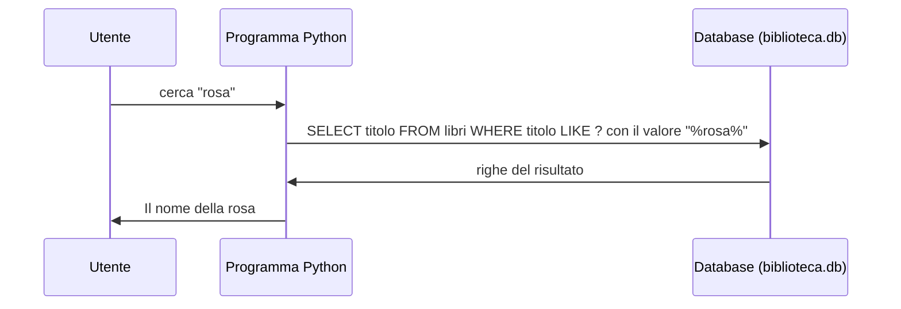

# Lezione 4.5: Python e database

> Contenuto originale. Riferimento: documentazione Python del modulo `sqlite3`, https://docs.python.org/3/library/sqlite3.html . Gli script sono nella cartella `laboratorio`.

Obiettivo: usare un database da un programma Python: connessione, interrogazioni con parametri, lettura dei risultati, transazioni; importare dati da un file CSV e produrre un rapporto.

## 4.5.1 Dal programma al database

Gli utenti non scrivono SQL: usano applicazioni (un sito, un'app, un gestionale) che eseguono le interrogazioni per loro. In Python il modulo `sqlite3` della libreria standard permette di usare SQLite senza installare nulla; per gli altri DBMS esistono moduli analoghi con la stessa struttura (connessione, esecuzione, lettura dei risultati).



## 4.5.2 Connessione, esecuzione, risultati

```python
import sqlite3

connessione = sqlite3.connect("biblioteca.db")          # apre (o crea) il file del database
connessione.execute("PRAGMA foreign_keys = ON")          # chiavi esterne attive per questa connessione
connessione.row_factory = sqlite3.Row                    # righe leggibili anche per nome di colonna

cursore = connessione.execute("SELECT titolo, anno FROM libri WHERE anno < ?", (1900,))
for riga in cursore:                                     # una riga alla volta
    print(riga["titolo"], riga["anno"])

connessione.close()
```

- `execute` restituisce un **cursore**, da cui si leggono le righe: con un ciclo `for`, con `fetchone()` (una riga, o `None` se non ce ne sono) o con `fetchall()` (tutte in una lista)
- con `row_factory = sqlite3.Row` si accede ai valori per nome (`riga["titolo"]`) oltre che per posizione (`riga[0]`)
- `executemany` esegue la stessa istruzione per ogni elemento di un elenco di valori

## 4.5.3 Parametri, mai valori nel testo SQL

I valori che arrivano dall'esterno (input dell'utente, file, rete) si passano sempre come **parametri**, con il segnaposto `?`:

```python
# corretto: il valore viaggia separato dall'istruzione
connessione.execute("SELECT titolo FROM libri WHERE titolo LIKE ?", (f"%{testo}%",))

# da non fare: il valore diventa parte del testo SQL
connessione.execute(f"SELECT titolo FROM libri WHERE titolo LIKE '%{testo}%'")
```

Con la seconda forma, un testo che contiene un apice (come "L'isola di Arturo") rompe l'istruzione, e un testo costruito apposta può cambiarne il significato: è la **SQL injection**, una delle vulnerabilità più diffuse delle applicazioni web (Corso 2, modulo 5). Con i parametri il DBMS tratta il valore sempre come dato, qualunque cosa contenga. La documentazione di Python lo indica esplicitamente.

I nomi di tabelle e colonne non si possono passare come parametri: se devono variare, si scelgono da un elenco fisso nel programma.

## 4.5.4 Transazioni

Una **transazione** è un gruppo di modifiche eseguite **tutte o nessuna**. Esempio: importare 30 prestiti da un file; se il ventesimo è sbagliato, non devono restare nel database solo i primi 19. Proprietà delle transazioni (in sigla **ACID**):

- **atomicità**: tutto o niente
- **coerenza**: alla fine i vincoli sono rispettati
- **isolamento**: gli altri utenti non vedono le modifiche a metà
- **durabilità**: una volta confermate (commit), le modifiche restano anche in caso di guasto

In Python la connessione usata con `with` gestisce la transazione:

```python
with connessione:                        # inizio della transazione
    connessione.executemany("INSERT INTO prestiti (...) VALUES (?, ?, ?, ?)", validi)
# uscita senza errori: commit; se si verifica un errore: rollback, cioè annullamento
```

## 4.5.5 Laboratorio

Tempo indicativo: 60 minuti. Cartella di lavoro `C:\corso-reti\lab45`, con i file della cartella `laboratorio` e una copia di `biblioteca.db` della lezione 4.1 (per ripartire dai dati originali, rieseguire `crea_database.py` nella cartella `lab41` e copiare di nuovo il file).

La bibliotecaria annota i prestiti su un foglio di calcolo e lo esporta in formato CSV: `nuovi_prestiti.csv`.

```text
collocazione,id_studente,data_prestito
A1-2,41,2026-06-11
B2-1,3,2026-06-11
...
```

### Parte 1: importazione con controlli

```powershell
python gestione_prestiti.py importa nuovi_prestiti_errati.csv
python gestione_prestiti.py importa nuovi_prestiti.csv
python gestione_prestiti.py importa nuovi_prestiti.csv
```

```text
ERRORE riga 3: la copia B2-2 è già in prestito
ERRORE riga 4: nessuna copia con collocazione Z9-9
ERRORE riga 5: nessuno studente con codice 99
ERRORE riga 6: data non valida '11/06/2026' (formato richiesto AAAA-MM-GG)
ERRORE riga 7: la copia F3-1 risulta smarrita
Prestiti importati: 0 (importazione annullata)
Prestiti importati: 5
ERRORE riga 2: la copia A1-2 è già in prestito
...
```

- il primo file ha una riga valida e cinque sbagliate: non viene importato nulla, nemmeno la riga valida
- il secondo file viene importato; importato una seconda volta, viene rifiutato perché le copie risultano già in prestito

Punti principali del codice:

```python
copia = connessione.execute(
    "SELECT id_copia, stato FROM copie WHERE collocazione = ?", (riga["collocazione"].strip(),)
).fetchone()
if copia is None:
    return None, f"nessuna copia con collocazione {riga['collocazione']}"
```

- `csv.DictReader` legge il file CSV riga per riga, come dizionari con i nomi delle colonne dell'intestazione
- `controlla_riga` esegue i controlli che i vincoli del database non possono fare da soli: copia smarrita, copia già in prestito (anche due volte nello stesso file), formato della data (`datetime.date.fromisoformat`)
- la data di scadenza si calcola in Python con `datetime.timedelta(days=30)`
- l'inserimento avviene solo se tutte le righe sono valide, dentro una transazione `with connessione:`

### Parte 2: rapporto

```powershell
python gestione_prestiti.py rapporto 2026-06-15
```

Lo script scrive il file `rapporto_2026-06-15.md`, da aprire in VS Code con l'anteprima Markdown (`Ctrl+Shift+V`):

```text
# Rapporto della biblioteca al 2026-06-15

Prestiti registrati: 205; in corso: 22.

## Libri più prestati
| Titolo | Prestiti |
...
## Prestiti scaduti e non restituiti
| Studente | Classe | Titolo | Scadenza | Giorni di ritardo |
...
| D'Angelo Martina | 3B | Novelle per un anno | 2025-12-03 | 194 |
```

- le tre sezioni sono interrogazioni con join e `GROUP BY` (lezione 4.4); la data di riferimento è un parametro (`?`), usato due volte
- i giorni di ritardo si calcolano in SQL con `julianday`
- senza data, lo script usa la data odierna (`datetime.date.today()`)

### Parte 3: ricerca e parametri

```powershell
python gestione_prestiti.py cerca rosa
python gestione_prestiti.py cerca "L'isola"
python gestione_prestiti.py cerca "' OR '1'='1"
```

L'ultimo testo, inserito direttamente nel testo SQL, trasformerebbe la condizione in una sempre vera; passato come parametro viene cercato letteralmente nei titoli e non trova nulla. Spiegare perché la ricerca di "L'isola" funziona.

Test: `python test_gestione_prestiti.py` (15 test, eseguiti su una copia temporanea del database).

### Attività

1. Aggiungere il comando `restituisci COLLOCAZIONE DATA`, che registra la restituzione del prestito in corso di una copia (con `UPDATE` e parametri) e segnala se la copia non è in prestito.
2. Aggiungere al rapporto la sezione "Studenti con più prestiti" (i primi 5).
3. Modificare `importa` perché, invece di annullare tutto, importi le righe valide e scriva quelle sbagliate in un file `scartati.csv`. In quali situazioni è preferibile ciascuna delle due scelte?

## 4.5.6 Aspetti orientativi (discussione)

- Importare dati da file, controllarli e produrre rapporti è un compito frequente in ogni organizzazione: è spesso il primo lavoro affidato a un programmatore o a un tecnico informatico.
- Le interrogazioni con parametri e le transazioni sono la base della correttezza e della sicurezza delle applicazioni che usano i dati.
- Domanda: la biblioteca conserva i prestiti degli studenti degli anni passati. Per quanto tempo è giusto conservarli, e perché?
