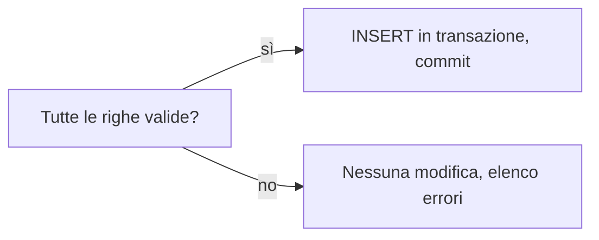

## Contenuti

- Il modulo sqlite3
- Parametri
- Transazioni
- Laboratorio
- Aspetti orientativi

## Il modulo sqlite3

- `sqlite3.connect`, `execute`, cursore
- `fetchone`, `fetchall`, ciclo for
- `row_factory = sqlite3.Row`: valori per nome
- `executemany`

## Parametri

```python
connessione.execute("SELECT titolo FROM libri WHERE titolo LIKE ?", (f"%{testo}%",))
```

- Mai valori nel testo SQL: SQL injection
- Apici nei dati senza problemi

## Transazioni

- ACID: atomicità, coerenza, isolamento, durabilità
- `with connessione:` commit o rollback



## Laboratorio

1. `python gestione_prestiti.py importa nuovi_prestiti.csv`
2. `python gestione_prestiti.py rapporto 2026-06-15`: file Markdown
3. `python gestione_prestiti.py cerca "L'isola"`
4. 15 test su una copia temporanea

## Aspetti orientativi

- Importare, controllare, riassumere: compiti di ogni organizzazione
- Parametri e transazioni: correttezza e sicurezza
- Per quanto tempo conservare i prestiti degli studenti?
