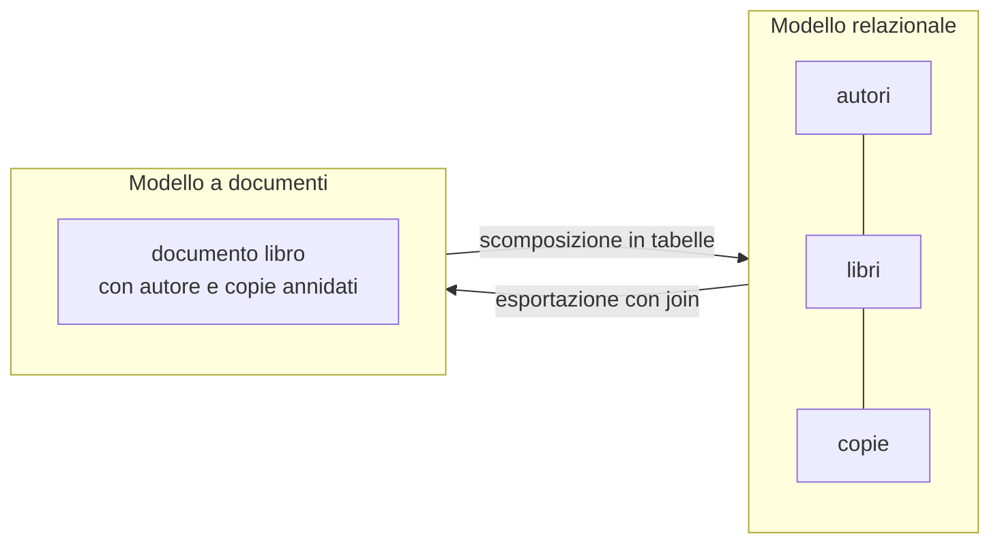

# Lezione 5.1: Formati dei dati e database a documenti

> Fonte della sezione 5.1.4: adattamento e traduzione da Microsoft, "Data Science for Beginners", lezione "Working with Data: Non-Relational Data", licenza MIT, https://github.com/microsoft/Data-Science-For-Beginners/blob/main/2-Working-With-Data/06-non-relational/README.md (le quattro famiglie di database NoSQL e il confronto tra documenti e JSON). Il resto della lezione è contenuto originale. Riferimenti: RFC 4180 (CSV), https://www.rfc-editor.org/rfc/rfc4180 ; RFC 8259 (JSON), https://www.rfc-editor.org/rfc/rfc8259 ; Wikipedia, "UTF-8", https://it.wikipedia.org/wiki/UTF-8 . Gli script sono nella cartella `laboratorio`.

Obiettivo: riconoscere e usare i formati più comuni per scambiare dati tra programmi, evitare gli errori di codifica dei caratteri, e confrontare il modello relazionale con quello a documenti.

## 5.1.1 Dati che viaggiano

Nel modulo 4 i dati restavano dentro un database. Molto spesso però devono passare da un sistema a un altro: un'esportazione da un foglio di calcolo, la risposta di un servizio web, un file di configurazione. Serve un **formato**: un modo concordato di scrivere i dati come testo (o come byte), che il destinatario sappia rileggere.

| Formato | Struttura | Punti di forza | Limiti | Uso tipico |
|---|---|---|---|---|
| CSV | tabella: righe e colonne separate da virgole | semplicissimo, leggibile da ogni foglio di calcolo | solo dati piatti; nessun tipo (tutto è testo); separatore e codifica non uniformi | esportazioni, scambi con Excel, dati aperti |
| JSON | oggetti annidati, elenchi, numeri, testi, `true`, `false`, `null` | leggero, vicino alle strutture dei linguaggi di programmazione | nessun commento; nessun tipo data | API web, configurazioni, database a documenti |
| XML | elementi annidati con attributi | schemi di validazione, spazi dei nomi, documenti misti di testo e dati | verboso | fatturazione elettronica, documenti per ufficio, formati storici |

## 5.1.2 CSV, JSON e XML a confronto

Gli stessi dati, un libro con le sue copie, nei tre formati.

CSV (una riga per libro: le copie vanno "appiattite"):

```text
id,titolo,genere,anno,autore,numero_copie,collocazioni
1,I promessi sposi,romanzo storico,1827,Alessandro Manzoni,3,A1-1|A1-2|A1-3
18,"Uno, nessuno e centomila",romanzo,1926,Luigi Pirandello,2,D3-1|D3-2
```

- la prima riga contiene i nomi delle colonne
- un valore che contiene una virgola va tra **virgolette doppie** (RFC 4180): `"Uno, nessuno e centomila"`
- l'elenco delle copie non entra in una cella: qui è unito con `|`, una scelta arbitraria che il destinatario deve conoscere

JSON (un documento annidato):

```json
{
  "id": 1,
  "titolo": "I promessi sposi",
  "anno": 1827,
  "autore": {"id": 1, "nome": "Alessandro", "cognome": "Manzoni"},
  "copie": [
    {"id_copia": 1, "collocazione": "A1-1", "stato": "usurato"},
    {"id_copia": 2, "collocazione": "A1-2", "stato": "buono"}
  ]
}
```

- `{ }` racchiude un **oggetto** (coppie nome: valore), `[ ]` un **elenco**; i nomi sono sempre tra virgolette doppie
- numeri e testi si distinguono (`1827` e `"1827"` sono valori diversi)
- in Python un oggetto JSON diventa un dizionario e un elenco una lista (`json.load`, `json.dump`)

XML (elementi e attributi):

```xml
<libro id="1">
  <titolo>I promessi sposi</titolo>
  <anno>1827</anno>
  <autore id="1"><nome>Alessandro</nome><cognome>Manzoni</cognome></autore>
  <copie>
    <copia id="1" collocazione="A1-1" stato="usurato" />
  </copie>
</libro>
```

- ogni elemento ha un'etichetta di apertura e una di chiusura; i dati semplici possono stare negli **attributi**
- XML è il formato della fattura elettronica italiana e dei documenti di Office (un file `.docx` è un archivio ZIP di file XML)

## 5.1.3 Codifica dei caratteri

Un file di testo è una sequenza di byte. La **codifica** stabilisce quale byte (o sequenza di byte) rappresenta ogni carattere.

- **ASCII**: 128 caratteri, lettere inglesi senza accenti, un byte ciascuno.
- **Windows-1252** (spesso chiamata "ANSI" nei programmi Windows): un byte per carattere, con le lettere accentate dell'Europa occidentale; usata da molte versioni di Excel per salvare i CSV.
- **UTF-8**: codifica di **Unicode**, che comprende i caratteri di tutte le lingue e i simboli; le lettere senza accenti occupano un byte, le altre da 2 a 4. È la codifica standard del web e quella obbligatoria per il JSON scambiato tra sistemi (RFC 8259).

| Carattere | UTF-8 | Windows-1252 |
|---|---|---|
| `e` | `65` | `65` |
| `è` | `c3 a8` | `e8` |
| `à` | `c3 a0` | `e0` |

Se un file scritto in UTF-8 viene letto come Windows-1252, ogni lettera accentata diventa due caratteri strani: "città" diventa "cittÃ" seguito da uno spazio (il byte `a0`). L'errore opposto produce un errore di decodifica o il carattere di sostituzione. La regola pratica: **dichiarare sempre la codifica** (in Python `open(..., encoding="utf-8")`) e usare UTF-8 salvo vincoli esterni.

Il CSV salvato da Excel in italiano usa di norma il **punto e virgola** come separatore, perché la virgola è il separatore decimale. I programmi che leggono CSV devono tenerne conto.

## 5.1.4 Database non relazionali

Non tutti i dati stanno bene in tabelle. **NoSQL** è un termine che raccoglie modi diversi di conservare dati non relazionali; si interpreta come "non SQL", "non relazionale" o "non solo SQL". Quattro famiglie principali:

- **Chiave-valore**
  a ogni chiave univoca corrisponde un valore, come in un dizionario di Python; lettura e scrittura velocissime. Uso tipico: sessioni degli utenti, memorie temporanee (cache).
- **Documenti**
  ogni elemento è un documento con campi e valori, spesso annidati, in formato simile a JSON; documenti della stessa raccolta possono avere campi diversi. Uso tipico: cataloghi di prodotti, profili, contenuti.
- **Grafi**
  nodi (per esempio persone, luoghi, interessi) e archi che rappresentano le relazioni tra loro. Uso tipico: reti sociali, raccomandazioni, percorsi.
- **Colonne**
  righe e colonne come nelle tabelle, ma le colonne sono raggruppate in famiglie e ogni riga può averne di diverse. Uso tipico: grandi volumi di dati distribuiti su molti server.

I documenti assomigliano molto al JSON: nella maggior parte dei casi i dati restituiti da un'API in JSON (lezione 5.2) si possono salvare direttamente in un database a documenti. Alcuni di questi sistemi permettono di interrogare i documenti con un linguaggio simile a SQL.

Confronto tra i due modelli con i dati della biblioteca:



| | Relazionale | Documenti |
|---|---|---|
| Struttura | tabelle con colonne fisse | documenti flessibili |
| Ripetizioni | evitate con le chiavi | accettate: l'autore è copiato in ogni suo libro |
| Lettura di un libro completo | join tra tre tabelle | un solo documento |
| Modifica del cognome di un autore | una riga | tutti i documenti dei suoi libri |
| Vincoli e transazioni | forti | variabili secondo il prodotto |

Nessun modello è migliore in assoluto: si sceglie in base a come i dati vengono letti e modificati.

## 5.1.5 Laboratorio

Tempo indicativo: 45 minuti. Cartella di lavoro `C:\corso-reti\lab51`, con i file della cartella `laboratorio` e una copia di `biblioteca.db` della lezione 4.1.

### Parte 1: dalle tabelle ai documenti, e ritorno

```powershell
python converti_formati.py
```

```text
libri.csv      1835 byte
libri.json    11619 byte
libri.xml      9654 byte
Primo libro dal file XML: ('I promessi sposi', 3)
Tabelle ricostruite dai documenti JSON uguali all'originale: sì
```

Aprire i tre file in VS Code e confrontarli: dove si trova l'autore? Come sono rappresentate le copie? Perché il JSON è il file più grande?

Punti principali del codice:

```python
documenti.append({
    "id": libro["id_libro"],
    "titolo": libro["titolo"],
    "autore": {"id": libro["id_autore"], "nome": libro["nome"], "cognome": libro["cognome"]},
    "copie": [dict(c) for c in copie],      # un elenco di dizionari, uno per copia
})
json.dump(documenti, f, ensure_ascii=False, indent=2)
```

- `leggi_documenti` esegue un join tra libri e autori e, per ogni libro, un'interrogazione sulle copie: il risultato è un elenco di dizionari annidati
- `csv.writer` mette automaticamente tra virgolette i valori che contengono virgole
- `ensure_ascii=False` scrive le lettere accentate come sono, invece che nella forma `\u00e8`; `indent=2` aggiunge i rientri
- `xml.etree.ElementTree` costruisce l'albero degli elementi (`SubElement`) e lo rilegge (`find`, `findall`, `findtext`)
- `tabelle_da_documenti` fa il percorso inverso: ogni autore viene registrato una sola volta in un dizionario, eliminando le ripetizioni

### Parte 2: codifiche e CSV di Excel

```powershell
python converti_formati.py --codifiche
python converti_formati.py --excel titoli_excel.csv
```

```text
Testo: perché città è così  (19 caratteri)
  utf-8: 23 byte  70 65 72 63 68 c3 a9 20 ...
 cp1252: 19 byte  70 65 72 63 68 e9 20 ...
Byte UTF-8 letti come Windows-1252: perché città è così
Codifica riconosciuta: cp1252; righe: 3
```

- `testo.encode("utf-8")` trasforma il testo in byte; `.hex(" ")` mostra i byte in esadecimale
- `leggi_csv_excel` prova a decodificare il file in UTF-8 e, se trova byte non validi (`UnicodeDecodeError`), in Windows-1252; `csv.Sniffer` riconosce il separatore

Aprire `titoli_excel.csv` in VS Code: nella barra di stato in basso a destra compare la codifica usata per leggerlo; con un clic si può scegliere **Reopen with Encoding** e confrontare il risultato con UTF-8 e con Windows-1252.

Test: `python test_converti_formati.py` (15 test).

### Attività

1. Aggiungere ai documenti JSON il numero di prestiti di ogni libro. Dove andrebbe questa informazione nel modello relazionale?
2. Con il modulo `shelve` della libreria standard (un semplice archivio chiave-valore su file) salvare ogni documento con la chiave `libro:<id>` e rileggerne uno.
3. Il cognome di un autore era sbagliato: quante modifiche servono nel database relazionale? E nel file `libri.json`?

## 5.1.6 Aspetti orientativi (discussione)

- Convertire, pulire e integrare dati provenienti da fonti diverse occupa gran parte del tempo di chi lavora con i dati (data engineer, analisti).
- Gli errori di codifica sono tra i problemi più comuni nelle integrazioni tra sistemi: riconoscerli al primo sguardo fa risparmiare molto tempo.
- Domanda: la Pubblica Amministrazione pubblica molti dati aperti in CSV e JSON. Quali vantaggi ha la scelta di formati aperti e non proprietari?
