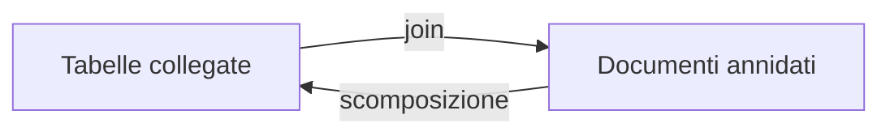

## Contenuti

- Tre formati
- Lo stesso libro
- Codifica dei caratteri
- Database NoSQL
- Laboratorio
- Aspetti orientativi

Fonte sezione 5.1.4: Microsoft, "Data Science for Beginners", licenza MIT, https://github.com/microsoft/Data-Science-For-Beginners

## Tre formati

| Formato | Struttura | Uso tipico |
|---|---|---|
| CSV | tabella piatta | fogli di calcolo, dati aperti |
| JSON | oggetti ed elenchi annidati | API, configurazioni, documenti |
| XML | elementi e attributi | fattura elettronica, documenti Office |

## Lo stesso libro

- CSV: copie "appiattite" in una cella; virgolette per le virgole
- JSON: `{"titolo": ..., "autore": {...}, "copie": [...]}`
- XML: `<libro id="1"><titolo>...</titolo>...</libro>`

## Codifica dei caratteri

| Carattere | UTF-8 | Windows-1252 |
|---|---|---|
| e | 65 | 65 |
| è | c3 a8 | e8 |

- UTF-8 letto come Windows-1252: "città "
- Dichiarare sempre la codifica; CSV di Excel con `;`

## Database NoSQL

- Chiave-valore, documenti, grafi, colonne

- Documenti: lettura in un colpo, ripetizioni accettate

## Laboratorio

1. `python converti_formati.py`: CSV, JSON, XML e ritorno alle tabelle
2. `--codifiche`: i byte degli accenti
3. `--excel titoli_excel.csv`: codifica e separatore riconosciuti
4. 15 test

## Aspetti orientativi

- Integrare dati: gran parte del lavoro con i dati
- Errori di codifica: riconoscerli subito
- Dati aperti in formati aperti
